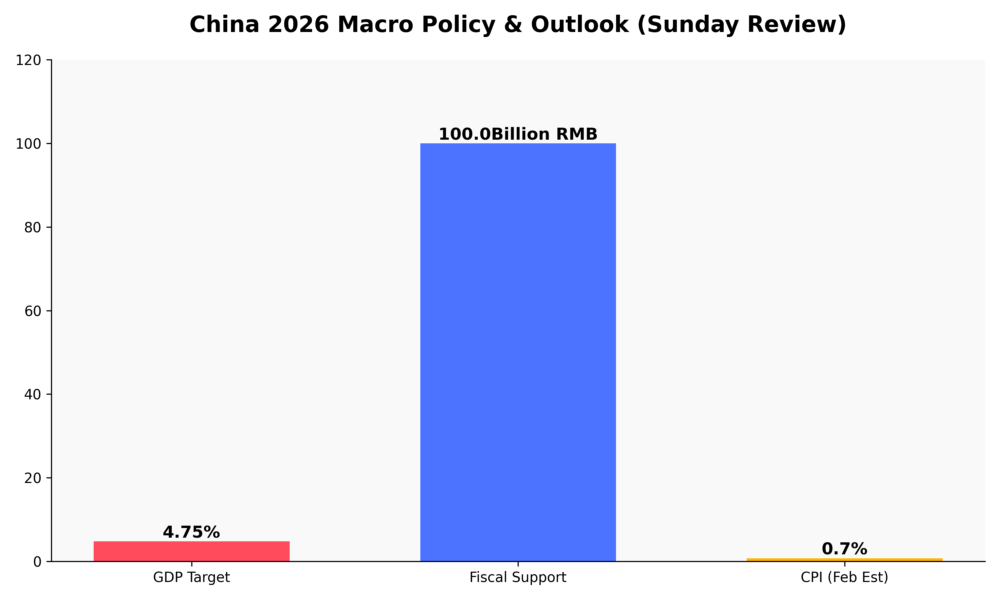

# 2026-03-08 周末复盘与下周前瞻

## 核心动态：宏观政策定调与两会发酵

本周末，随着两会进程的推进，多项重磅政策信号密集释放，为下周及全年的市场走势奠定了基调。

> **财政与货币政策协同发力**
> 2026年政府工作报告将GDP增长目标设定在 **4.5%-5%**。财政部明确安排 **1000亿元** 专项资金支持内需，而央行行长潘功胜强调将实施“适度宽松”的货币政策，并灵活运用降准降息工具，确保流动性充裕。

> **资本市场监管趋严**
> 证监会主席吴清重申对财务造假和市场操纵的“零容忍”态度。同时，即将于4月施行的短线交易新规也成为了周末讨论的热点，显示出监管层净化市场生态、保护投资者的决心。

## 视觉看板：政策力度与预期

*   **GDP 预期**：保持中高速增长信心。
*   **财政支持**：精准滴灌实体经济。
*   **物价水平**：关注明日发布及PPI数据。

## 机构观点：三月主线聚焦“涨价 + AI”

中信证券与中金公司在周末发布的策略报告中达成高度共识：

1.  **叙事推动，涨价催化**：建议关注供给受限的化工、有色金属板块，以及受地缘政治催化的石油石化。
2.  **科技行情延续**：AI依然是核心线索，重点布局电子、机械等具备高AI敞口的领域。
3.  **高股息底座**：在波动中复苏背景下，优质现金流、高分红的蓝筹股仍是避风港。

## 下周重要经济日历

*   **3月9日（周一）**：2月 CPI/PPI 数据、1年期 LPR 报价。
*   **3月10日（周二）**：1-2月 进出口数据。

---

## 市场图志

> **本周情绪总结：** 巨龙觉醒。传统水墨勾勒出市场在政策利好下的复苏与期待，寓意着即将到来的新一周充满生机与力量。

---
免责声明：内容仅供参考，不构成投资建议。
