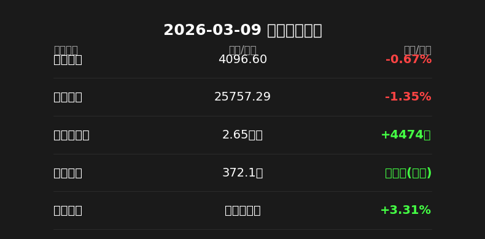

# 每日市场观察：2026年3月9日 (收盘概报)

今天，A股与港股在波动的国际地缘政治背景下展现出截然不同的韧性。A股在经历大幅波动后成功“金针探底”，而港股则见证了史诗级的南向资金大扫货。

## A股：金针探底，万亿成交重现韧性

截至收盘，**上证指数**下跌 **0.67%**，报 **4096.60点**；**创业板指**下跌 **0.64%**。全天两市成交额高达 **2.65万亿元**，较昨日显著放量。

*   **行情解读**：
    > 尽管受外围局势压制早盘低开，但 A 股随后走出坚实的修复行情。日线形态上呈现典型的“金针探底”，显示在 4100 点关口下方有极强的资金承接力度。两市放量近 4500 亿，说明多头正在底部积极换手。

*   **领涨板块**：
    *   **石油/煤炭**：中东局势升级推动中国海油股价创下历史新高（盘中一度触及涨停）。
    *   **AI/算力**：受政府报告“人工智能+”任务提振，AI 训练、算力租赁、电网设备板块表现活跃，优刻得 20% 涨停。

## 港股：外资撤离，内资“史诗级”抄底

**恒生指数**今日表现较弱，收跌 **1.35%** 报 **25757.29点**。但盘面出现了一个极其显著的数据：**南向资金净买入额达 372.13 亿港元**，创下历史单日最高纪录。

*   **核心观察**：
    > 虽然美联储降息预期因通胀担忧有所推迟，导致外资暂时流出，但国内公募及长线资金正加速布局估值处于底部的港股。煤炭、石油及新能源汽车（小鹏、比亚迪）成为南下资金的首选。

## 宏观政策：2026 “十五五”开局力度空前

2026年政府工作报告出炉，为全年定下了稳健进取的基调：
*   **增长目标**：设定在 **4.5% - 5%**，区间目标展现了政策灵活性。
*   **财政弹药**：拟发行 **1.3万亿** 超长期特别国载，用于“两重”、“两新”建设。
*   **货币环境**：央行维持“适度宽松”，确保流动性充裕以应对外部冲击。

*   **机构观点**：
    > 中信建投认为，当前 A 股情绪杀跌已接近极致，若地缘局势不进一步恶化，市场将快速回归自身节奏，建议锁定“确定性”与“高景气”赛道。

---

### 今日市场情绪：负隅顽抗，韧性十足

*免责声明：内容仅供参考，不构成投资建议。*
