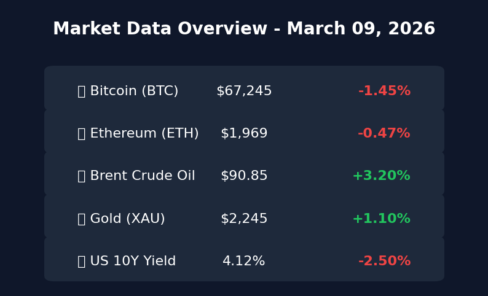
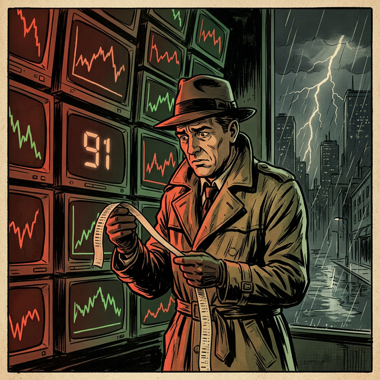

# 2026-03-09 周一早间：避险情绪升温，美就业软着陆还是硬威胁？

> **核心摘要**：周末中东局势升级推动原油站上 $91，避险情绪显著升温。美 2 月就业数据意外疲软（失业率升至 4.4%），引发市场对衰退与降息节奏的剧烈博弈。加密货币市场承压，BTC 回撤至 $67,000 点位。

## 1. 全球市场周末要闻回顾总结

*   **中东局势升级，油价飙升**：受美国、以色列与伊朗冲突加剧影响，布伦特原油一度逼近 **$91/桶**。地缘政治不稳定性显著增加了全球供应链压力及通胀预期，市场呈现明显的“Risk-off”（规避风险）特征。
*   **美国就业数据“爆冷”**：2 月非农就业减少 **9.2 万**人，失业率爬升至 **4.4%**。这一数据严重超出市场预期，投资者在衰退担忧（经济增长停滞）与降息预期（美联储或重回鹰派）之间摇摆。
*   **两会时间：中国政策博弈**：全国两会继续聚焦社会经济发展规划，市场高度关注有关大宗商品、能源需求及科技供应链的增量政策信号。
*   **企业动向**：花旗集团承诺投入 600 亿美元支持美国住房负担能力计划；尼日利亚解决 OPL 245 油田争议，提振其财政前景。

> **核心解读**：当前市场交易逻辑已从“软着陆”向“衰退担忧”偏移。就业数据的下行虽然为降息打开了空间，但地缘政治引发的能源成本上升却在掣肘美联储的政策灵活性。此时的“静默期”意味着宏观数据对后续波动将更具穿透力。

## 2. 华尔街策略：2026 牛市余勇尚在？

*   **高盛 (Goldman Sachs)**：对 2026 年依然持有建设性态度。虽指数回报可能低于 2025 年，但预计标普 500 可达 **7,600** 点。强调 AI 驱动的生产力提升和非衰退性降息是核心支柱。
*   **摩根大通 (J.P. Morgan)**：预测全球股市仍有双位数增长。认为任何短期由于地缘政治引发的调整均为买入机会，重点看好资产密集型经济转型及 AI 投资深化。
*   **摩根士丹利 (Morgan Stanley)**：认为标普 500 年底目标位在 **7,500** 点左右，步入牛市第四年。建议避开纯被动指数投资，转向受 AI 效率提升驱动的广泛行业领军企业。

> **核心解读**：大行观点趋于共识，即 2026 年是“牛市中后期”但并非终结。AI 的实质性业绩贡献正从科技巨头向传统行业扩散，形成所谓的“Broadening Bull Market”（广义牛市）。

## 3. 本周全球经济日历重点前瞻

*   **3月9日（周一）**：**中国 2 月 CPI/PPI 数据**（关注通胀回暖信号）；日本 Q4 GDP 终值。
*   **3月11日（周三）**：**美国 2 月 CPI**（全周核心重点，决定 3 月会议调性）；德国 CPI。
*   **3月12日（周四）**：美国 2 月 PPI；土耳其央行利率决议。
*   **后续关注**：下周（3月17-18日）联储 FOMC 会议。

## 4. 行情速递：避险资产与加密货币

*   **比特币 (BTC)**：周末回撤至 **$67,245** 附近（单日跌幅约 1.45%），关键支撑区间在 $67k-$68k。ETF 资金连续出现显著净流出（3月6日流出 $3.48 亿），显示机构情绪趋于审慎。
*   **以太坊 (ETH)**：跌破 $2,000 关口，收于 **$1,969** 附近。市场“恐惧与贪婪指数”维持在 20 左右的恐惧区间。

---
## 5. 今日市场情绪：观望中的焦虑

根据周末的地缘危机与就业利空，今日市场主旋律为“防御性观望”。

*免责声明：内容仅供参考，不构成投资建议。*
