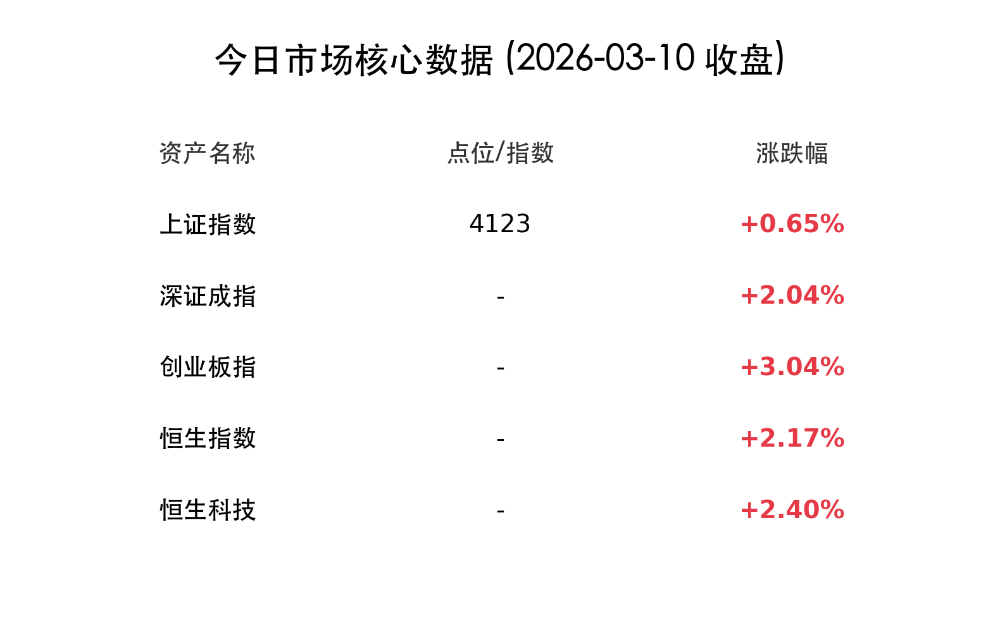

# 每日市场观察：A股、港股强势反弹，AI热潮席卷全场 (2026-03-10 收盘)

## 核心行情概览

今日 A 股与港股市场在外部地缘政治压力缓解及 AI 题材爆发的带动下，呈现强劲反弹态势。三大指数高开高走，全线收红。

### **A 股市场**
*   **沪指：** 收涨 **0.65%**，报 **4123点**。
*   **深证成指：** 收涨 **2.04%**。
*   **创业板指：** 收涨 **3.04%**，领涨大盘。
*   **成交量：** 全市场成交额达 **2.42万亿元**，较前一交易日缩量约2538亿元，但仍维持在极高水平。
*   **资金流向：** 市场呈现普涨格局，全市场超4500只个股上涨。场外资金在指数回踩后积极入场。

### **港股市场**
*   **恒生指数：** 收涨 **2.17%**。
*   **恒生科技指数：** 收涨 **2.40%**。
*   **资金面：** 市场交投活跃，南向资金延续强劲流入势头。

---

## 核心解读与市场逻辑

> **1. 地缘局势缓和，避险情绪消退**
> 美国总统特朗普称中东战争“基本结束”，并暗示将通过释放储备或制裁豁免来压低油价。这一表态直接导致全球原油价格剧震回落，避险情绪消退，资金回流权益市场。

> **2. OpenClaw（龙虾）热潮引爆 AI 算力**
> 开源 AI 智能体 OpenClaw 火爆出圈，引发市场对“AI+硬件”及端侧推理算力需求的重新定价，成为今日两地市场最强主线。CPO、光通信板块多股涨停。

> **3. 宁德时代年报提振权重信心**
> 宁德时代发布 2025 年报，净利润达 722 亿元，拟派发超 300 亿元巨额分红，提振了新能源及权重股信心。

---

## 领涨与领跌板块

### **领涨板块**
*   **AI 算力与硬件：** CPO 概念、OpenClaw 概念爆发，光迅科技、烽火通信等涨停。
*   **通信与 6G：** 光纤光缆、通信设备板块大涨，长飞光纤涨停。
*   **半导体（港股）：** 天数智芯涨超 30%，澜起科技涨超 10%。

### **领跌板块**
*   **资源类：** 油气股集体重挫，煤炭、黄金及钛白粉板块跌幅居前。

---

## 今日市场情绪

---
免责声明：内容仅供参考，不构成投资建议。
