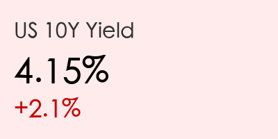

# 全球市场晨报：特朗普“一句话”逆转“疯狂星期一”，油价高台跳水

**日期：2026年03月10日 (星期二)**  
**时段：上午 (国际市场隔夜复盘)**

---

## 1. 全球核心指数表现 (3月9日收盘)

隔夜美股上演了戏剧性的“深V”大反转。受地缘政治局势变动影响，三大股指全线转涨。

*   **标普500指数 (S&P 500)**：报收 **6,795.99** 点，上涨 **55.97** 点 (+0.83%)。
*   **纳斯达克综合指数 (Nasdaq)**：报收 **22,695.95** 点，上涨 **308.27** 点 (+1.38%)。
*   **道琼斯工业平均指数 (Dow Jones)**：报收 **47,740.80** 点，上涨 **239.25** 点 (+0.50%)。

> **深度解读**：
> 市场开盘时曾极度恐慌，道指一度重挫近 **900** 点。然而，随着特朗普总统在盘中表示与伊朗的冲突“基本结束 (very complete)”，市场情绪瞬间逆转。这一言论引发了最后1小时的报复性拉升。

---

## 2. 大宗商品与债市动态

*   **WTI原油**：波动剧烈，从盘中近 **$120** 的高点回落至 **$86.24** 美元 (-8.5% 从日内高点)。
*   **现货黄金**：小幅回落至 **$5,133** 美元/盎司。
*   **美债10年期收益率**：上升至 **4.15%** 附近，通胀担忧仍然挥之不去。

> **深度解读**：
> “油价过山车”反映了市场对霍尔木兹海峡封锁风险的定价。在外交缓和预期下，原油多头发生踩踏。但由于上周非农数据失色（失业率升至 4.4%），“滞胀”阴影依然笼罩在债市上方。

---

## 3. 加密货币市场

*   **比特币 (BTC)**：目前在 **$69,250** 附近震荡，试图重新夺回 7 万美元大关。
*   **以太坊 (ETH)**：由于今日（3月10日）将进行重要的网络升级，各大交易所已暂时关闭充提服务。

> **深度解读**：
> 比特币表现出了一定的“数字黄金”韧性。在极端恐慌指数触及 8 (极度恐惧) 之后，买盘开始介入。市场正屏息以待今日下午的以太坊升级表现。

---

## 4. 市场核心洞察

> **核心观点 1：特朗普言论的“情绪阀门”作用**  
> 市场目前处于极度敏感期，总统的非正式表态直接主导了隔夜数百亿美元的资金流向，这显示出地缘政治逻辑已完全凌驾于基本面之上。

> **核心观点 2：科技股的“避风港”效应**  
> 以英伟达 (+2.7%) 为首的 AI 龙头在动荡中表现出色，投资者倾向于认为无论地缘政治如何，AI 革命的确定性最高。

> **核心观点 3：通胀与滞胀的博弈**  
> 尽管油价回调，但服务业通胀和疲软的就业数据正在让美联储陷入两难。目前市场已将 2026 年首次降息的预期推迟到了 9 月。

---

## 今日市场情绪插画

---
*免责声明：内容仅供参考，不构成投资建议。*
