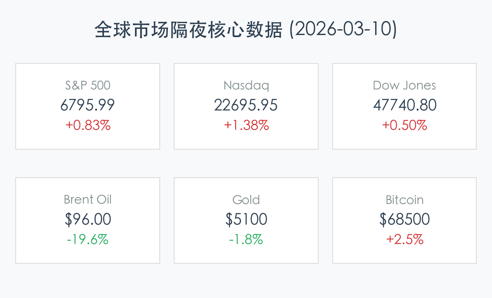

# 每日市场核心简报 (2026-03-10 早报)

## 隔夜全球市场概览

周一（3月9日），美股市场上演惊天逆转。开盘受中东局势升级影响大幅跳空低开，随后在特朗普总统关于战争“基本结束”的言论刺激下，能源市场剧烈回吐涨幅，三大股指集体反弹收涨。

### 核心指数表现
*   **S&P 500**: **6,795.99** (+0.83%)
*   **Nasdaq Composite**: **22,695.95** (+1.38%)
*   **Dow Jones**: **47,740.80** (+0.50%)

### 核心解读与市场洞察
> **1. 地缘政治驱动的“过山车”行情**：
> 交易时段初期，由于中东地区涉及美国、以色列和伊朗的冲突，布伦特原油一度冲高至 **$119.50/桶**，引发全球通胀担忧。然而，下午盘特朗普总统的乐观言论以及G7能源部长释放战略石油储备（SPR）的信号，导致油价暴跌回 **$90** 区间。这种极端的波动显示出当前市场对外部政治因素的高度敏感。
>
> **2. 劳动力市场降温与加息预期的博弈**：
> 投资者仍在消化上周五非农数据。2月新增就业减少 **9.2万**，失业率升至 **4.4%**。在通常情况下这被视为利空，但在通胀高企的背景下，劳动力市场的降温反而给了美联储未来可能的政策转圜空间，科技股受此提振表现强劲。
>
> **3. 避险情绪的暂时降温**：
> 美债收益率在油价冲顶时一度飙升，10年期收益率最高触及 **4.21%**，但随后回落至 **4.11%** 附近。金价在避险情绪消退和收益率波动的双重影响下，从 **$5,192** 高位回撤至 **$5,100** 附近。

---

## 加密货币市场动态

加密市场目前处于“脆弱的平衡”状态，正试图从油价冲击和宏观压力中恢复。

*   **Bitcoin (BTC)**: 目前在 **$68,500** 附近波动，24小时涨幅约为 **2.5%**。
*   **Ethereum (ETH)**: 维持在 **$2,000** 关口。
*   **恐惧与贪婪指数**: 仍处于 **“极度恐惧” (10-19)** 区间。

### 核心动态
> **1. “稀缺性叙事”强化**：
> 比特币网络即将迎来第 **2000万枚** 币的产生（预计3月11-15日间），这将使流通量达到总量的 95.24%，长期持有者的信心在市场波动中表现坚挺。
>
> **2. 宏观压力的“拉锯战”**：
> 尽管 BTC 显示出一定的韧性，但由于油价波动导致的通胀担忧，市场普遍预期美联储降息可能推迟到 2026 年 9 月。在 3 月 17-18 日 FOMC 会议前，交易员普遍持防御态度。

---

## 市场情绪插图
*(由于系统 Image Generation 工具暂时不可用，今日情绪插图暂缺)*

---

免责声明：内容仅供参考，不构成投资建议。
