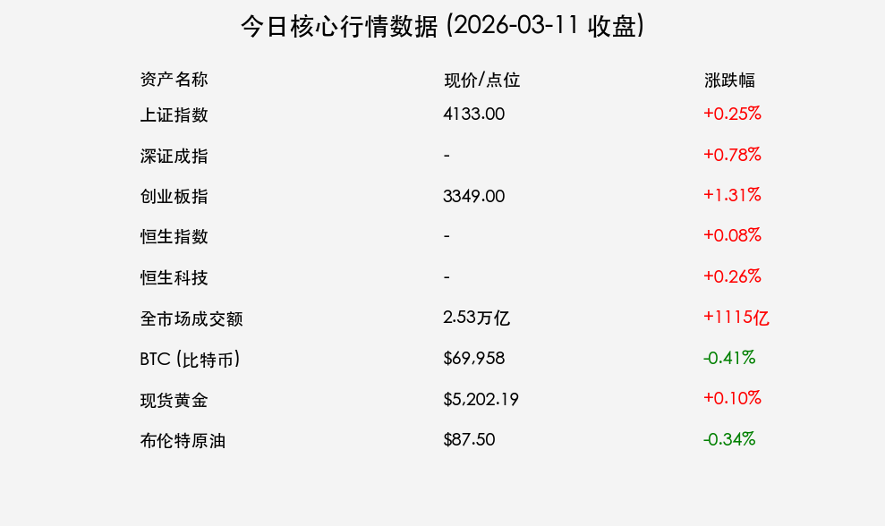

# 2026年3月11日 每日市场观察

**日期：2026年03月11日 (星期三)** &nbsp; **时段：下午 (国内市场今日收盘)**

> **核心摘要**：今日A股与港股延续反弹势头，新能源产业链在龙头股宁德时代带动下集体爆发，创业板指创下近一个多月新高。两会期间释放的“适度宽松”货币政策信号与“反内卷”导向提振了市场对高质量发展的预期。

## 核心行情复盘

今日市场呈现明显的“权重搭台，题材唱戏”特征。尽管全市场有近3300只个股下跌，但在新能源、基建等核心权重的支撑下，主要指数均实现红盘收官。

*   **上证指数**：报 **4133点**，上涨 **0.25%**。
*   **深证成指**：上涨 **0.78%**。
*   **创业板指**：报收约 **3349点**，上涨 **1.31%**，表现最为强劲。
*   **恒生指数**：微涨 **0.08%**；**恒生科技指数**：上涨 **0.26%**。
*   **成交量**：全市场成交额达 **2.53万亿元**，较前一交易日放量 **1115亿元**。
*   **资金流向**：基础建设行业获逾 **49亿元** 主力资金净流入；**中国能建** 获34亿元流入并拉至停板。
*   **关键资产动态**：
    *   **BTC (比特币)**：$69,958 (-0.41%)
    *   **现货黄金**：$5,202.19 (+0.10%)
    *   **布伦特原油**：$87.50 (-0.34%)

### 领涨板块观察
1.  **新能源产业链**：光伏、储能、锂电全线爆发。**宁德时代** 盘中涨超7%，总市值重回1.8万亿元；港股宁德时代一度涨10%。
2.  **基础建设**：中国能建创历史新高，板块具备极强的资金吸引力。
3.  **科技前沿**：AI领域受 OpenClaw（龙虾）操作系统热议带动；江苏省政策利好触发脑机接口概念异动。

---

## 核心解读与市场逻辑

> **市场逻辑深度剖析**：
> 1. **龙头业绩驱动**：宁德时代等新能源龙头企业业绩预期改善，叠加机构对产能过剩忧虑的边际缓解，触发了超跌后的估值修复。
> 2. **政策预期共振**：两会期间明确“适度宽松”的货币政策导向，并强调“深入整治内卷式竞争”，这标志着政策重点正在从“规模扩张”转向“利润修复”，利好具备定价权的行业龙头。
> 3. **避险与风险并存**：国际市场上，原油受中东局势与IEA储备释放消息影响大幅波动，而国内市场由于政策窗口期的存在，表现出较强的内生稳定性。

---

## 政策脉动

*   **央行动态**：开展265亿元逆回购，利率维持1.40%。行长潘功胜重申灵活运用降准降息，支持资本市场稳健发展。
*   **证监会新规**：发布《关于短线交易监管的若干规定》，将近亲属账户纳入监管，严打违规减持，旨在维护市场公平。
*   **宏观硬指标**：2026年单位GDP二氧化碳排放降低目标设定为3.8%左右，绿色转型进入“硬约束”时代。
*   **“十五五”前瞻**：证监会主席吴清阐述资本市场高质量发展路径，强调从“政策补缺”转向“制度赋能”，重点支持“新质生产力”。

---

## 最新机构观点

*   **中金公司：乘势笃行，风格趋于均衡**
    > 建议采取“成长+周期”双线联动的策略。当前市场正进入盈利预期改善驱动的新阶段，关注AI应用、创新药等业绩兑现板块，以及受“反内卷”政策利好的化工、养殖等顺周期行业。

*   **中信证券：角逐定价权，迈向“低波动慢牛”**
    > 强调中国企业正从“份额优势”转向“定价权优势”，这是A股迈向慢牛的基础。看好海外份额持续提升的头部电池企业，以及在提质升级中获益的有色、化工行业。

---

## 今日市场情绪：新能源领涨，两会政策定调

---

**免责声明：内容仅供参考，不构成投资建议。**
