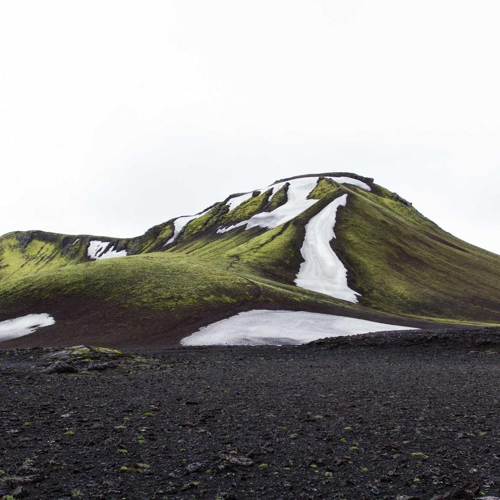

# 全球市场晨间快报：CPI 揭榜前夕的“风暴眼”

**日期：2026年03月11日 (星期三)** &nbsp; **时段：上午 (国际市场隔夜复盘)**

> **核心摘要**：美股隔夜收盘涨跌互现，市场进入 2 月 CPI 数据公布前的“极度谨慎”模式。原油受去地缘溢价影响大幅下挫，而比特币在特朗普和平信号下重回 7 万美元上方。

## 核心行情复盘

隔夜美股表现分化，科技股小幅回暖但能源板块受油价暴跌拖累。标普 500 指数微跌，纳指在芯片股支撑下勉强收涨。

*   **标普 500 (S&P 500)**：收于 **6,781.48** 点，跌幅 **0.21%**。
*   **纳斯达克 (Nasdaq)**：收于 **22,697.10** 点，微涨 **0.01%**。
*   **道琼斯 (Dow Jones)**：收于 **47,706.51** 点，跌幅 **0.07%**。
*   **黄金 (Gold)**：报 **$5,231.79**，涨幅 **1.9%**，在地缘不确定性中仍具备避险吸引力。
*   **原油 (WTI)**：暴跌 **10.0%** 至 **$83.45**，创下近期单日最大跌幅。
*   **比特币 (Bitcoin)**：强势回升至 **$70,665**，涨幅 **2.1%**。

## 核心解读与市场逻辑

> **1. 原油“跳水”背后的逻辑转变**：
> 隔夜能源市场发生剧震，WTI 原油价格出现“自由落体”式下跌。主因是市场对霍尔木兹海峡封锁的担忧因美国可能的军事介入传闻而缓解，叠加特朗普关于伊朗冲突可能“很快结束”的表态，导致前期堆积的“战争溢价”迅速溃散。IEA 提出的战略储备投放计划进一步重创了多头信心。
> 
> **2. 决战 CPI 指数**：
> 华尔街目前的交易逻辑已完全锁定在即将于美东时间 8:30 公布的 2 月 CPI 数据。这是下周美联储议息会议前最重要的通胀参考。市场普遍预期同比增速在 2.4%-2.5% 之间，任何超预期的粘性都将彻底浇灭上半年的降息希望。

## 政策脉动

*   **美国 CPI 发布（今日）**：2 月核心 CPI 预期维持在 **2.5%**。若数据走高，美联储的“长期高利率”政策将更具确定性。
*   **美联储 3 月会议前瞻**：目前市场定价显示，美联储在 3 月 17-18 日会议上**维持利率在 3.5%-3.75% 区间不变**的概率高达 97%。
*   **地缘局势缓冲**：美方释放可能介入霍尔木兹海峡以恢复通航的信号，全球供应链压力预期小幅缓解。

## 最新机构观点

*   **高盛 (Goldman Sachs)**：持防御立场。警告称虽然服务通胀在降温，但关税政策带来的核心商品成本上涨可能在 5 月前将 CPI 推高至 **3.0%**，这将迫使美联储在更长时间内保持鹰派。
*   **摩根大通 (JPMorgan)**：认为通胀具有“粘性”，是 2026 年的市场主旋律。虽然看好股市韧性，但认为美国经济陷入衰退的可能性依然维持在 **35%**。
*   **摩根士丹利 (Morgan Stanley)**：看淡大宗商品长期走势。预计随着地缘溢价消退，布伦特原油将在 2026 年三季度前跌至 **$55-$57.50** 的底部区间。

## 今日市场情绪：极度恐惧与屏息凝神

目前市场“恐慌与贪婪指数”处于 **13-18** 的“极度恐惧”区间，反映了交易员在重大数据出炉前的极端焦虑。

免责声明：内容仅供参考，不构成投资建议。
