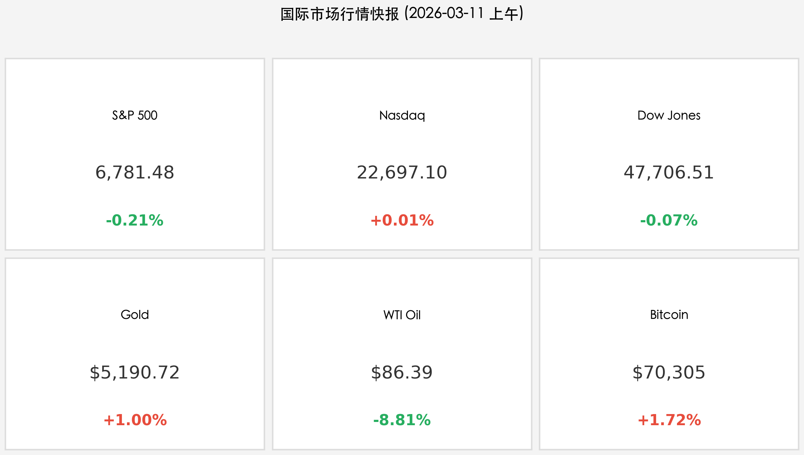

# 国际市场隔夜复盘与早报

**日期：2026年03月11日 (星期三)**
**时段：上午 (国际市场隔夜复盘)**

> **核心摘要**：美股周二收盘涨跌互现，市场在关键 CPI 数据公布前陷入“冷冻期”。受 G7 释放战略原油储备消息影响，原油价格崩跌近 9%，极大缓解了通胀担忧。黄金挑战 $5,200 关口，BTC 站稳 $70,000，全球资本正在 CPI 前夕进行剧烈仓位博弈。

## 板块一：核心行情复盘

周二（3月10日）美股三大指数表现平稳，投资者情绪克制：
* **标普500指数 (S&P 500)**：收于 **6,781.48** 点，跌幅 **-0.21%**。
* **纳斯达克综合指数 (Nasdaq)**：收于 **22,697.10** 点，微涨 **+0.01%**，AI 板块提供支撑。
* **道琼斯工业平均指数 (Dow Jones)**：收于 **47,706.51** 点，跌幅 **-0.07%**。

**大宗商品与加密货币表现：**
* **黄金 (Gold)**：报价 **$5,190.72** (+1.00%)，地缘避险需求持续。
* **WTI 原油 (Oil)**：报价 **$86.39** (**-8.81%**)，单日崩跌近 9%。
* **比特币 (BTC)**：报价 **$70,305** (+1.72%)，风险偏好有所回暖。

## 板块二：宏观博弈与政策脉动

1. **CPI 数据审判日**：市场焦点完全锁定在今日（3月11日）美东时间 8:30 公布的 2 月 CPI 报告。共识预期同比增速为 **2.4%**，核心 CPI 为 **2.5%**。该数据将直接决定美联储未来的利率路径。
2. **能源市场巨震**：原油价格从近期的 $120 高点大幅回落，主因是 G7 国家讨论释放 3-4 亿桶战略储备原油以平抑通胀。这一举动在 CPI 公布前夕被视为重大的政策调控信号。
3. **全球经济信号**：
   * **中国贸易**：2 月出口同比增长 **21.8%**，大幅超预期，显示全球需求依然坚挺。
   * **日本 GDP**：第四季度增长上修为 **1.3%**，企业投资强劲。

## 板块三：核心解读与机构策略 (Deep Dive)

> **高盛 (Goldman Sachs)**：当前美国宏观产品的空头头寸已达到 3 年来的最高水平（第 93 百分位）。如果今日 CPI 录得低于预期的数值，市场可能会出现极其猛烈的“空头挤压”（Right-tail squeeze risk），迫使空头回补从而推高股市。

> **摩根大通 (JP Morgan)**：对 2026 年的降息节奏持谨慎态度，预计全年仅有 **一次降息**（可能在 9 月）。尽管 2 月非农数据录得负增长（-9.2万），但劳动力市场的降温是否足以让美联储提前行动仍存疑。

> **摩根士丹利 (Morgan Stanley)**：维持长期看涨观点，设定标普 500 目标位为 **7,500** 点。分析师指出，2026 年非科技行业的盈利增长预期（14-16%）是去年的两倍，但这种“高增长预判”意味着容错率极低。

## 板块四：今日市场情绪

## 今日市场情绪：CPI前夕的谨慎与石油重挫后的观望

*(注：由于技术原因，今日情绪插图暂缺)*

---
免责声明：内容仅供参考，不构成投资建议。
