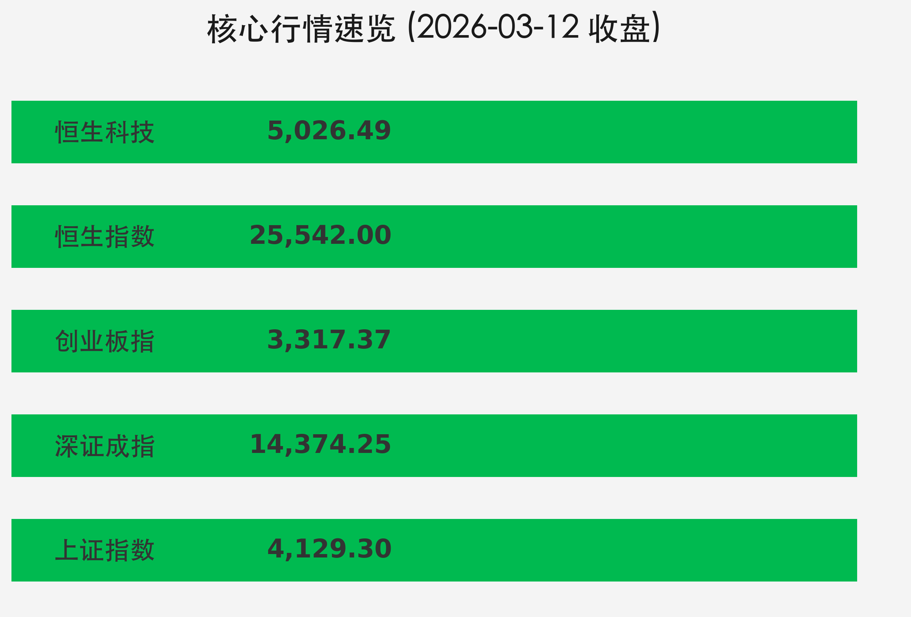

# 每日市场观察：能源板块逆市狂飙，科技成长全线承压

**日期：2026年3月12日 (星期四)** &nbsp; **时段：下午 (国内市场今日收盘)**

> **核心摘要**：今日A股与港股全线回调，中东地缘局势升级引发“能源强、科技弱”的分化格局。成交额维持在2.4万亿高位，资金避险情绪显著，能源与化工产业链成为主要避风港。

## 核心行情复盘

今日市场呈现震荡调整态势，三大指数集体收跌。能源、化工等周期板块在外部因素刺激下逆市爆发。

*   **上证指数**：报 **4129.30点**，跌幅 **0.10%**。
*   **深证成指**：报 **14374.25点**，跌幅 **0.63%**。
*   **创业板指**：报 **3317.37点**，跌幅 **0.96%**。
*   **恒生指数**：报 **25542.00点**，跌幅 **1.38%**。
*   **恒生科技**：报 **5026.49点**，跌幅 **0.56%**。
*   **成交额**：两市全天成交额约 **2.4万亿元**，较前一交易日略有缩量，但市场活跃度依旧。
*   **北向资金**：表现分化，能源龙头获席位净买入，整体呈现避险调仓特征。

**领涨板块：**
*   **绿电/电力**：受《数据中心绿色低碳发展专项行动计划》刺激，绿发电力、华电能源实现3连板。
*   **化工/PTA**：供给收紧预期强烈，金牛化工（9天5板）、三房巷等十余股涨停。
*   **煤炭**：避险及能源涨价逻辑驱动，兖矿能源、郑州煤电涨停，中煤能源创18年新高。

**领跌板块：**
*   军工装备、燃气轮机、贵金属、机场航运及半导体板块表现低迷。

## 核心解读与市场逻辑

1.  **地缘政治引发连锁反应**：美伊冲突持续升级，霍尔木兹海峡航运受阻预期推高了全球能源及化工品价格。原油价格的剧烈波动导致资金从高弹性的科技成长股流向低估值的能源周期股。
2.  **能源供应预警**：尽管国际能源署（IEA）宣布释放4亿桶紧急石油储备，但市场对短期供应缺口的担忧仍占据主导，支撑了煤、油、气等板块的强势。
3.  **科技股获利回吐**：在避险情绪升温背景下，前期涨幅较大的AI及半导体个股面临估值修复压力，部分获利盘选择在动荡期套现离场。

## 政策脉动

*   **国际消息**：特朗普称与伊朗的战争将“很快”结束；国际能源署（IEA）释放史上最大规模（4亿桶）石油储备。
*   **贸易摩擦**：美国拟对包括中国、欧盟在内的16个贸易伙伴发起301调查。
*   **国内数据**：国新办定于3月16日发布1-2月国民经济运行数据，市场进入数据验证前的观察期。
*   **监管动态**：香港证监会与廉政公署联合打击内幕交易，引发市场对合规风险的关注。

## 最新机构观点

*   **中信证券**：建议增加**低估值因子**敞口。提出“HALO”（重资产、低技术替代风险）资产是阶段性主题，看好具备生存确定性的实物资产。
*   **中金公司**：警惕美国“类滞胀”风险，资产配置上推荐 **商品 > 股票 > 债券**。预计美联储降息时点可能推迟至二季度。

## 今日市场情绪：能源狂飙与科技避险

---
免责声明：内容仅供参考，不构成投资建议。
