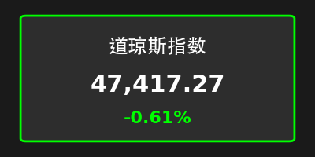
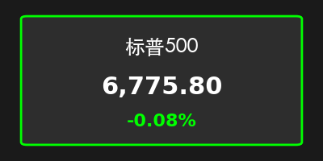
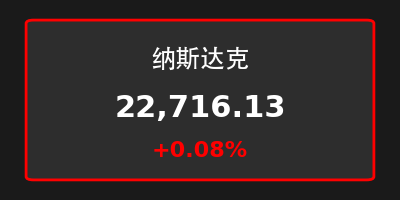
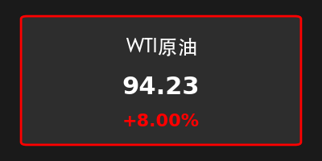
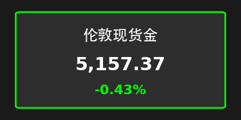
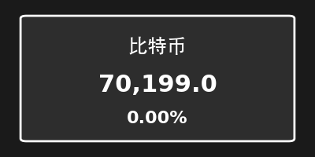
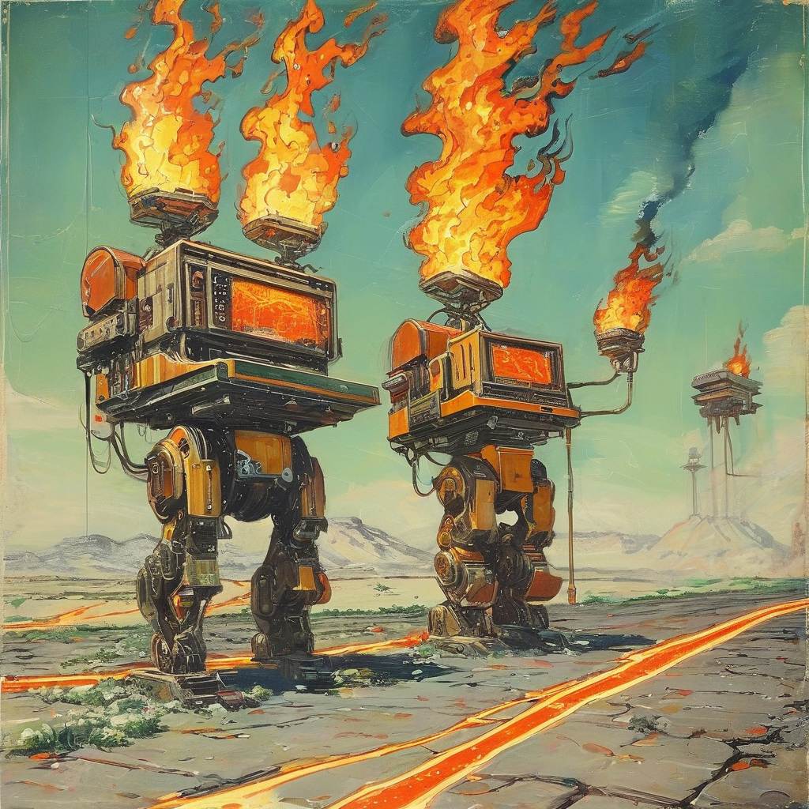

# 2026年3月12日 晨间市场简报

**日期：2026年03月12日 (星期四)** &nbsp; **时段：上午 (国际市场隔夜复盘)**

> **核心摘要**：伊朗冲突进入第12天，霍尔木兹海峡封锁风险引发油价单日飙升约8%，市场滞胀担忧加剧。美股三大指数表现分化，纳指在AI龙头股支撑下微涨，道指则因防御性抛售深跌。

## 核心行情复盘

2026年3月11日（周三）美股收盘表现不一。市场在平淡的通胀数据与剧烈的地缘政治动荡之间震荡，能源成本的飙升成为压制风险偏好的主因。

*   **道琼斯指数**：收于 **47,417.27点**，下跌 **0.61%**（跌幅约289点）。
*   **标普500指数**：收于 **6,775.80点**，下跌 **0.08%**。
*   **纳斯达克综合指数**：收于 **22,716.13点**，上涨 **0.08%**。
*   **10年期美债收益率**：攀升至 **4.22%**。

**大宗商品与加密货币：**
*   **WTI原油**：收于 **94.23美元/桶**，涨幅高达 **8.0%**。
*   **布伦特原油**：约 **91.98美元/桶**，涨幅约 **5%**。
*   **伦敦现货金**：报 **5,157.37美元/盎司**，下跌 **0.43%**。
*   **比特币 (BTC)**：约 **70,199美元**，维持高位震荡。

## 核心解读与市场逻辑

> **战争与能源的负反馈循环**：
> 伊朗冲突升级导致霍尔木兹海峡供应中断风险极度升高。尽管国际能源署 (IEA) 宣布释放创纪录的4亿桶储备，但市场依然担忧供应缺口。能源成本的飙升不仅直接打击了道指中的传统工业板块，还引发了市场对“二次通胀”的恐慌。

> **通胀数据的“失效”**：
> 美国2月CPI同比增长2.4%，虽符合预期，但投资者普遍认为该数据具有滞后性，未能反映近期战争引发的油价暴涨。交易员已将美联储降息预期从6月推迟至7月。

> **AI科技股的避风港属性**：
> 纳指的微涨主要由甲骨文 (Oracle) 财报超预期（大涨9%）及英伟达 (Nvidia) 20亿美元的新投资消息支撑。AI板块的强劲盈利预期在宏观迷雾中提供了难得的确定性。

## 政策脉动

*   **联合国外交努力**：安理会通过第2817号决议，要求伊朗停止打击海湾船只，但地缘紧张局势尚未实质缓解。
*   **IEA紧急干预**：释放4亿桶石油储备，旨在稳定油价，目前效果有限。
*   **中国政策动态**：十四届全国人大四次会议今日闭幕，市场密切关注闭幕后的政策信号及对“十五五”规划的展望。

## 最新机构观点

*   **高盛 (Goldman Sachs)**：
    > 维持标普500目标价 **7,600点**。高盛策略师认为，牛市将延续，但动力转向企业盈利。地缘政治引发的回调应视为“**战术性抄底机会**”，只要不发生持久的能源断供，看涨逻辑不变。
*   **摩根士丹利 (Morgan Stanley)**：
    > 设定标普500目标价为 **7,800点**。首席策略师Mike Wilson将2026年定义为“**滚动复苏下的广谱牛市**”，认为美股表现将持续优于全球其他市场，由AI效率提升和政策红利驱动。

## 今日市场情绪：能源焦虑与科技支撑

---
免责声明：内容仅供参考，不构成投资建议。
