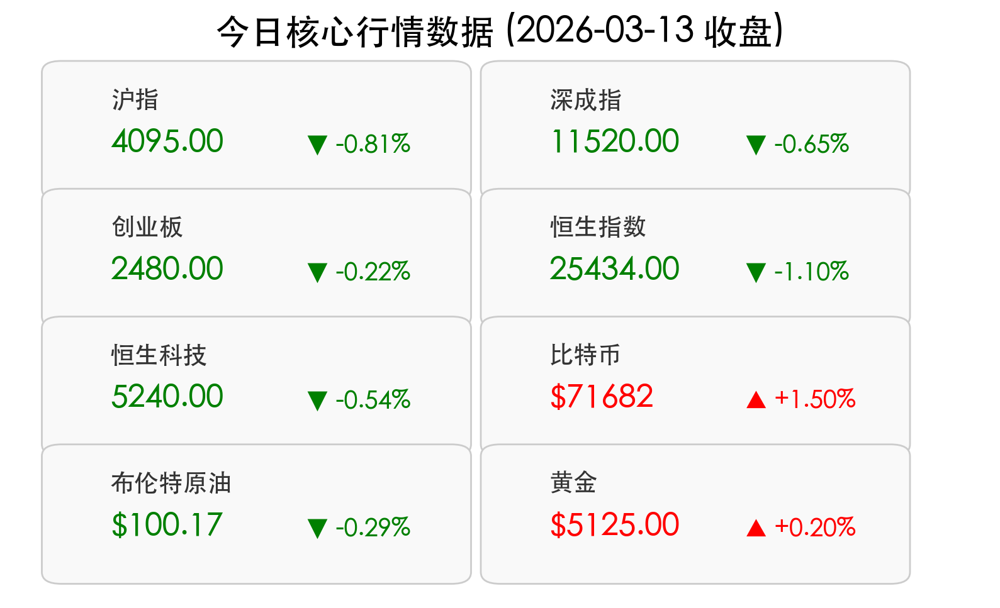

# 每日金融市场观察：A股失守4100点，能源危机阴影笼罩全球

**日期：2026年03月13日 (星期五)** &nbsp; **时段：下午 (国内市场今日收盘)**

> **核心摘要**：今日A股三大指数午后集体走弱，沪指失守4100点关口。受中东局势升级、伊朗威胁封锁霍尔木兹海峡影响，全球原油价格高位震荡，能源焦虑导致避险资金加速轮动，电力设备、化肥等板块逆市走强。

## 核心行情复盘

今日A股市场呈现明显的震荡调整态势，超过3800只个股下跌。

*   **沪指（上证指数）**：收报 **4095.00点**，下跌 **0.81%**，失守4100点整数关口。
*   **深证成指**：下跌 **0.65%**。
*   **创业板指**：下跌 **0.22%**。
*   **全市场成交额**：沪深两市合计约 **2.42万亿元**，较前一交易日缩量约433亿元。
*   **港股表现**：恒生指数收报 **25,434点**，下跌 **1.10%**；恒生科技指数收跌约 **0.54%**。
*   **大宗与加密**：布伦特原油维持在 **$100.17** 高位；比特币逆势走强，稳守 **$71,682**。

**板块动向：**
*   **领涨**：风电设备、化肥/农化制品、电池/储能、白酒/银行。
*   **领跌**：小金属/贵金属、算力租赁/AI概念、电网设备。

## 核心解读与市场逻辑

> 今日市场的核心驱动力在于**地缘政治风险的急剧升温**。伊朗关于封锁霍尔木兹海峡的威胁直接冲击了全球能源供应链预期。
> 1. **能源成本推升通胀预期**：国际油价站稳100美元关口，引发市场对全球通胀长期化的担忧，直接压制了港股及A股中对利率敏感的科技板块。
> 2. **避险资金的结构性轮动**：资金从前期涨幅较大的AI、小金属等领域流出，转向防御性的白酒、银行，以及受供应短缺预期提振的化肥和受益于能源转型的风电板块。
> 3. **外部环境扰动**：隔夜美股三大指数集体收跌，加剧了亚太市场的观望情绪。

## 政策脉动

1. **中国人民银行**：行长潘功胜明确将继续实施**适度宽松的货币政策**，强调逆周期和跨周期调节，目标是促进经济稳定增长和物价合理回升。
2. **证监会**：明确“十五五”时期将重点提升上市公司的**“可投性”**，同时强化严监管，近期联合廉政公署打击内幕交易，释放净化市场环境的强烈信号。
3. **国家发改委**：表示2026年 **4.5%至5%** 的GDP增长目标有坚实基础实现，并将《国家发展规划法》正式纳入法律安排，增强政策的可预期性。
4. **指数调整**：科创50、科创100等指数样本的季度定期调整于今日收市后正式实施。

## 最新机构观点

*   **中信证券**：市场正迈向“低波动慢牛”，建议以“涨价”为矛，关注具备竞争优势的资源品和传统制造业。2026年是制造业定价权重估的关键年，AI应用和绿色能源将是长线主赛道。
*   **中金公司**：预计A股风格将趋向“均衡”，驱动力从估值修复转向基本面驱动。在复杂国际环境下，应重视AI应用、创新药等景气成长板块，以及化工、养殖等周期反转行业。

## 今日市场情绪：能源供应焦虑与避险轮动

---
免责声明：内容仅供参考，不构成投资建议。
