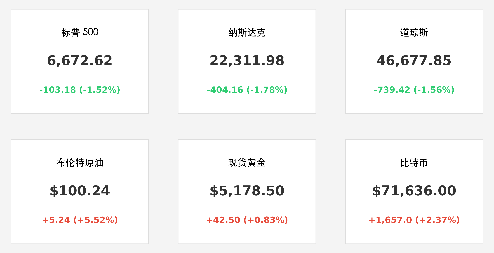

# 隔夜全球市场观察：原油破百与通胀幽灵

**日期：2026年03月13日 (星期五)** &nbsp; **时段：上午 (国际市场隔夜复盘)**

> **核心摘要**：中东局势骤然升级导致布伦特原油突破 100 美元大关，通胀担忧重燃引发美股三大股指全线大幅下挫，市场情绪陷入“极度恐慌”状态。

## 核心行情复盘

在昨日（3月12日）的交易中，全球金融市场遭受剧烈冲击。由于对能源供应中断和通胀长期高企的恐惧，投资者采取了“先卖出，再提问”的激进策略。

*   **标普 500 (S&P 500)**：收于 **6,672.62** 点，下跌 103.18 点 (**-1.52%**)。
*   **纳斯达克 (Nasdaq)**：收于 **22,311.98** 点，下跌 404.16 点 (**-1.78%**)。
*   **道琼斯 (Dow Jones)**：收于 **46,677.85** 点，下跌 739.42 点 (**-1.56%**)。
*   **恐慌指数 (VIX)**：飙升 **12.63%** 至 **27.29**，反映出市场极度不安。
*   **核心资产**：
    *   **原油**：布伦特原油自 13 个月以来首次站稳 **100 美元/桶** 以上。
    *   **黄金**：作为避险资产受到青睐，价格升至 **$5,178/盎司** 附近。
    *   **比特币**：经历剧烈波动后微涨，目前在 **$71,636** 附近横盘。

## 核心解读与市场逻辑

1.  **地缘政治引爆油价**：伊朗方面关于霍尔木兹海峡可能持续关闭的表态，是本次市场暴跌的直接导火索。该海峡承担了全球约 20% 的石油贸易，其封锁意味着极大的供应缺口。尽管国际能源署（IEA）宣布释放 4 亿桶战略储备，但市场认为这只是“杯水车薪”。
2.  **通胀与利率预期重估**：油价破百直接推升了通胀预期，市场对美联储 2026 年降息的期待大幅降温。2 年期美债收益率跳升至 **3.76%**，显示债市已在定价更长期的紧缩环境。
3.  **科技股与金融股双重压力**：Adobe 因业绩指引疲软及 CEO 突然离职导致股价重挫 7%；同时，摩根大通和高盛因私有信贷市场的流动性压力，股价均下跌超过 4%。

## 政策脉动

*   **中东局势**：多国政府正进行紧急外交斡旋，试图缓解霍尔木兹海峡的紧张局势。
*   **宏观数据前瞻**：市场正屏息以待即将在今日（周五）晚间发布的美国 **PCE 物价指数**（核心个人消费支出）。如果该数据依然强劲，可能会进一步确认通胀失控的风险。
*   **流动性支持**：部分央行已暗示，若市场出现极端流动性枯竭，将考虑提供临时性的市场支撑工具。

## 最新机构观点

*   **高盛 (Goldman Sachs)**：对 2026 年全球增长仍持建设性态度，但警告称，中东局势的进一步升级是能源进口国的最大尾部风险。
*   **摩根大通 (JPMorgan)**：对私有信贷市场发出预警，并已开始限制对相关供应商的贷款，这被市场解读为流动性紧缩的信号。
*   **华尔街大行共识**：多数分析师认为当前进入了“高波动、高油价”的防御阶段，建议增加现金和实物资产（如黄金）的比重。

## 今日市场情绪：极度恐慌与原油冲击

---
免责声明：内容仅供参考，不构成投资建议。
