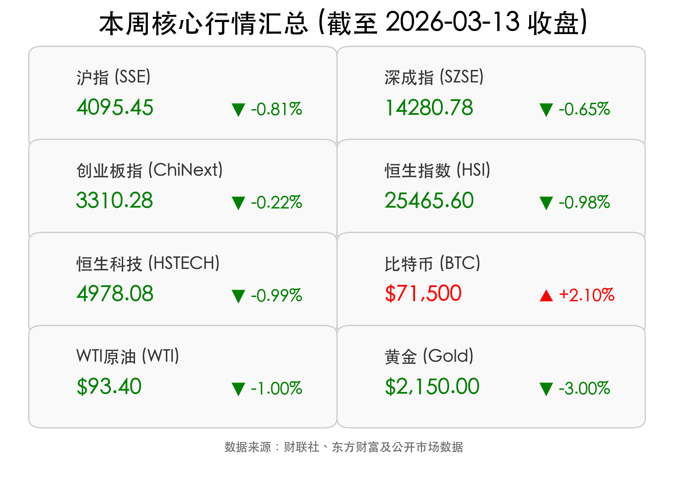

# 2026年3月14日 市场周评：地缘引震、科技突围与“十五五”展望

**日期：2026年03月14日 (星期六)** &nbsp; **时段：下午 (国内市场本周复盘 & 重磅政策解读)**

> **核心摘要**：本周全球金融市场在复杂的“能源+科技”双主线中震荡。国内 A 股随外部压力回调，但核心资产韧性凸显；港股受益于开源 AI 项目 OpenClaw 呈现局部回暖。证监会周末定调“十五五”规划，为后续资本市场深化改革指明方向。

## 核心行情复盘

本周（3月9日-3月13日）A 股呈现明显的“先扬后抑”震荡态势。3月13日（周五）收盘，三大指数集体下挫：
*   **上证指数** 下跌 **0.81%**，收报 4095.45 点，失守 4100 点关口；
*   **深证成指** 下跌 **0.65%**，收报 14280.78 点；
*   **创业板指** 跌幅相对较窄，下跌 **0.22%**，收报 3310.28 点。

全周来看，风电设备、基础化工、家电板块逆市走强。港股方面，受美股波动及外部地缘压力影响，**恒生指数** 与 **恒生科技指数** 周五分别下跌 **0.98%** 与 **0.99%**。

## 核心解读与市场逻辑

1.  **能源安全主导资源板块**：受中东局势升级（美伊冲突及霍尔木兹海峡封锁担忧）影响，国际油价剧烈波动，布伦特原油一度冲破 **100 美元/桶**。能源价格的高位运行虽推升了工业成本，但也带动了国内基础化工、煤炭等资源品的价格表现。
2.  **AI 科技突围**：国产开源 AI 项目 **OpenClaw (龙虾)** 在技术社区引爆热潮，带动恒生科技成分股周中大幅反弹。尽管周五随大盘回落，但“AI 技术应用落地”已成为市场在震荡中寻找结构性机会的核心驱动力。
3.  **资金流向分化**：主力资金全周净流出超 **1460 亿元**，主要集中在机械设备、有色金属及传统科技板块。然而，以**宁德时代**（净流入 36.3亿）、**阳光电源**（32.24亿）为代表的电力设备及新能源龙头获显著增仓，显示机构资金在回调中正积极向具备核心竞争力的“新质生产力”靠拢。

## 政策脉动

*   **资本市场“十五五”蓝图**：证监会主席吴清主持召开党委扩大会议，明确抓紧编制**资本市场“十五五”规划**。会议强调将发布实施深化创业板改革方案，优化再融资机制，释放了持续加强制度建设、严厉打击财务造假、操纵市场等违法行为的强力信号。
*   **公募信披新规发布**：证监会正式发布修订后的《公开募集证券投资基金信息披露定期报告准则》，旨在通过更透明、更简洁的披露要求提升行业透明度，强化投资者导向。
*   **货币供应稳健支持**：央行披露今年前两个月社融增量累计达 **9.6 万亿元**，显示金融体系对实体经济的支持力度依然稳固。

## 最新机构观点

*   **中信证券**：认为 2026 年将是消费行业景气拐点确立的关键之年。短期策略建议“高股息筑基 + 成长消费突围”，密切关注财政刺激政策带来的 Beta 机会。
*   **中金公司**：提出“国际秩序重构”与“中国产业创新”两大因素将共振支撑 A 股。建议关注 AI 应用兑现（机器人、智能驾驶）、外需突围（家电、工程机械）以及周期反转（化工、新能源）三条主线。
*   **招商证券**：预计 3 月指数将在前期高点附近震荡，风格趋于均衡。地缘政治成为最重要的边际变量，建议重点关注“资源 + 科技”双主线。

## 今日市场情绪：科技之光与地缘阴影

今日市场情绪表现出明显的“分化式谨慎”。科技热浪虽暖，但原油与地缘局势的阴影仍笼罩全球风险偏好。在传统避险资产黄金出现回调之际，部分资金开始寻找加密资产或高股息资产作为避风港。

免责声明：内容仅供参考，不构成投资建议。
