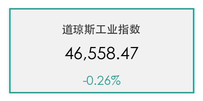
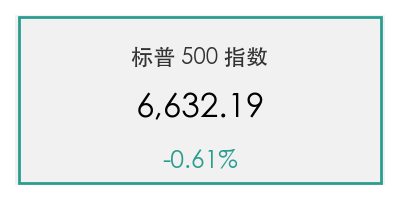
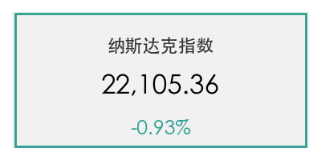
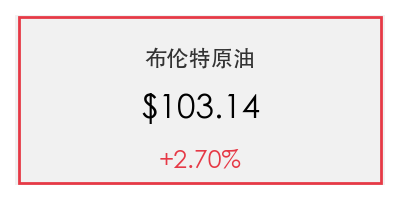
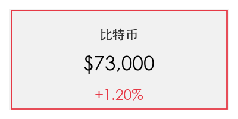
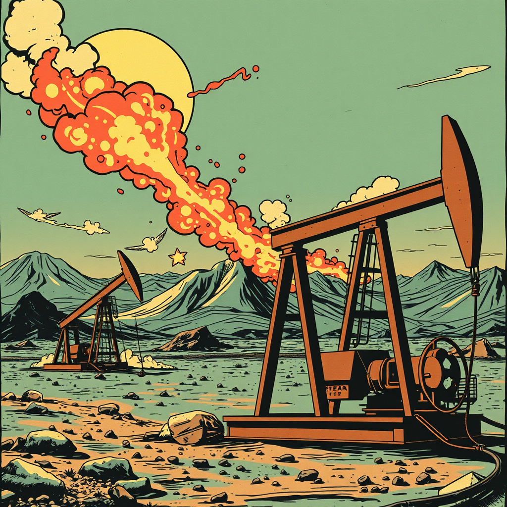

# 全球市场周五收官：油价飙升与“三重不确定性”笼罩美股

**日期：2026年03月14日 (星期六)** &nbsp; **时段：上午 (国际市场隔夜复盘)**

> **核心摘要**：美股周五全线收跌，受中东冲突升级导致的油价大涨及摩根士丹利私募信贷基金限制赎回引发的流动性担忧影响。尽管密歇根大学消费者信心指数降至三月低点，但比特币表现出较强韧性，重回 73,000 美元上方。

## 核心行情复盘

周五美股表现疲软，三大股指均录得连续第三周下滑。能源板块因油价走高表现强劲，而金融与消费支出板块则表现落后。

*   **道琼斯工业平均指数**：收于 **46,558.47** 点，下跌 **119.38** 点 (**-0.26%**)。
*   **标普 500 指数**：收于 **6,632.19** 点，下跌 **40.43** 点 (**-0.61%**)。
*   **纳斯达克综合指数**：收于 **22,105.36** 点，大跌 **206.62** 点 (**-0.93%**)。
*   **大宗商品**：布伦特原油收报 **103.14** 美元/桶，上涨 **2.7%**；WTI 原油结算价接近 **98.71** 美元。
*   **加密货币**：比特币表现稳健，盘中收复 **73,000** 美元关口，在宏观波动中展现出优于黄金及传统指数的流动性属性。

## 核心解读与市场逻辑

> 市场的焦点已从单一的通胀逻辑转向了复杂的“三重不确定性”：AI 带来的行业变革阵痛、中东局势升级引发的能源危机，以及私募信贷领域的流动性压力。

1.  **地缘政治与能源冲击**：霍尔木兹海峡局势持续紧张，导致原油价格本月累计上涨达 40%-46%。能源成本的高企不仅直接推高了通胀预期，更令市场担忧美联储在 2026 年上半年的降息空间被极度压缩。
2.  **流动性焦虑**：摩根士丹利旗下私募信贷基金（North Haven Private Income Fund）将赎回比例限制在 5%，这一举动引发了市场对非公开信贷市场潜在风险的广泛担忧，金融板块受到显著拖累。
3.  **增长预期下修**：2025 年第四季度 GDP 二次估值下修至 **0.7%**，部分反映了去年底政府关门带来的负面冲击，整体经济增长动能显出疲态。

## 政策脉动

*   **消费者信心受挫**：3 月密歇根大学消费者信心指数初值降至 **55.5**（前值 56.6），反映出家庭对高汽油价格和地缘局势可能恶化个人财务状况的深层焦虑。
*   **利率预期调整**：结合本周早些时候高于预期的 PPI 数据，交易员已开始减少对美联储近期降息的押注。市场分析认为，若油价维持在三位数水平，美联储可能被迫在更长时间内维持高利率。

## 最新机构观点

*   **摩根士丹利 (Morgan Stanley)**：分析师 Chris Slimmon 指出，市场目前正处于高压测试期，私募信贷的流动性风险与地缘政治风险交织，投资者需警惕估值过高板块的进一步回调。
*   **高盛 (Goldman Sachs)**：尽管短期承压，高盛分析师对 2026 年全年表现仍持建设性态度，预计全球经济将实现 2.8% 的稳健增长，但警告称 2026 年的指数回报率将显著低于 2025 年。

## 今日市场情绪：三重不确定性下的原油冲击

---
免责声明：内容仅供参考，不构成投资建议。
