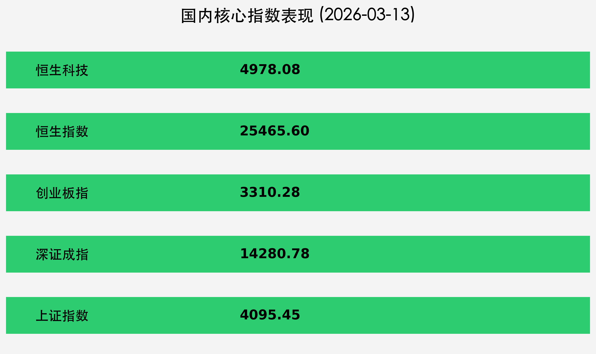

# 金融市场每日简报：周末复盘与下周前瞻

**日期：2026年03月15日 (星期日)** &nbsp; **时段：下午 (国内市场周末复盘与策略前瞻)**

> **核心摘要**：周末政策面迎来密集利好，证监会部署“十五五”规划开局五大方向，央行社融数据超预期。下周将迎来“超级央行周”，美联储等多家央行将公布利率决议。国内1-2月核心宏观数据明日发布，市场进入基本面验证期。

## 核心行情复盘

受地缘政治波动及外部市场压力影响，上周五（3月13日）国内及港股市场集体回调，呈现缩量下跌态势。

*   **上证指数**：报收 **4095.45点**，下跌 **0.81%**，失守4100点整数关口。
*   **深证成指**：报收 **14280.78点**，下跌 **0.65%**。
*   **创业板指**：报收 **3310.28点**，下跌 **0.22%**。
*   **恒生指数**：报收 **25465.60点**，下跌 **0.98%**。
*   **恒生科技**：报收 **4978.08点**，下跌 **0.99%**。
*   **全市场成交**：沪深京三市合计成交 **2.40万亿元**，较前一交易日缩量约416亿元。
*   **资金流向**：主力资金全天净流出 **400.95亿元**；北向资金净流出 **28.6亿元**；南向资金逆市净流入 **150.0亿港元**，避险与抄底情绪并存。

**板块异动**：
*   **领涨**：风电设备（受英国取消关税利好）、农化制品、煤化工（地缘政治驱动油价走高）。
*   **领跌**：算力概念、贵金属、小金属、电网设备。

## 核心解读与市场逻辑

> **宏观数据回暖与验证**：央行最新发布的社融数据显示，前两个月增量累计达9.6万亿元，同比多增3162亿元，显示货币政策支持实体经济力度不减。明日（3月16日）国家统计局将发布1-2月工业增加值、消费、投资等核心数据，这将是验证2026年经济复苏强度的第一个关键窗口。

> **地缘政治二次冲击**：中东局势升级导致国际油价突破100美元/桶，这在短期内推升了资源品（煤炭、石油、化工）的避险价值，但也加剧了全球通胀再次回升的担忧，对成长股估值形成压制。

> **新质生产力催化**：国家药监局批准首个植入式脑机接口医疗器械注册，脑机接口、AI应用等新质生产力主线在周末持续发酵，有望成为下周盘面的结构性亮点。

## 政策脉动

1.  **证监会“十五五”布局**：明确强本强基、严监严管主线，加快编制资本市场“十五五”规划，深化并购重组改革，支持硬科技企业。
2.  **国常会分工落实**：通过2026年重点工作分工方案，要求各部门靠前发力，确保“十五五”良好开局。
3.  **LPR 报价前瞻**：下周五（3月20日）将公布新一期 LPR，市场高度关注在当前经济复苏背景下是否有进一步降息空间。

## 最新机构观点

*   **中信证券**：**“涨价为矛，聚焦低估值重估”**。建议以涨价逻辑（有色、化工、石油）作为进攻主线，同时关注出海主线（机械、创新药、电力设备）。
*   **中金公司**：**“前升后稳，风格趋向均衡”**。认为市场核心逻辑转向盈利驱动，关注“温差收敛”带来的顺周期补涨机会，聚焦AI应用兑现与外需突围。
*   **招商证券**：**“内需回归，指数震荡蓄势”**。强调“全球共振”逻辑，看好扩内需主线（消费、基建）及科技主线（海外与国产算力业绩兑现）。

## 今日市场情绪：冷静观察，政策待发

免责声明：内容仅供参考，不构成投资建议。
