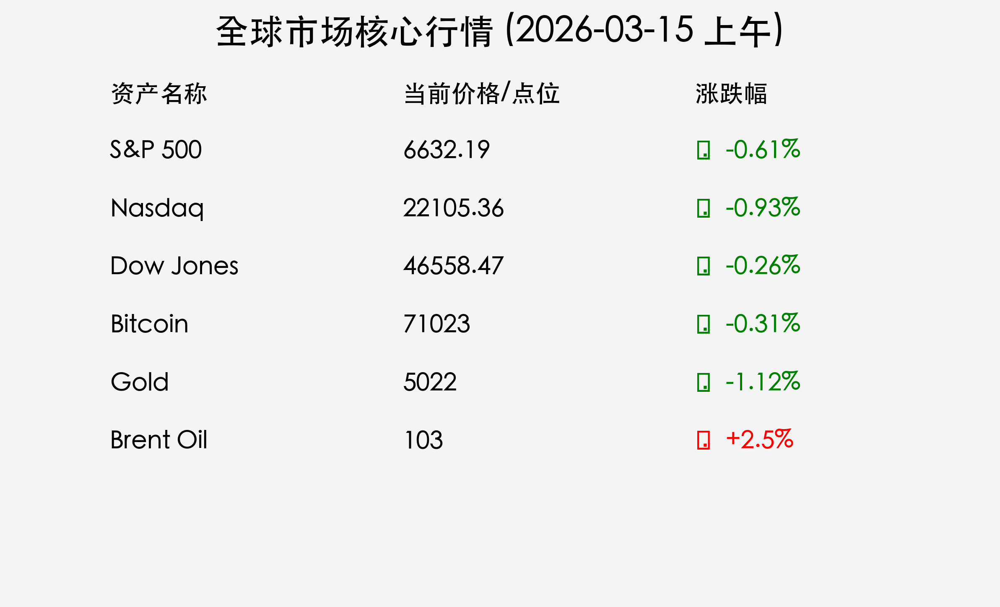

# 2026年3月15日国际市场早报：能源危机与“央行超级周”前瞻
**日期：2026年03月15日 (星期日)** &nbsp; **时段：上午 (国际市场周末复盘)**

> **核心摘要**：中东地缘冲突升级导致霍尔木兹海峡封锁，布伦特原油飙升至103美元，全球通胀压力骤增。本周迎来“超级央行周”，美联储等8家央行将公布利率决议。华尔街机构指出，极端空头头寸可能引发市场“空头挤压”式的报复性反弹。

## 核心行情复盘

上周五（3月13日），美股三大指数集体收跌，连续第三周走低。由于中东局势恶化引发的油价飙升，市场避险情绪浓厚。

*   **S&P 500**：收于 **6632.19** 点，下跌 **40.43** 点 (0.61%)。
*   **Nasdaq**：收于 **22105.36** 点，下跌 **206.62** 点 (0.93%)。
*   **Dow Jones**：收于 **46558.47** 点，下跌 **119.38** 点 (0.26%)。
*   **Bitcoin (BTC)**：当前报 **$71,023**，下跌 0.31%。
*   **Ethereum (ETH)**：当前报 **$2,088**，下跌 0.39%。
*   **Gold (黄金)**：报 **$5,022/盎司**，下跌 1.12%（受美元走强及流动性需求压制）。
*   **Brent 原油**：飙升至 **$103/桶**，创2022年8月以来新高。

## 核心解读与市场逻辑

> **地缘政治危机：霍尔木兹海峡封锁**
> 截至3月11日，由于美以与伊朗冲突升级，通过全球20%原油供应的霍尔木兹海峡已有效关闭。至少18艘船只遭到袭击，美国潜艇在斯里兰卡附近击沉了伊朗护卫舰。这一“黑天鹅”事件直接导致能源价格失控，液化天然气（LNG）期货在欧洲和亚洲分别飙升了77%和51%。

> **市场波动的“弹簧”效应**
> 尽管宏观环境严峻，但市场呈现出一种“紧绷的弹簧”状态。高盛指出，对冲基金在做多个股的同时，对宏观指数的做空头寸已达到2022年9月以来的最高水平。这种极端的看跌定位意味着，任何关于冲突缓解的积极信号都可能触发剧烈的空头挤压，导致指数在短期内出现 2% - 3% 的快速反弹。

## 政策脉动

*   **超级央行周**：本周内，美联储（周三）、欧洲央行（周四）、英国央行（周四）、日本央行（周四）等8家主要央行将公布利率决议。
*   **美联储动向**：市场普遍预期美联储将维持利率在 **3.50% - 3.75%** 不变，投资者将密切关注“点阵图”对未来降息路径的指引。
*   **通胀压力**：油价长期维持在100美元以上可能导致全球GDP增长下降0.4%，并使美欧通胀率上升1.2-1.5个百分点。

## 最新机构观点

*   **高盛 (Goldman Sachs)**：维持对美股全年的建设性看法，预计2026年标普500将有 **12%** 的涨幅。目前市场处于“右尾风险”极高的状态，随时可能出现向上的报复性拉升。
*   **摩根士丹利 (Morgan Stanley)**：首席策略师 Mike Wilson 维持 **7,800点** 的年底目标。他认为市场正从“AI建设期”向“AI落地期”转型，预计企业EPS将激增17%。
*   **摩根大通 (JPMorgan)**：虽然油价引发通胀担忧，但2026年美国的“大额税改退税”将为消费者提供新鲜现金流，建议在2026年上半年采取“风险偏好”立场。

## 今日市场情绪：危机中的紧绷反弹

---
免责声明：内容仅供参考，不构成投资建议。
