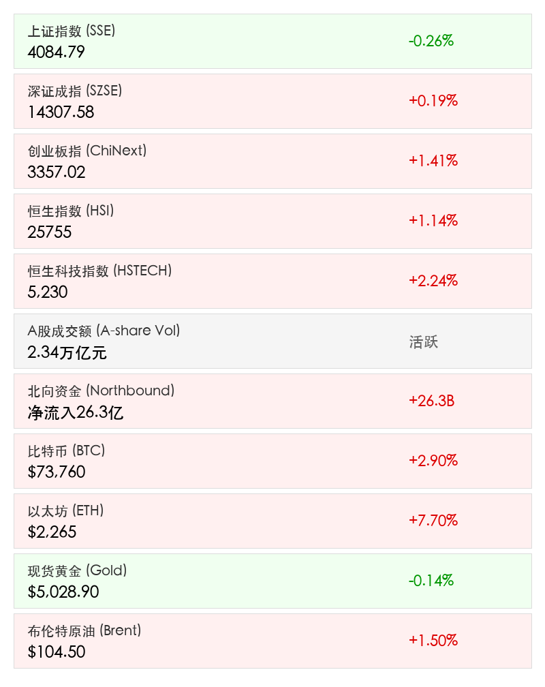

# 2026年3月16日 A股/港股收盘简报
日期：2026年03月16日 (星期一) &nbsp; 时段：下午 (国内市场今日收盘)

> **核心摘要**：今日 A 股与港股呈现显著分化，资金大规模从高位周期股流向低位科技成长股。创业板与恒生科技指数领涨，全市场成交额突破 2.3 万亿元，显示出强烈的风格切换信号。

## 核心行情复盘

今日市场呈现“冰火两重天”态势。科技成长板块集体爆发，而传统资源类周期股大幅下挫。

*   **上证指数**：收报 **4084.79点**，跌幅 **0.26%**。
*   **深证成指**：收报 **14307.58点**，涨幅 **0.19%**。
*   **创业板指**：收报 **3357.02点**，大涨 **1.41%**，引领市场人气。
*   **恒生指数**：收报 **25755点**，涨幅 **1.14%**。
*   **恒生科技指数**：大涨 **2.24%**，科网龙头股集体反弹。
*   **全市场成交额**：沪深京三市合计成交 **2.34万亿元**，维持极高活跃度。
*   **资金动向**：北向资金全天净流入 **26.3亿元**；主力资金净买入半导体、电子板块，大幅净流出电力设备（超 133 亿元）及有色金属。

### 领涨与领跌板块分析
*   **领涨**：半导体、存储芯片、算力租赁。**兆易创新**、**太极实业**等多股封板，科技成长赛道赚钱效应爆棚。
*   **消费**：白酒板块走强，**贵州茅台**涨近 3% 重回 1.8 万亿市值。
*   **领跌**：周期股重挫。钢铁、有色金属、煤炭跌幅居前，山金国际、西部黄金等跌超 7%。

## 核心解读与市场逻辑

> 市场核心逻辑正在发生重大转变：**资金“高低切换”特征极其明显**。经过前期周期股的持续拉升，获利盘回吐压力增大，而处于低位的科技成长股（特别是受 AI 技术突破带动的半导体与算力）成为了资金避风港。此外，港股受到华尔街知名投资人看多以及中东资金流入预期的提振，信心显著修复。

## 政策脉动

*   **宏观数据公布**：国家统计局发布 1—2 月经济数据。工业增加值增长 **6.3%**，社会消费品零售总额增长 **2.8%**，显示经济基本面稳步复苏，但房地产投资仍有待改善（下降 11.1%）。
*   **产业政策**：发改委下调能繁母猪存栏目标至 3650 万头以平抑猪价波动；全国卫星互联网系统标准化技术委员会正式获批成立，利好卫星通信产业链。

## 最新机构观点

*   **中信建投**：当前市场维持震荡格局，建议投资者重点布局“实物资产+确定性成长”的双主线。
*   **招商证券**：白酒行业目前已进入周期底部，随着渠道情绪修复，行业具备中长期配置价值。
*   **华尔街大空头（迈克尔·伯里）**：罕见发声唱多恒生科技指数，认为其估值处于严重低估区间，看好未来反弹潜力。

## 今日市场情绪：弃周期，抱成长

免责声明：内容仅供参考，不构成投资建议。
