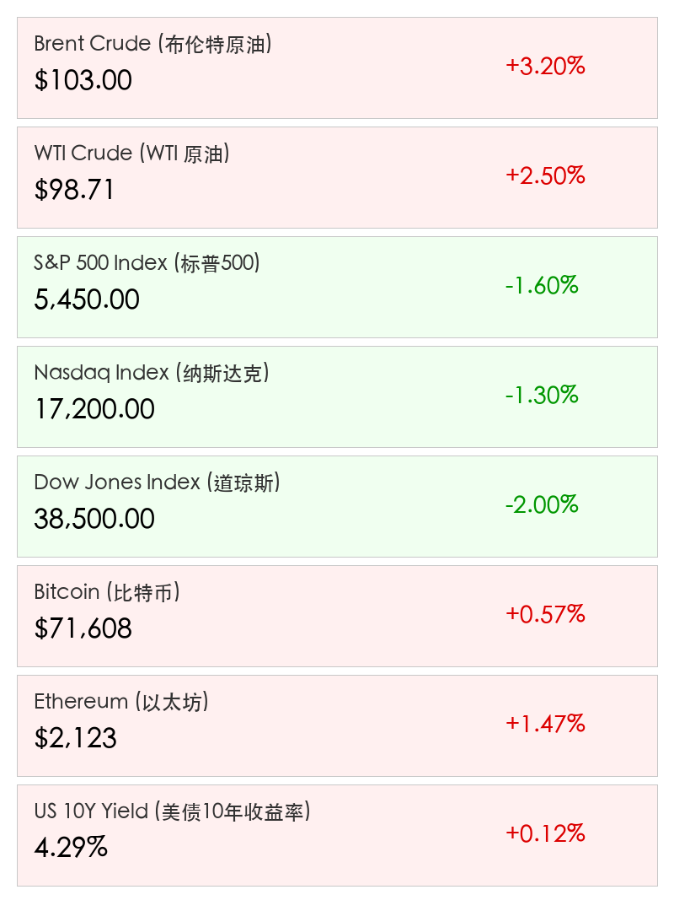

# 2026年3月16日 全球市场早报：原油冲击下的避险博弈

**日期：2026年03月16日 (星期一)** &nbsp; **时段：上午 (国际市场隔夜复盘)**

> **核心摘要**：中东冲突剧烈升级，伊朗封锁霍尔木兹海峡引发全球原油供应恐慌，布伦特原油突破103美元。全球股市显著下行，美联储利率会议在即，市场定价“更高更久”通胀压力，AI盛会Nvidia GTC成为科技股唯一看点。

## 周末财经要闻终极汇总

*   **中东战火剧烈升级**：
    > 3月14日至15日周末期间，中东局势进入“沸腾点”。美以联军对伊朗境内超过200个目标（包括导弹发射基地及防空系统）进行了密集打击。作为报复，伊朗宣布封锁霍尔木兹海峡——这条承载全球20%原油供应的生命线，直接引发全球能源市场震荡。
*   **油价暴力拉升**：
    > 受封锁消息冲击，布伦特原油已冲破 **$103** 大关，WTI原油触及 **$98.71**。自2月冲突爆发以来，能源价格累计涨幅已达45%，市场对“第二次通胀浪潮”的担忧急剧升温。
*   **全球市场避险模式开启**：
    > 印度卢比汇率跌至历史新低（92.45），美债10年期收益率攀升至 **4.29%**。航空业受到波及，印度航空、阿联酋航空等已因油价飙升及航路受阻加收燃油附加费并大面积取消航班。

## 新一周市场核心博弈逻辑

*   **滞胀风险重燃**：
    > 能源价格上涨不仅推高CPI，也显著抑制消费和工业产出。高盛已将美国PCE通胀预期上调至2.9%，同时下调GDP增长至2.2%。市场关注点正从“何时降息”转向“是否会再次加息”或“进入长期高利率时代”。
*   **流动性回缩与防御性仓位**：
    > 摩根士丹利指出，当前的调整尚未触及“高质量龙头股”，标普500指数仍有约 **7%** 的下行空间，建议投资者保持高现金比例。
*   **AI板块的独立行情**：
    > 尽管宏观大势不佳，但Nvidia GTC 2026大会被视为“AI界的伍德斯托克”，投资者期待新一代硬件与软件集成能为估值提供支撑。

## 本周重磅经济数据与会议前瞻

*   **美联储 FOMC 决议 (3月17-18日)**：
    > 核心看点在于“点阵图”是否出现鹰派偏移。在油价冲击下，鲍威尔对通胀“暂时性”的表述或将面临考验。
*   **全球央行“超级周”**：
    > 日本央行、英国央行、欧央行及加拿大央行均将发表重要政策声明，市场普遍预期政策转向将进一步推迟。
*   **行业催化剂**：
    > **Nvidia GTC 2026** (3月16-19日)：英伟达将展示其在非科技行业（如医疗、能源）的AI部署进展。

## 头部券商/投行开盘策略点睛

*   **高盛 (Goldman Sachs)**：建议执行 **“HALO”战略**（Heavy Assets, Low Obsolescence），增持能源生产、工业制造及物流等重资产领域，以对冲科技股在高通胀下的波动。
*   **摩根士丹利 (Morgan Stanley)**：CIO Mike Wilson 维持防御立场，认为目前的抛售尚未出清，应优先关注组合的“质量”而非“弹性”。
*   **摩根大通 (JPMorgan)**：虽然短期审慎，但仍看好AI从“采用”向“部署”阶段的演进，预计美股长期年化回报率仍有6.7%左右。

## 核心行情数据

## 今日市场情绪：原油冲击下的全球避险

---
免责声明：内容仅供参考，不构成投资建议。
