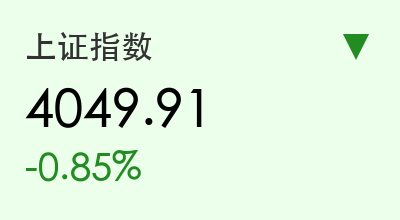
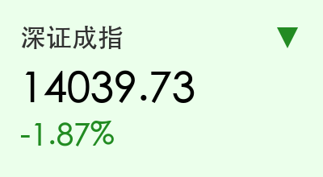
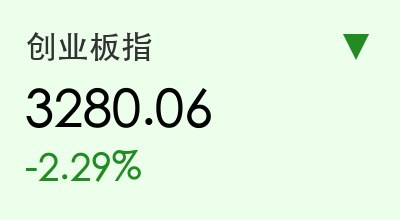
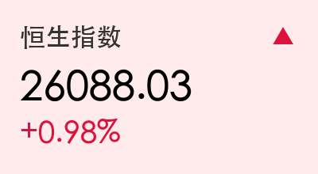
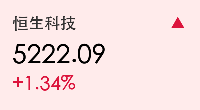

# A股收盘评述：沪强深弱“弃成长守防御”，港股科技股逆势走强

**日期：2026年03月17日 (星期二)** &nbsp; **时段：下午 (国内市场今日收盘)**

> **核心摘要**：今日A股呈现显著的风格切换，大金融与食品饮料等防御性板块表现稳健，而前期活跃的AI算力及成长股出现较大幅度回调。港股市场则受券商整合及阿里、美团等科技龙头提振，三大指数逆势走高。

## 核心行情复盘
今日A股三大股指走势分化，沪深两市成交额达2.21万亿元，市场交投依然维持在高位，但资金防御意愿增强。

*   **上证指数**：报 **4049.91点**，下跌 **0.85%**。
*   **深证成指**：报 **14039.73点**，下跌 **1.87%**。
*   **创业板指**：报 **3280.06点**，下跌 **2.29%**。
*   **恒生指数**：报 **26088.03点**，上涨 **0.98%**。

### 盘面分布与资金动向
*   **领涨行业**：银行（+1.23%）、证券（+0.76%）、食品饮料（+0.98%）、房地产。
*   **领跌行业**：电力设备（-3.45%）、电子（-3.12%）、计算机（-2.89%）、通信（-2.67%）。
*   **北向资金**：今日全天净流出 **12.8亿元**，流出重点为电力设备及半导体。
*   **南向资金**：今日净流出约 **40亿港元**，但腾讯、美团仍获部分内资吸纳。

## 核心解读与市场逻辑
> 1. **风格“弃高就低”**：在前期科技成长股积累了较大涨幅后，市场今日出现了明显的获利了结情绪。资金流向估值更具防御属性的大金融和白酒板块，反映了牛市中期典型的结构性调整。
> 2. **券商整合预期点燃港股**：关于“蚂蚁集团收购耀才证券获批”的传闻刺激港股券商板块集体爆发，带动恒生指数重回26000点上方。
> 3. **科技龙头的韧性**：阿里巴巴宣布成立ATH事业群并发布AI原生平台“悟空”，美团股价大涨近4%，科技龙头基本面的实质性突破在一定程度上抵御了宏观流动性的波动。

## 政策脉动
*   **证监会主席吴清表态**：强调加快编制资本市场“十五五”规划，并完善“中国特色稳市机制”，监管层对维护市场稳定和高质量发展的信号明确。
*   **上海楼市重磅政策**：上海商办房贷首付比例降至30%，为20年来首次大幅下调，旨在提振商业地产活力，对房地产板块构成利好。
*   **氢能应用试点启动**：工信部等启动氢能综合应用试点，单个城市群奖励可达16亿元，为绿色能源赛道注入长期政策红利。

## 最新机构观点
*   **中信证券 (裘翔)**：认为当前市场已从“拔估值”转向“盈利驱动”。建议投资者坚定布局具备中国优势的制造业（如化工、有色、新能源）以及低估值的保险与券商板块。
*   **中金公司 (缪延亮)**：维持“慢牛”判断，认为AI革命的逻辑尚未破裂，但短期波动不可避免。当前建议关注涨价逻辑下的顺周期品种。
*   **华泰证券**：港股目前仍处于“估值洼地”，高股息资产与具备强劲现金流的科技龙头是当前环境下最好的避风港。

## 今日市场情绪：沪强深弱，防御回归

免责声明：内容仅供参考，不构成投资建议。
