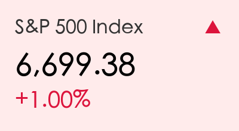
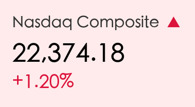
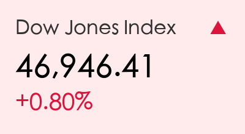
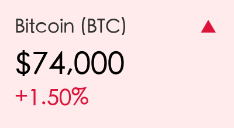
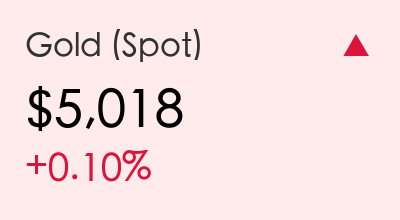
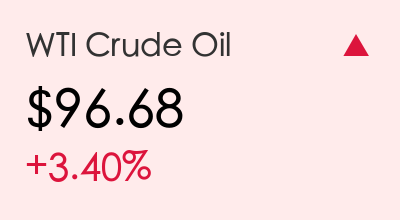
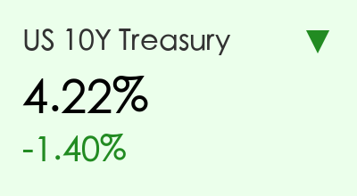

# 全球市场周二早报：科技股引领反弹，油价高位回落

**日期：2026年03月17日 (星期二)** &nbsp; **时段：上午 (国际市场隔夜复盘)**

> **核心摘要**：隔夜美股三大指数集体收涨，标普500上涨1.0%，纳指大涨1.2%。油价从高位显著回落缓解了通胀担忧，科技股在英伟达等AI龙头的带动下表现强劲。市场目前聚焦今日开始的联储会议。

## 核心行情复盘
隔夜美股走出五周来最强单日表现，市场在能源价格企稳后迅速修复情绪。
*   **标普500指数**：上涨1.0%至 **6,699.38** 点。
*   **道琼斯指数**：上涨0.8%至 **46,946.41** 点。
*   **纳斯达克指数**：上涨1.2%至 **22,374.18** 点。

### 大宗商品与加密货币
*   **原油**：WTI原油在触及102美元高位后显著回落，周一结算价报 **93.50美元**，跌幅5.3%。今日早盘略有回升至 **96.68美元**。
*   **黄金**：维持在 **5,018美元** 附近，避险情绪在油价下跌后有所降温，但仍处于高位。
*   **比特币**：站稳 **74,000美元** 关口，加密市场情绪乐观。

## 核心解读与市场逻辑
> 1. **油价“降温”是核心利好**：美国可能允许通过霍尔木兹海峡进行有限运输的消息传出，令市场对极端供应中断的担忧有所缓解。WTI原油周一暴跌5.3%，极大释放了通胀压力。
> 2. **AI科技股的坚韧**：英伟达（NVIDIA）上涨1.6%，CEO黄仁勋表示到2027年AI芯片需求将达1万亿美元。Meta通过裁员20%以转向AI基础设施的举措也获得市场认可，股价大涨超5%。
> 3. **美债收益率下行**：10年期美债收益率回落至4.22%，部分原因是纽约州制造业指数意外疲软，暗示经济放缓可能限制美联储进一步加息的空间。

## 政策脉动
*   **FOMC议息会议开始**：美联储今日开始为期两天的会议。市场普遍预期维持利率在3.75%不变，但关键在于“点阵图”是否会显示2026年内的降息路径。
*   **日本干预预警**：日元跌至159.75，日本财务大臣片山发出“大胆行动”的警告，并开始动用战略石油储备。
*   **澳大利亚央行（RBA）**：今日将公布利率决议，市场预期有68%的概率加息25个基点。

## 最新机构观点
*   **高盛 (Goldman Sachs)**：将2026年终标普500目标位上调至 **7,600点**，预计盈利将增长12%。尽管短期有能源冲击，但看好IT板块的长期驱动力。
*   **摩根士丹利 (Morgan Stanley)**：首席投资官迈克尔·威尔逊认为回调已进入“后期”，标普500在6,400-6,500区间有强力支撑。
*   **摩根大通 (JP Morgan)**：建议投资者“逢低买入”周期性行业。认为目前市场对战争恐慌的定价过高，AI相关板块的盈利动能依然是全市场最强的。

## 今日市场情绪：油价回落带动科技反弹

免责声明：内容仅供参考，不构成投资建议。
