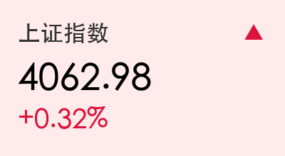
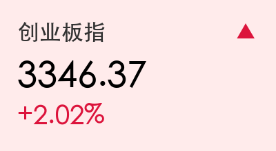
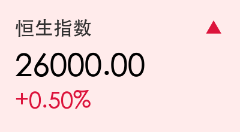

# 每日市场观察：双创爆发领涨，AI硬件全线回潮

**日期：2026年03月18日 (星期三)** &nbsp; **时段：下午 (国内市场今日收盘)**

> **核心摘要**：今日A股三大指数集体收涨，创业板指在2.02%的涨幅带动下领跑，全市场成交额维持在2万亿高位。在阿里云产品最高涨价34%及全球AI算力需求爆发的刺激下，AI硬件产业链（存储、CPO、算力）上演涨停潮，科技板块呈现明显的资金回流。

## 核心行情复盘

今日市场呈现典型的“科技领涨”格局。早盘指数小幅低开后，在AI算力与存储芯片板块的带动下快速走高，双创板块表现尤为强劲。

*   **上证指数**：报 **4062.98点**，上涨 **0.32%**。
*   **深证成指**：报 **14187.80点**，上涨 **1.05%**。
*   **创业板指**：报 **3346.37点**，上涨 **2.02%**。
*   **成交数据**：全天成交额 **20460.63亿元**，较前一交易日缩量约1618亿元，但仍处于高位博弈区间。
*   **个股表现**：全市场上涨家数超 **3500家**，约1800只个股下跌，70只个股涨停。

**港股市场表现**：
*   **恒生指数**：盘中一度冲破 **26000点** 关口，午后涨幅维持在0.5%左右。
*   **核心板块**：科技板块受益于阿里云涨价逻辑，午后走强。

**领涨板块：**
*   **AI硬件产业链**：存储芯片（同有科技、深科达20cm涨停）、CPO（中贝通信、可川科技涨停）、算力租赁。
*   **前沿技术**：6G概念、卫星互联网、液冷服务器、智谱AI概念。

**领跌板块：**
*   油气开采、粮食概念、白酒、房地产、汽车整车等传统防御板块。

## 核心解读与市场逻辑

> **逻辑一：AI基础设施的“定价权重估”**
> 阿里云宣布其AI算力、存储产品最高涨价34%，这一信号直接引爆了市场对AI基础设施稀缺性的担忧与重估。市场逻辑从单纯的“概念炒作”转向“供需错配导致的利润扩张”，带动存储芯片和光模块（CPO）板块集体爆发。

> **逻辑二：主力资金的仓位切换**
> 今日主力资金全天净流出约48亿元，但行业分布极度分化。通信设备板块获近80亿资金净流入，而电池、光伏等新能源板块则出现明显失血（电池净流出41亿）。这反映出资金正从产能过剩的传统赛道流向景气度陡增的AI算力赛道。

## 政策脉动

*   **央行流动性管理**：今日开展205亿元7天期逆回购操作，利率1.40%。因有265亿到期，实现**净回笼60亿元**，体现了监管层在“十五五”规划开局之年维持流动性“精准有效”的思路。
*   **证监会铁腕治乱**：今日集中发布对科创信息（财务造假）、英集芯及亚辉龙（脑机接口概念误导陈述）的行政处罚，最高拟罚款达800万元。监管层对“蹭热点”行为的严厉打击，旨在引导资金流向真科技。
*   **财政政策定调**：财政部明确2026年将继续实施更加积极的财政政策，超长期特别国债将持续支持“两重”与“两新”建设。

## 最新机构观点

*   **中信证券**：建议维持**“杠铃策略”**配置。一端是高股息资产作为底仓，另一端则需积极把握**AI商业化应用**与服务消费的爆发，判断2026年将是消费与科技共振的景气拐点。
*   **中金公司**：强调**“HALO资产”**配置逻辑，即寻找那些AI技术冲击下替代风险低且具备资源稀缺性的领域。在AI浪潮中，首选算力、半导体等“卖铲人”角色，同时关注受益于电力扩张的上游资源品。

## 今日市场情绪：硬科技的狂欢

---
免责声明：内容仅供参考，不构成投资建议。
