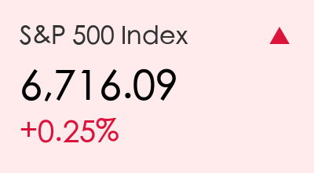
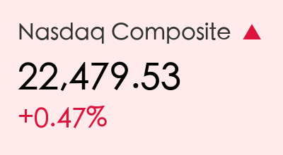
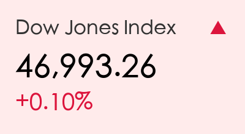
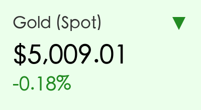
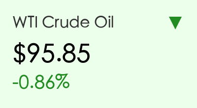
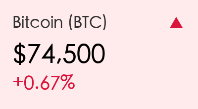

# 全球市场早报：加息阴云下的科技曙光与战争溢价

**日期：2026年03月18日 (星期三)** &nbsp; **时段：上午 (国际市场隔夜复盘)**

> **核心摘要**：美股小幅收高，投资者在美联储议息会议前保持谨慎，英伟达万亿订单及美光财报预期提振科技板块；中东局势持续紧张支撑能源价格，黄金高位震荡，比特币突破7.5万美元。

## 核心行情复盘

隔夜美股三大指数集体收涨，科技股表现强劲。

*   **标普500指数**：收于 **6,716.09** 点，上涨 **0.25%**。
*   **纳斯达克综合指数**：收于 **22,479.53** 点，上涨 **0.47%**。
*   **道琼斯工业平均指数**：收于 **46,993.26** 点，上涨 **0.10%**。

**板块异动分析**：
*   **半导体板块**：英伟达（Nvidia）GTC 2026 大会透露数据中心订单积压达 **1万亿美元**，美光科技（Micron）在财报前大涨 **4.44%**，成为市场风向标。
*   **航空板块**：达美航空（Delta Air Lines）上调营收预期，股价飙升 **6.71%**。
*   **交通出行**：优步（Uber）扩大与英伟达的自动驾驶出租车合作，股价上涨 **4.26%**。

**大宗商品与加密货币**：

*   **黄金**：现货金价报 **5,009.01美元/盎司**，在地缘政治溢价支撑下维持历史高位。
*   **原油**：布伦特原油报 **103.26美元/桶**，WTI原油报 **95.85美元/桶**，霍尔木兹海峡的航行限制持续提供“战争溢价”。
*   **比特币**：站稳 **75,000美元** 关口，受现货 ETF 持续流入提振。

## 核心解读与市场逻辑

> **1. 美联储议息会议（FOMC）开启**
> 市场普遍预期利率将维持在 **3.50%–3.75%** 不变，但所有目光都聚焦于随后公布的“点阵图”，以寻找未来降息路径的蛛丝马迹。在通胀压力依然存在的背景下，鲍威尔的表态将决定本周余下时间的市场走向。
>
> **2. 地缘冲突与能源供应链**
> 美-以-伊冲突进入第三周，霍尔木兹海峡的限制措施虽然有所缓解，但主要航道仍受限。能源价格的高企正在成为全球通胀的新变量，迫使多国央行重新评估政策。
>
> **3. 经济数据的矛盾信号**
> 美国2月工业产出增长 **0.2%** 展现韧性，但纽约联储制造业指数意外跌至 **-0.2**，显示出地区性制造业的疲软，这种不确定性限制了指数的进一步冲高。

## 政策脉动

*   **澳洲联储（RBA）加息**：由于燃料价格飙升推高通胀，RBA 昨日意外加息 25 个基点至 **4.10%**。
*   **监管新规**：3月18日起，外国发行人的董事和高管需根据《追究外国公司责任法案》(HFIA) 开始披露持股情况，跨境监管进一步收紧。

## 最新机构观点

*   **高盛 (Goldman Sachs)**：指出过去一个月系统性基金已抛售约 **800亿美元** 全球股票，目前宏观产品的空头头寸处于2022年9月以来的最高水平。这可能为潜在的“空头挤压（Short Squeeze）”创造条件，一旦利好消息出现，反弹可能非常剧烈。
*   **摩根士丹利 (Morgan Stanley)**：认为目前市场风险并非系统性的，企业资产负债表依然健康。但警示在 AI 驱动的软件行业变革中，直接贷款违约率可能接近 **8%**（新冠疫情峰值水平）。

## 今日市场情绪：科技引领的谨慎乐观

免责声明：内容仅供参考，不构成投资建议。
