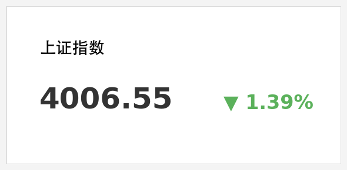
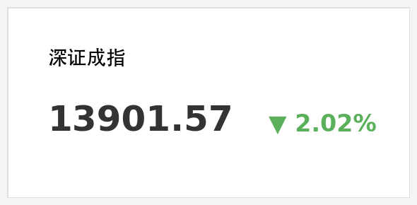
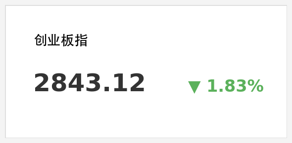
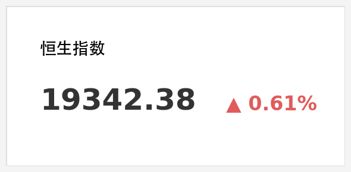
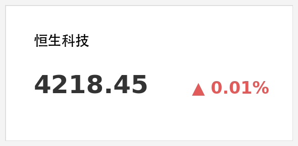

# A股失守4100点支撑，能源股逆势爆发，港股恒指微涨

**日期：2026年03月19日 (星期四)** &nbsp; **时段：下午 (国内市场今日收盘)**

> **核心摘要**：受中东地缘局势骤然升级及美联储鹰派表态双重打击，A股三大指数全天震荡走低，沪指失守4100点并回踩4000点边缘；石油、天然气等“战争受益”板块逆势大涨。港股则在科技龙头及能源股支撑下表现坚韧，微幅收红。

## 核心行情复盘

今日 A 股市场呈现典型的“避险与能源”主导特征。受隔夜美联储鹰派信号及中东战火蔓延影响，市场风险偏好显著收缩。

*   **上证指数**：报收 **4006.55点**，下跌 **1.39%**。
*   **深证成指**：报收 **13901.57点**，下跌 **2.02%**。
*   **创业板指**：报收 **2843.12点**，下跌 **1.83%**。
*   **成交额**：沪深两市全天成交额达 **2.11万亿元**，较昨日明显放量，显示恐慌盘有所涌出。

**板块表现分析**：
*   **能源板块（领涨）**：石油、天然气、煤炭板块集体爆发。**中国石油**、**中国石化**均有亮眼表现，**中油资本**、**广汇能源**封涨停。中东局势令能源供应链担忧达到顶点。
*   **科技与消费（领跌）**：受美债收益率攀升压力，半导体、AI、房地产及食品饮料板块全线下跌。贵金属板块在隔夜金价暴跌后亦表现低迷。

**港股市场表现**：

*   **恒生指数**：报收 **19342.38点**，上涨 **0.61%**。
*   **恒生科技指数**：报收 **4218.45点**，上涨 **0.01%**。
*   **亮点**：小米集团在 SU7 持续热销及万亿大模型 MiMo-V2-Pro 发布刺激下领涨科技股；南向资金持续流入腾讯、阿里等头部资产。

## 核心解读与市场逻辑

> **1. 中东“黑天鹅”：能源安全溢价回归**
> 以色列与伊朗冲突的实质性升级（互相打击能源基础设施）导致布伦特原油站稳 100 美元关口并冲向 107 美元。市场正在交易“二次通胀”风险，国内能源权重股成为资金天然的避风港。
>
> **2. 联储“鹰风”过境：分母端估值压制**
> 鲍威尔昨日表态“降息可能延后至 2027 年”，彻底粉碎了市场的乐观预期。美债收益率回升导致全球风险资产定价基准上行，对外资依赖度较高的核心资产（茅指数、宁组合）形成直接估值挤压。
>
> **3. A股分化：权重股撑盘 vs 成长股失血**
> 尽管三大指数齐跌，但“中字头”能源及基建股表现出极强韧性，阻止了指数出现断崖式下跌。相比之下，缺乏基本面支撑的小盘股和高弹性科技股跌幅惨烈。

## 政策脉动

*   **农村政策**：中办、国办印发意见，部署第二轮土地承包到期后再延长30年试点，旨在稳定农村土地承包关系。
*   **财政动向**：财政部据悉正研究推出“财政补贴负面清单”，以提高资金使用效率，引导资金向核心制造领域倾斜。
*   **地缘局势**：外交部就中东局势发声，呼吁各方保持克制，强调能源通道安全对全球经济至关重要。

## 最新机构观点

*   **中信证券 (2026春季论坛)**：首席经济学家明明指出，中国经济目前处于“V”型修复的关键期，预计全年 GDP 增长 **4.9%**。虽然外部压力巨大，但国内仍有 **1-2 次降息** 空间。
*   **中金公司 (春季策略会)**：建议投资者在上半年坚守“确定性”，配置以**石油、化工**为代表的稳定现金流行业；下半年待情绪企稳，可关注恒生科技及优质白酒的超跌反弹机会。
*   **招商证券**：认为 A 股正在经历从“预期博弈”到“财报验证”的阵痛期，地缘政治冲突只是加速了获利盘的了结。

## 今日市场情绪：焦虑中的能量分化

免责声明：内容仅供参考，不构成投资建议。
