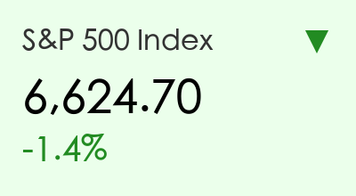
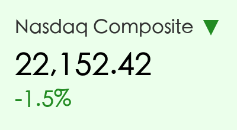
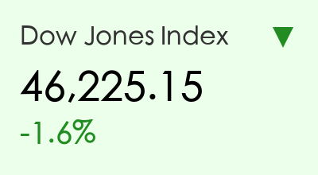
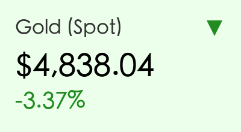
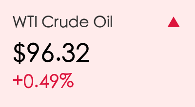
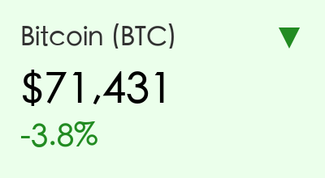

# 全球市场隔夜复盘：美联储鹰派暂停与能源冲击双重压力

**日期：2026年03月19日 (星期四)** &nbsp; **时段：上午 (国际市场隔夜复盘)**

> **核心摘要**：美联储在 3 月会议上维持利率不变但释放鹰派信号，暗示 2026 年仅降息一次；同时中东局势升级导致油价大涨，美股三大指数全线走低，金价与比特币显著回调。

## 核心行情复盘

隔夜美股三大指数集体收跌，受鹰派议息会议及超预期 PPI 数据打击。

*   **标普500指数**：收于 **6,624.70** 点，下跌 **1.4%**。
*   **纳斯达克综合指数**：收于 **22,152.42** 点，下跌 **1.5%**。
*   **道琼斯工业平均指数**：收于 **46,225.15** 点，下跌 **1.6%**。

**板块异动分析**：
*   **能源板块**：受油价飙升提振，雪佛龙（Chevron）与埃克森美孚（ExxonMobil）逆市走高，成为标普指数中唯一的亮点。
*   **科技与非必需消费品**：对利率敏感的科技成长股遭受重创，芯片板块整体下挫，特斯拉（Tesla）下跌 **3.2%**。
*   **金融板块**：尽管收益率曲线走陡，但对经济衰退的担忧拖累银行股表现，摩根大通（JPMorgan）收跌 **1.1%**。

**大宗商品与加密货币**：

*   **原油**：布伦特原油大涨 **3.8%** 报 **107.38美元/桶**，WTI 原油报 **96.32美元/桶**。霍尔木兹海峡局势的恶化为市场注入了极高的“战争溢价”。
*   **黄金**：现货金价暴跌 **3.37%** 报 **4,838.04美元/盎司**，强势美元和美债收益率攀升至 4.2% 以上打击了无息资产的吸引力。
*   **比特币**：承压回落至 **71,431美元**，跌幅达 **3.8%**，市场风险偏好显著收缩。

## 核心解读与市场逻辑

> **1. 美联储的“鹰派暂停”与点阵图冲击**
> 尽管 FOMC 如期维持利率在 **3.50%–3.75%** 不变，但更新的“点阵图”中位数显示 2026 年仅有一次 25 个基点的降息空间，远低于市场此前预期的 3-4 次。鲍威尔在记者会上强调，通胀依然“极具粘性”，能源价格上涨带来了新的上行风险。
>
> **2. 胀压重启：超预期的 PPI 数据**
> 美国 2 月生产物价指数（PPI）环比上涨 **0.7%**，远超 0.3% 的预期值。配合核心 PCE 依然维持在 3.1% 的高位，证明了通胀回落的路径并非一帆风顺，直接导致了美债收益率的全线反弹。
>
> **3. 地缘政治：中东局势的二次发酵**
> 伊朗冲突升级及霍尔木兹海峡的实际性封锁风险，直接导致了能源供应端的恐慌。市场正在重新定价“滞胀”风险，即经济放缓与能源驱动的通胀并存。

## 政策脉动

*   **美联储 (Fed)**：维持利率不变，但上调了 2026 年的核心 PCE 通胀预测至 **2.7%**（原 2.5%）。
*   **加拿大央行 (BoC)**：同步维持基准利率在 2.25% 不变，对能源驱动的输入型通胀表示高度警惕。
*   **地缘政策**：多国考虑动用战略石油储备（SPR）以平抑油价，但市场认为象征意义大于实际。

## 最新机构观点

*   **高盛 (Goldman Sachs)**：将 2026 年首次降息的时间表从 6 月推迟至 9 月，并预计全年仅有两次降息（9月与12月）。高盛指出，能源冲击正在改变美联储的政策天平。
*   **摩根士丹利 (Morgan Stanley)**：首席经济学家 Michael Gapen 认为美联储正处于“极度数据依赖”模式。如果失业率保持稳定且通胀不降，下半年可能面临“零降息”的极端情况。
*   **摩根大通 (JP Morgan)**：观点最为激进，策略师 Michael Feroli 认为 2026 年降息大门已经关闭，通胀的中枢上移将迫使联储维持高利率更久。

## 今日市场情绪：避险中的焦虑

免责声明：内容仅供参考，不构成投资建议。
