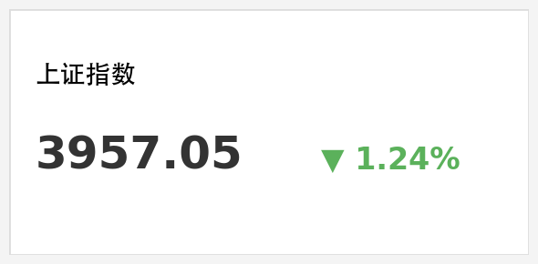
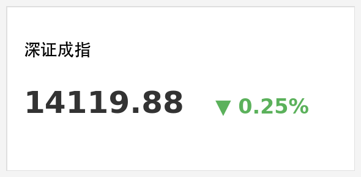
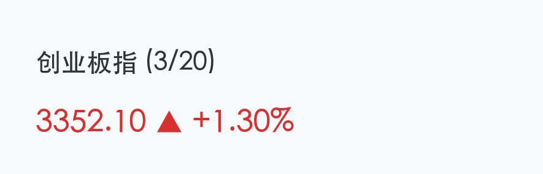
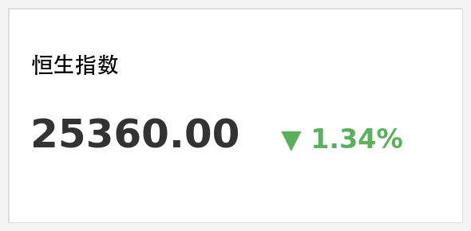
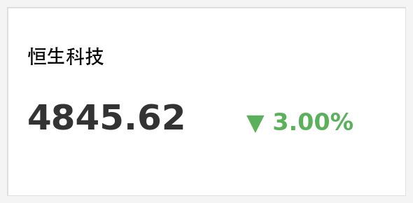

# 2026年3月20日 A股收盘博弈：万亿成交中的“弃权重、保成长”

**日期：2026年03月20日 (星期五)** &nbsp; **时段：下午 (国内市场今日收盘)**

> **核心摘要**：沪指失守4000点大关，但全天两市成交额创下2.3万亿元的巨量。创业板指逆势走强涨1.3%并创下四年多新高。市场呈现极端的结构性分化，算力、新能源等新质生产力板块疯狂吸金，与周期权重板块形成鲜明对比。

## 核心行情复盘

今日A股与港股市场呈现明显分化走势。A股三大指数涨跌不一，在极端放量中完成了筹码的大规模交换。

*   **上证指数**：报收 **3957.05点**，下跌 **1.24%**，失守4000点整数关口。
*   **深证成指**：报收 **13866.20点**，下跌 **0.25%**。
*   **创业板指**：报收 **3352.10点**，上涨 **1.30%**，盘中创下2021年12月以来新高。
*   **成交额**：沪深京三市合计成交额达到 **2.3万亿元**，较前一交易日显著放量。
*   **北向资金**：今日呈现逆势加仓态势，午后净流入约 **86.32亿元**，重点布局科技与消费板块。

港股市场受权重科技股业绩及地缘局势影响全线走低：
*   **恒生指数**：收盘下跌约 **1.34%**，报收 **25360点**。
*   **恒生科技指数**：跌幅达 **3.00%**，报收 **4845.62点**，险守4800点关口。

### 领涨行业分析
1.  **CPO与算力硬件**：算力需求持续爆发，**源杰科技** 股价突破1000元，成为A股历史上第8只“千元股”。
2.  **光伏与锂电**：受政策催化及“算电协同”概念带动，宁德时代、赣锋锂业等权重股逆势上扬。
3.  **电力板块**：华电辽能实现5连板，板块内多股涨停，防御属性与政策利好共振。

## 核心解读与市场逻辑

> **1. 极端分化的“跷跷板”效应**：今日市场成交额达到2.3万亿，显示出极其活跃的博弈氛围。资金从银行、保险、化工等传统周期权重板块撤出，大举涌入以创业板为代表的新质生产力赛道，形成“弃权重、保成长”的奇观。
>
> **2. 外部扰动与避险情绪**：中东局势（美以伊冲突）引发全球避险情绪升温，原油与金价剧烈波动。这直接导致了石油石化、有色金属等板块在午后出现重挫，压制了沪指表现。
>
> **3. 业绩期博弈**：港股科网股如腾讯、阿里业绩略逊预期，拖累了恒生科技指数的表现。小米集团虽有新车发布利好，但由于前期涨幅过大，今日出现剧烈调整。

## 政策脉动

> **LPR报价维持不变**：2026年3月20日贷款市场报价利率（LPR）为：1年期3.00%，5年期以上3.50%，均与上月持平。这表明当前货币政策处于稳健观察期。
>
> **央行党委扩大会议**：强调继续实施好适度宽松的货币政策，并研究建立对非银金融机构的流动性支持机制，坚定维护市场平稳。
>
> **证监会监管态势**：明确表示将严惩上市公司蹭热点、炒概念等行为，旨在引导资金流向真正的技术创新企业。

## 最新机构观点

*   **中信证券**：2026年是“十五五”规划开局之年，新质生产力正从概念走向产业落地。A股正从“存量博弈”转向“增量配置”的关键转折期，建议关注低估值和定价权核心资产。
*   **中金公司**：认为A股已进入“慢牛”阶段，尽管外部存在地缘政治与美联储鹰派表态的扰动，但中国市场的稳健底色未变。随着资本市场生态优化，中长期资金入市趋势不可逆。

## 今日市场情绪：万亿成交下的极端分化

免责声明：内容仅供参考，不构成投资建议。
