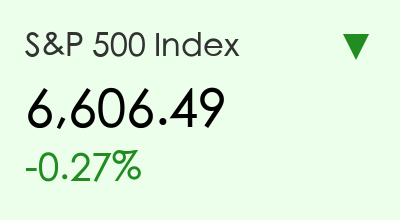
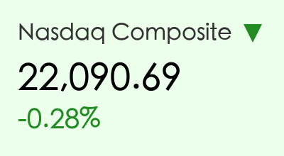
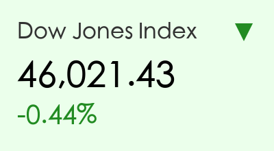
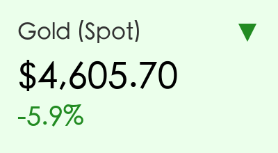
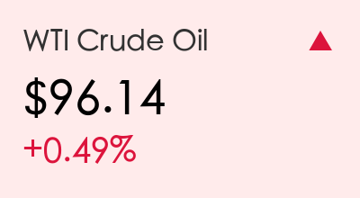
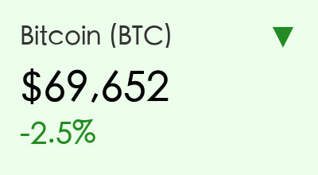
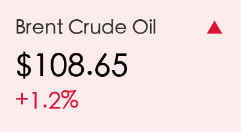

# 全球市场隔夜复盘：能源冲击余波与通胀担忧下的市场震荡

**日期：2026年03月20日 (星期五)** &nbsp; **时段：上午 (国际市场隔夜复盘)**

> **核心摘要**：美股周四继续承压走低，能源价格因中东局势再度飙升，布伦特原油一度突破 119 美元；同时，高于预期的 PPI 数据和美联储鹰派立场使降息预期进一步推后，金价创下近年最大单周跌幅。

## 核心行情复盘

隔夜美股三大指数集体收跌，市场情绪受到能源成本上升和持续通胀压力的双重打击。

*   **标普500指数**：收于 **6,606.49** 点，下跌 **0.27%**。
*   **纳斯达克综合指数**：收于 **22,090.69** 点，下跌 **0.28%**。
*   **道琼斯工业平均指数**：收于 **46,021.43** 点，下跌 **0.44%**。

**板块异动分析**：
*   **能源板块**：继续在油价上涨带动下逆势走强，成为标普指数中唯一的避风港。
*   **科技板块**：半导体巨头美光科技（Micron）虽然财报强劲，但因高额资本开支担忧下跌 **3.8%**；特斯拉（Tesla）受监管调查消息影响下跌 **3.2%**。
*   **黄金与白银**：遭遇近几年最严重的抛售，金价暴跌 **5.9%**，资金流向能源及美元避险。

**大宗商品与加密货币**：

*   **原油**：由于伊朗对波斯湾能源基础设施的袭击报道，布伦特原油一度暴涨至 **119美元/桶**，最终收于 **108.65美元/桶**，涨幅 **1.2%**。WTI原油报 **96.14美元/桶**。
*   **黄金**：现货金价大幅下跌 **5.9%** 报 **4,605.70美元/盎司**，强势美元和美债收益率上升削弱了贵金属吸引力。
*   **比特币**：跌破 70,000 美元心理关口，报 **69,652美元**，跌幅约 **2.5%**。

## 核心解读与市场逻辑

> **1. 中东能源供应链的“黑天鹅”**
> 有报道称伊朗对卡塔尔等地的能源基础设施发动了袭击，导致布伦特原油价格盘中剧烈震荡。虽然美方随后发出的制裁松动信号略微平息了涨幅，但市场对霍尔木兹海峡及周边航道的安全担忧已达到顶点。
>
> **2. 通胀粘性与“Higher for Longer”**
> 隔夜公布的美国生产者价格指数（PPI）高于预期，进一步证明了通胀的反复性。配合美联储周三维持利率不变并暗示 2026 年仅降息一次的鹰派立场，交易员目前普遍将首次降息的时间表推迟到了 2026 年底甚至 2027 年。
>
> **3. 避险逻辑的切换**
> 传统上黄金是地缘局势紧张时的避险首选，但在本次冲击中，由于能源成本直接推高了通胀预期和利率前景，资金更倾向于流向具有现金流支撑的能源股和现金类资产（美元），导致黄金遭遇流动性踩踏式回撤。

## 政策脉动

*   **美联储 (Fed)**：主席鲍威尔在会后的后续表态中重申了对通胀反弹的高度关注，市场认为联储已从“数据依赖”转向“能源依赖”。
*   **地缘政策**：美国正在紧急评估动用更多战略石油储备（SPR）的可能性，并考虑对部分产油国的制裁进行“针对性豁免”以平抑价格。

## 最新机构观点

*   **摩根士丹利 (Morgan Stanley)**：首席经济学家 Seth Carpenter 警告称，如果布伦特原油持续维持在 **125美元** 以上，全球经济将面临“需求破坏”阶段，衰退概率将上升至 **20%**。
*   **高盛 (Goldman Sachs)**：尽管短期内下调了 GDP 增长预测，但仍维持 S&P 500 年底 **7,600** 的目标。高盛认为企业盈利能力依然强韧，目前的震荡更多是估值回归。
*   **摩根大通 (JP Morgan)**：策略师警告“投资者过度乐观”，并指出历史上多次类似的能源冲击最终都引发了严重的经济衰退。JP Morgan 建议增加防御性资产配置。

## 今日市场情绪：中东冲击与联储鹰风

免责声明：内容仅供参考，不构成投资建议。
