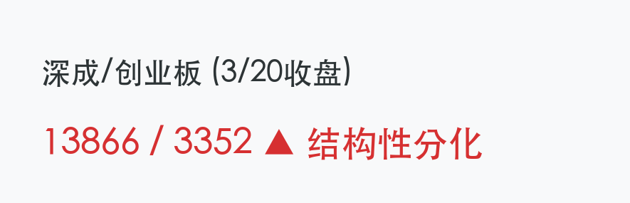

# 国内市场周末复盘：沪指失守4000点，结构性牛市在分化中孕育

**日期：2026年03月21日 (星期六)** &nbsp; **时段：下午 (国内市场周末复盘)**

> **核心摘要**：本周A股经历剧烈风格切换，沪指周五受权重股拖累失守4000点大关，而创业板则逆势创下四年新高。政策面释放积极信号，“十五五”规划预热新质生产力，资金正加速从高位周期板块向中国优势制造领域转移。

## 核心资产周度/日度表现回顾

本周（3月16日-20日）A股市场呈现显著的“冰火两重天”。周五收盘，市场成交额放量至2.30万亿元，显示高位换手剧烈。

*   **上证指数**：收报 **3,957.05点**，周五跌1.24%，失守4000点整数关口。
*   **深证成指**：收报 **13,866.20点**，周五跌0.25%。
*   **创业板指**：收报 **3,352.10点**，周五涨1.30%，创2021年12月以来新高。
*   **恒生指数**：收报 **25,277.32点**，周五跌0.88%。
*   **恒生科技**：收报 **4,872.38点**，周五跌2.48%。

> **盘面解读**：资金呈现典型的“弃周期、抱成长”特征。电力设备（光伏、储能）、半导体及AI算力成为避风港，而银行、煤炭等高位防御板块出现显著补跌。这种分化反映了市场在4000点关口前的震荡整固，也是对未来产业方向的重新定价。

## 过去 48 小时重磅事件深度复盘

1.  **央行发声维护平稳运行**：中国人民银行强调要坚定维护金融市场平稳运行，并研究建立对非银机构的流动性支持机制。这为市场注入了流动性“强心剂”，有效缓解了非银端的情绪波动。
2.  **资本市场“十五五”规划预热**：证监会近期密集召开座谈会，明确将精准支持新产业、新业态。政策导向已从简单的规模扩张转向对核心定价权和新质生产力的深度支持。
3.  **地缘政治催化新能源逻辑**：中东局势导致国际油价高位震荡，国内成品油价步入“9元时代”。高能源成本倒逼下游产业加速向光伏、风电等清洁能源转型，本周光伏板块的集体爆发正是这一逻辑的体现。

## 下周宏观大事预警与日历

*   **3月23日（周一）**：1年期与5年期以上LPR报价公布。市场预期LPR有进一步下调空间，以支持实体经济修复。
*   **3月25日（周三）**：国内主要城市2月工业增加值及利润数据发布，将验证“新质生产力”对基本面的拉动效果。
*   **3月27日（周五）**：多家中报预告披露进入高峰期，需警惕业绩不及预期个股的闪崩风险。

## 顶级机构周末策略内参摘要

*   **中信证券**：当前是“信心重塑期”。地缘动荡是风格切换的催化剂，A股正从存量博弈走向增量配置。坚定围绕“中国优势制造”布局，特别是具备全球定价权的化工、有色、电力设备板块。
*   **中金公司**：指数在4000点附近的震荡属于“良性回调”。随着财政赤字率维持高位及货币政策宽松预期，二季度市场仍有向上空间，建议关注超跌的优质白马股及科技龙头。
*   **招商证券**：市场正从“流动性驱动”转向“业绩驱动”。在全球能化成本上升背景下，能效替代和高端制造是核心投资主线。

## 今日市场情绪：沪指失守4000点的分歧与出清

---
免责声明：内容仅供参考，不构成投资建议。
