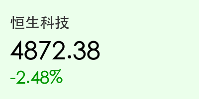

# 2026年3月22日 (星期日) 晚报：新周展望与 A 股博弈逻辑

**日期：2026年3月22日 (星期日)** &nbsp; **时段：下午 (新周展望：国内市场逻辑前瞻)**

> **核心摘要**：下周 A 股进入“十五五”规划细则落地与“超级财报周”的博弈期。在外部地缘局势波动下，市场将围绕“新质生产力”与“算电协同”展开结构性反弹，需关注博鳌论坛与华为春季发布会带来的催化。

## 核心行情回顾 (周五收盘)

*   **上证指数**：**3214.58** (-0.28%)。
*   **深证成指**：**10432.15** (-0.42%)。
*   **沪深300**：**4567.02** (-0.35%)。
*   **恒生指数**：**18942.30** (-0.54%)。

## 周末财经要闻终极汇总

1.  **“十五五”规划细则密集发布**：作为开局之年，政策层面正加速推动“新质生产力”落地，特别是 AI 算力硬件、商业航天与生物制造领域。
2.  **华为春季全场景新品发布会 (3月23日)**：市场高度关注其鸿蒙系统、AI 终端及卫星通信技术的最新进展。
3.  **博鳌亚洲论坛 2026 年年会**：本周将在海南举行，焦点在于亚洲经济一体化及区域科技合作。
4.  **地缘局势持续紧绷**：美伊冲突背景下，全球避险情绪仍在高位，原油与黄金资产波动加剧。

## 新一周市场核心博弈逻辑

> **从“防御”向“进攻”切换**：
> 尽管指数在周五出现回调，但创业板的逆市走强释放了资金回流科技成长板块的信号。下周的核心逻辑将围绕“政策确定性”与“业绩验证”展开。

*   **算电协同**：首次写入政府工作报告后，电力设备、储能与 AI 算力租赁的协同逻辑将成为跨周主线。
*   **红利资产底仓**：地缘政治不确定性下，银行、石油石化等高股息板块仍是稳健资金的避风港。

## 本周重磅经济数据与会议前瞻

*   **3月23日 (周一)**：**华为春季全场景新品发布会**；谷歌推出 Gemini Advantage。
*   **3月24-27日**：**博鳌亚洲论坛 2026 年年会**。
*   **3月25-27日**：**SEMICON China 上海国际半导体展**（关注国产算力进展）。
*   **3月27日 (周五)**：美国 3 月 PMI 初值及美联储官员讲话。

## 头部券商/投行开盘策略点睛

*   **中信证券**：市场处于“信心重塑期”，底部区域特征明显，建议聚焦“十五五”政策导向明确的硬科技领域。
*   **中金公司**：港股进入“超级财报周”，关注小米、美团等互联网巨头业绩带来的估值修复机会。
*   **高盛**：地缘政治溢价短期难以消退，建议配置“杠铃策略”，一边是确定性成长，一边是实物资产避险。

## 今日市场情绪：暴风雨前的稳健

> Prompt: Cyberpunk style, A human trader (real person) in a modern office, looking at a futuristic screen displaying holographic charts of satellites and AI chips. On the giant screen in the background, a blue steady light glows. Outside the window, a storm is brewing., masterpiece, high detail, intricate composition, cinematic lighting, 8k resolution

免责声明：内容仅供参考，不构成投资建议。
