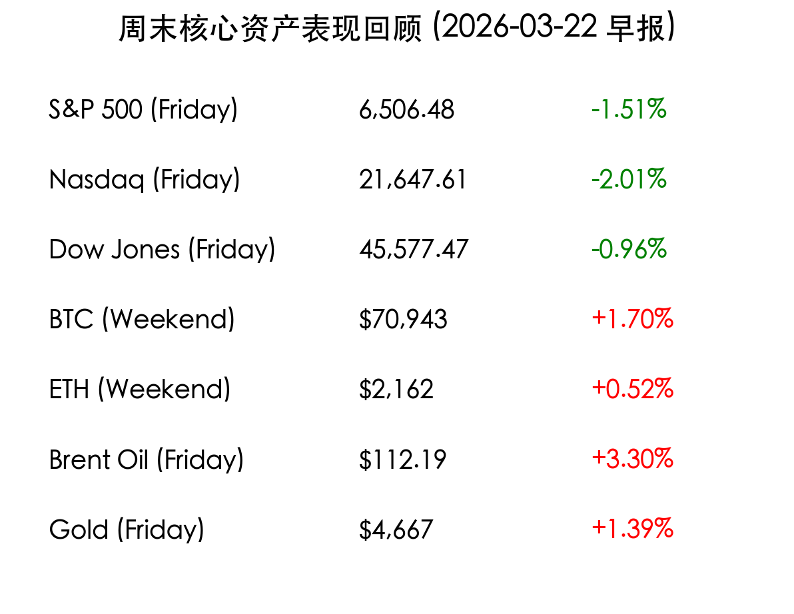

# 周末市场复盘：地缘冲突与通胀阴霾笼罩，美股均线告破

**日期：2026年03月22日 (星期日)** &nbsp; **时段：上午 (国际市场隔夜复盘)**

> **核心摘要**：美股三大股指连续第四周下跌，标普500指数跌破200日均线关键支撑。中东局势升级推动油价站上110美元，引发市场对滞胀的深度恐慌。加密货币周末小幅回升，但机构减持压力犹存。

## 核心资产周度/日度表现回顾

在刚刚结束的交易周中，全球风险资产遭遇剧烈抛售。地缘政治冲突的溢价效应在能源市场显著体现，而股市则因对长期高通胀及美联储“鹰派停留”的担忧而承压。

*   **标普 500 指数 (Friday)**：收于 **6,506.48点**，下跌 **1.51%**，技术面破位下行。
*   **纳斯达克指数 (Friday)**：收于 **21,647.61点**，下跌 **2.01%**，科技股领跌。
*   **道琼斯指数 (Friday)**：收于 **45,577.47点**，下跌 **0.96%**。
*   **比特币 (BTC/Weekend)**：报约 **$70,943**，周末录得约 **1.70%** 的小幅反弹。
*   **以太坊 (ETH/Weekend)**：报约 **$2,162**，在质押 ETF 预期下表现出相对韧性。
*   **布伦特原油 (Friday)**：结算价 **$112.19/桶**，单日涨幅 **3.30%**。
*   **现货黄金 (Friday)**：报约 **$4,667/盎司**，上涨 **1.39%**，避险需求强劲。

## 过去 48 小时重磅事件深度复盘

> **地缘风险：中东冲突进入第四周**：伊朗局势的进一步恶化已成为当前市场的主导逻辑。霍尔木兹海峡的潜在封锁风险直接导致油价站稳110美元上方，这不仅加剧了全球供应链的成本压力，更引发了华尔街对“二次通胀”的担忧。

> **美联储“鹰派停留”余震**：本周美联储维持利率在 3.50%–3.75% 不变，但点阵图显示 2026 年仅存一次降息空间。这一信号打破了市场此前的乐观预期，美债10年期收益率一度重回 4.3% 关键水平。

## 下周宏观大事预警与日历

下周市场将进入情绪修正期，重点关注能源价格对实体经济的反馈：

*   **周一 (3/23)**：美国1月建筑支出；休斯顿 **CERAWeek 能源大会** 开幕（油价风向标）。
*   **周二 (3/24)**：**S&P Global 制造业/服务业 PMI 初值**（美、英、欧）；观察能源冲击下的扩张动力。
*   **周三 (3/25)**：澳大利亚及英国 CPI 数据；全球通胀路径的关键印证。
*   **周五 (3/27)**：**密歇根大学消费者信心指数**（终值）；评估高油价对美国消费意愿的打击程度。

## 顶级机构周末策略内参摘要

*   **摩根大通 (JPMorgan)**：下调标普500目标价至 **7,200点**。分析师指出，市场对地缘冲突的“快速解决”假设过于乐观，若指数无法收复200日均线，可能进一步下探至 **6,000-6,200点** 区间。
*   **高盛 (Goldman Sachs)**：维持 **7,600点** 的基本目标，但建立了一个“极端情境”模型。高盛警告称，若油价长期维持在120美元以上，标普500可能面临 19% 的回撤至 **5,400点**。目前建议配置 **医疗保健及太阳能** 板块对冲风险。
*   **摩根士丹利 (Morgan Stanley)**：首席策略师 Mike Wilson 建议“在恐慌中寻找机会”，预计 4 月初可能出现技术性低点 **6,300点**，这将是长期增持的良机，特别看好受冲突波及较小的美国本土防御板块。

## 今日市场情绪：避险中的焦虑

---
免责声明：内容仅供参考，不构成投资建议。
