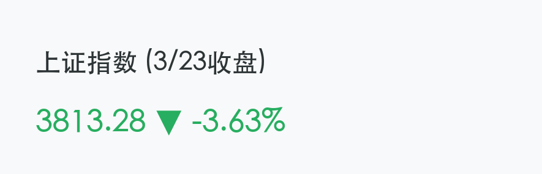
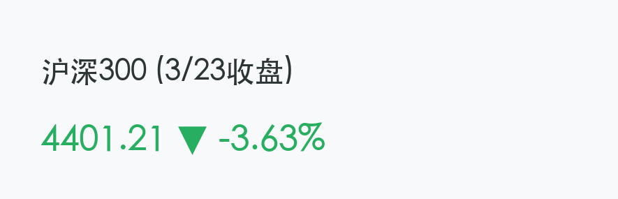
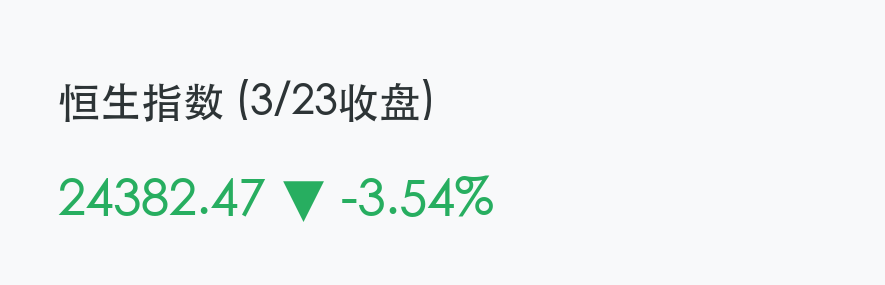

# 2026年3月23日 (星期一) 晚报：中东局势升级引发亚太股市全线重挫

**日期：2026年3月23日 (星期一)** &nbsp; **时段：下午 (国内市场今日收盘)**

> **核心摘要**：今日亚太市场遭遇“黑色星期一”，受中东局势剧烈动荡及美国对伊朗发出 48 小时最后通牒影响，全球避险情绪全面爆发。A 股与港股双双放量大跌，恒生指数重挫逾 3.4% 创下半年新低，国际油价飙升至 112 美元上方，市场正经历剧烈的风险资产重新定价。

## 核心行情复盘

今日国内及香港市场全线遭遇重挫，三大指数低开低走，午后跌幅进一步扩大。

*   **上证指数**：**3813.28** (-3.63%)，失守 3900 点大关。
*   **深证成指**：**13345.51** (-3.76%)。
*   **创业板指**：**3235.22** (-3.49%)，领跌两市。
*   **沪深300**：**4401.21** (-3.63%)。
*   **恒生指数**：**24382.47** (-3.54%)，跌至 2025 年 8 月以来最低水平。
*   **恒生科技**：**4712.00** (-3.28%)。

## 核心解读与市场逻辑

> **“霍尔木兹海峡阴云”笼罩全球**：
> 导致今日市场崩盘的核心动因是中东地缘局势的骤然升级。美国总统特朗普向伊朗发出 48 小时最后通牒，要求其重新开放霍尔木兹海峡，否则将面临针对能源基础设施的军事打击。

1.  **地缘冲突升级**：伊朗随后威胁将回击区域内的能源与水资源设施。这一“硬碰硬”的态势直接切断了市场的风险偏好。
2.  **油价飙升的负反馈**：布伦特原油价格突破 **112 美元/桶**。高油价引发了全球性通胀反弹的担忧，市场普遍预期各大央行原定的降息节奏将被打乱，甚至可能被迫再次加息以抑制滞胀风险。
3.  **避险资金撤离**：亚太地区股市普遍下挫，日经 225 与韩国 KOSPI 指数跌幅均在 3% 至 6% 之间。资金疯狂涌向美元、黄金等避险资产，有色金属中的黄金板块成为今日两市唯一的避风港。

## 政策脉动

*   **监管层表态**：针对今日市场剧烈波动，证监会正密切关注市场动态，强调维护市场平稳运行。
*   **资金流向**：北向资金今日大幅净流出逾 **150 亿元**，显示外资在不确定性面前采取了果断的避险操作。

## 最新机构观点

*   **中信证券**：地缘政治因素在短期内已超越基本面成为决定市场方向的主导力量。建议投资者增加高股息红利资产及黄金类 ETF 的配置，暂时规避对宏观环境敏感的成长板块。
*   **中金公司**：港股当前估值虽已处于底部区间，但在“黑天鹅”事件充分落地前，波动率仍将维持在高位。关注能源及资源类企业的对冲价值。
*   **高盛**：霍尔木兹海峡的封锁风险一旦从预期变为现实，全球供应链将面临新一轮冲击。维持对中国股市短期“谨慎”的评级。

## 今日市场情绪：中东风云下的避险踩踏

> Prompt: Cinematic style, A human trader (real person) standing in a high-tech control room, looking at a massive screen displaying red falling stock charts and a digital map of the Middle East with a glowing orange warning. The trader's expression is tense. On the giant screen in the background, a silhouette of a giant oil tanker is seen in a stormy sea., masterpiece, high detail, intricate composition, cinematic lighting, 8k resolution

免责声明：内容仅供参考，不构成投资建议。
