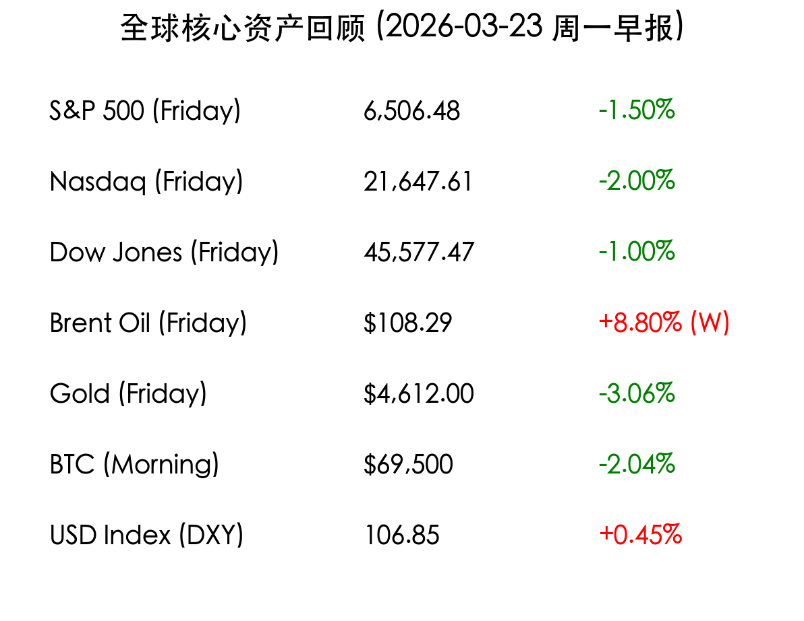

# 周一早报：中东战云笼罩能价高企，全球市场步入“滞胀”阴霾

**日期：2026年03月23日 (星期一)** &nbsp; **时段：上午 (国际市场隔夜复盘)**

> **核心摘要**：中东局势因霍尔木兹海峡风险急剧升级，布伦特原油站稳 100 美元大关。美股经历连续四周下跌，市场定价美联储首次降息推迟至 9 月，周一全球开盘面临严峻“滞胀”压力。

## 周末财经要闻终极汇总

*   **能源危机与战争升级**：布伦特原油过去一周暴涨 8.8%，收于 **108.29 美元/桶**。周末有报道称，美国正考虑采取军事行动以确保伊朗哈尔格岛石油设施的安全，市场极度担忧供应中断。
*   **美联储预期大转向**：在主要央行维持利率不变的一周后，周末情绪转向“Higher for Longer”。市场基本抹去了 2026 年上半年的降息预期，滞胀风险成为博弈核心。
*   **企业巨头利空**：**超微电脑 (SMCI)** 周跌幅达 33%，其联合创始人因涉及向中国走私服务器的联邦指控被停职，引发 AI 硬件板块震动。
*   **大宗商品波动**：黄金创下近年来最差单周表现，周五下跌 3.06%，投资者在美元走强和避险需求间剧烈博弈。

## 核心行情复盘

> **市场洞察**：美股三大指数周五集体收跌，标普 500 指数下跌 1.5%，正在测试 200 日均线支撑。纳斯达克指数因 AI 板块估值回调压力，跌幅达 2%。美元指数 (DXY) 创下 10 个月新高，避险资金持续涌入美债与美元。

## 新一周市场核心博弈逻辑

1.  **能源价格的“二阶效应”**：如果油价持续站稳 100 美元上方，将直接挑战主要经济体的抗通胀成果，迫使央行维持高利率甚至重启加息。
2.  **地缘政治的物理边界**：投资者正在从定价“危机”转向定价“地面战争”，焦点在于波斯湾能源基础设施的物理完整性。
3.  **AI 叙事的估值重构**：尽管 Micron 财报亮眼，但市场未能维持涨势，表明在宏观逆风下，纯粹的 AI 情绪驱动已现疲态。

## 本周重磅经济数据与会议前瞻

*   **周一**：日本 2 月 CPI 数据（能源成本压力凸显）、南韩 5 年期国债拍卖。
*   **周三**：中信证券 (600030.SH) 发布 2025 年度业绩报告，关注券商龙头对国内市场的展望。
*   **周四/周五**：Adobe、Lululemon 等消费与技术权重股财报，观察 AI 转化率。

## 头部券商/投行开盘策略点睛

*   **高盛 (Goldman Sachs)**：尽管维持 2026 年底标普 500 指数 7,600 点的目标，但警告短期内政策不确定性和地缘风险将加大波动。
*   **摩根士丹利 (Morgan Stanley)**：正式将其首降预期从 6 月推迟至 **9 月**，并提出“战略硬化”策略，建议配置具备强定价权的防御性资产。
*   **中信证券 (CITIC)**：看好国内半导体存储芯片厂商，认为三星电子罢工导致的全球供应偏紧将加速国产替代进程。

## 今日市场情绪：战云下的滞胀焦虑

> Prompt: cinematic style, A human trader (real person) standing in front of a giant digital screen showing chaotic red market curves and burning oil barrels in the background. The scene is tense and dark, lit by the glow of the screen., masterpiece, high detail, intricate composition, cinematic lighting, 8k resolution

---
免责声明：内容仅供参考，不构成投资建议。
