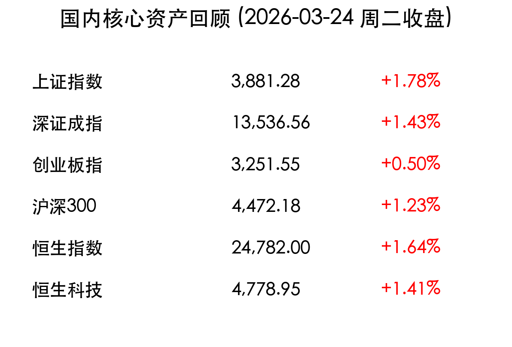

# 周二收盘：央行释放“支持性”强信号，A股绝地反击2.1万亿成交重燃希望

**日期：2026年03月24日 (星期二)** &nbsp; **时段：下午 (国内市场今日收盘)**

> **核心摘要**：国内市场今日迎来强势普涨，上证指数重回 3800 点上方。央行行长潘功胜明确“支持性”货币政策立场，叠加算力与电力协同政策利好，全市场超 5100 只个股上涨。尽管成交额较昨日微缩，但 2.1 万亿的水平显示出买盘力量依然雄厚，市场风险偏好显著回升。

## 核心行情复盘

在经历前期由于地缘政治引发的剧烈调整后，A 股与港股今日双双走出探底回升的强劲反弹行情。

*   **上证指数**：收报 **3,881.28点**，大涨 **1.78%**。
*   **深证成指**：收报 **13,536.56点**，上涨 **1.43%**。
*   **创业板指**：收报 **3,251.55点**，上涨 **0.50%**（早盘曾一度跌近 2.5%）。
*   **沪深300**：收报 **4,472.18点**，上涨 **1.23%**。
*   **恒生指数**：收报 **24,782.00点**，上涨 **1.64%**。
*   **恒生科技**：收报 **4,778.95点**，上涨 **1.41%**。

> **领涨板块分析**：**电力（绿电）**与**算力产业链**成为今日绝对主角。受“算电协同”政策直接催化，多只电力龙头封板。此外，**国防军工**、**医药生物（CXO）**及**光通信**板块表现活跃。**个股表现**极其亮眼，全市场上涨个股超 5100 只，赚钱效应极佳。
>
> **领跌板块分析**：受隔夜国际油价暴跌影响，**油气开采**、**煤化工**等传统能源板块出现逆势回调。

## 核心解读与市场逻辑

> **政策面的定海神针**：央行行长潘功胜在公开场合明确表示将坚持“支持性的货币政策立场”，这极大缓解了市场对二季度流动性的担忧。尤其是在外部局势波动之际，这种明确的表态被视为“政策底”的再次确认。

> **“算电协同”新叙事**：国家数据局关于枢纽节点绿电占比 80% 以上的要求，为电力行业打开了新的增长估值空间。市场开始意识到，算力的尽头是电力，而绿色电力则是连接数字经济与双碳目标的终极桥梁。

## 政策脉动

*   **央行支持性立场**：中国人民银行强调系统部署金融支持经济结构转型，确保高水平开放。
*   **算电协同工程**：国家数据局大力推进工程落实，直接带动了相关配套电力基础设施的投资预期。
*   **毫秒用算专项行动**：工信部发文目标到 2027 年形成全域毫秒级算力网络，利好光通信及算力产业链。

## 最新机构观点

*   **中金公司 (CICC)**：认为当前点位或为 **A 股中期相对低点**。经历深度调整后，估值处于合理水平，股债性价比具备优势。建议关注景气成长（AI 落地、存储）及具备现金流支撑的高股息红利资产。
*   **中信证券 (CITIC)**：指出政策助力**电力行业电价底部提前出现**，行业基本面预期改善，估值有望重拾扩张。同时看好创新药板块的估值修复机会。
*   **瑞银证券**：认为 A 股短期“去风险化”已接近尾声，近期盈利一致预期已获得上调，对后市持乐观态度。

## 今日市场情绪：绝地反击下的“绿色”希望

> Prompt: Cyberpunk style, A futuristic lighthouse powered by glowing green energy beams, casting a protective light over a sea of digital stock tickers, representing the 'Computing-Electricity Coordination' policy, in the background a giant digital dragon made of green code coils around a server tower, representing A-share revival, masterpiece, high detail, intricate composition, cinematic lighting, 8k resolution

---
免责声明：内容仅供参考，不构成投资建议。
