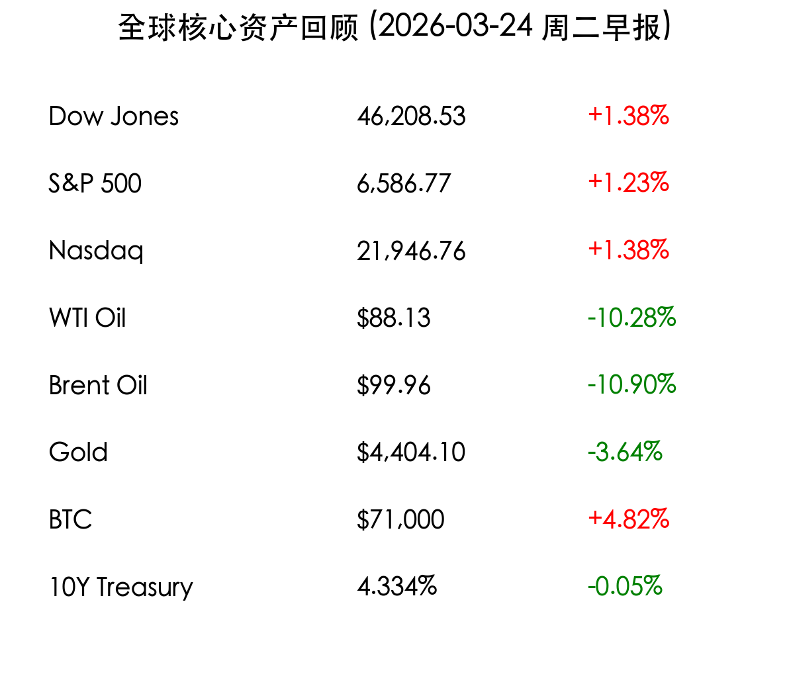
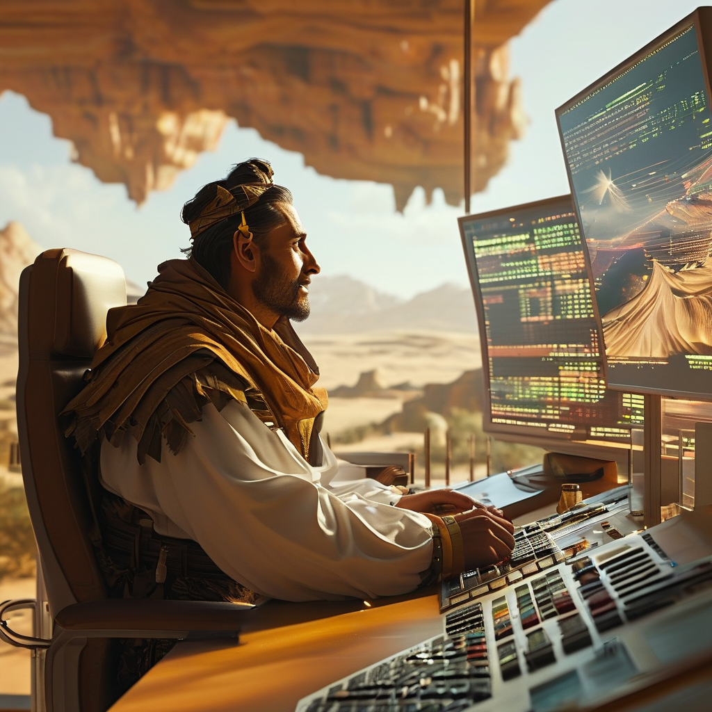

# 周二早报：特朗普“五日止战”令油价雪崩，美股应声反弹上演“TACO”行情

**日期：2026年03月24日 (星期二)** &nbsp; **时段：上午 (国际市场隔夜复盘)**

> **核心摘要**：特朗普宣布对伊朗军事行动暂停五天，中东紧张局势出现剧烈反转。受此提振，美股周一全线收涨，道指涨逾 600 点；原油遭遇雪崩式抛售，布伦特跌破 100 美元关口。市场情绪由极度恐慌转为“风险偏好”，机构普遍认为这是一次久违的超跌反弹。

## 核心行情复盘

周一（3月23日），国际资产市场经历了一场戏剧性的“极速转弯”。随着战争风险的临时消解，避险资金快速撤离黄金与原油，转而追逐风险资产。

*   **道琼斯指数**：收于 **46,208.53点**，上涨 **1.38%** (+631.06)。
*   **标普500指数**：收于 **6,586.77点**，上涨 **1.23%** (+80.10)。
*   **纳斯达克指数**：收于 **21,946.76点**，上涨 **1.38%** (+299.15)。
*   **WTI 原油**：收于 **$88.13/桶**，暴跌 **10.28%**。
*   **布伦特原油**：收于 **$99.96/桶**，大跌 **10.90%**，跌破关键整数位。
*   **现货黄金**：结算价为 **$4,404.10/盎司**，下跌 **3.64%**。
*   **比特币 (BTC)**：大幅反弹至 **$71,000** 上方，涨幅达 **4.82%**。
*   **10年期美债收益率**：回落至 **4.334%**。

> **板块表现分析**：周期性行业领涨全场，**非必需消费品**与**工业**板块表现抢眼。卡特彼勒 (Caterpillar) 上涨 3.1%，受益于燃料价格下跌预期，联合航空 (United Airlines) 飙升 4.5%。能源板块则因油价重挫而大幅走低。

## 核心解读与市场逻辑

> **“TACO”行情的逻辑支撑**：华尔街将周一的走势戏称为“Trump Always Chickens Out”（特朗普总是退缩）行情。在经历了四周的连续下跌后，市场处于极度超卖状态。特朗普在 Truth Social 上宣布因“富有成效的对话”而推迟对伊朗电厂的打击，这为市场提供了一个完美的缓解理由。

> **原油的多头踩踏**：此前的战争溢价在一天内几乎被全部抹去。尽管伊朗方面否认了直接谈判，但“五日停火”的消息足以触发布伦特原油 10% 以上的单日跌幅，反映了前期投机仓位的过度拥挤。

## 政策脉动

*   **白宫五日指令**：特朗普政府确认，已要求五角大楼将针对伊朗基础设施的既定打击计划向后推迟 120 小时（五天），以观察外交努力是否能取得实质性进展。
*   **德黑兰的冷淡回应**：伊朗议长及官方媒体对“谈判说”予以否认，称此次推迟是美方的单方面举动。这种认知上的错位使得市场在收盘前未能进一步扩大涨幅。

## 最新机构观点

*   **里索兹财富管理 (Barry Ritholtz)**：这仅仅是一个过度下跌市场久违的强烈反弹，标普 500 指数在周一之前已连续四周走低，技术上的回抽需求巨大。
*   **高盛 (Goldman Sachs)**：尽管今日油价暴跌，但仍将其 3-4 月布伦特原油平均预期上调至 **110 美元**，警告霍尔木兹海峡的结构性供应威胁依然存在。
*   **摩根大通 (J.P. Morgan)**：继续看好“大宗商品超级周期”，并大胆预测到 2026 年底金价可能因央行持续买入而触及 **$6,300/盎司**。
*   **奥本海默 (Oppenheimer)**：提醒投资者，中东冲突已进入第四周，地缘政治仍是悬在市场头上的“忧虑之墙”，波动性并未彻底平息。

## 今日市场情绪：止战传闻下的短线狂欢

> Prompt: Cinematic style, A human trader (real person) in a trading floor, looking at a giant screen in the background that shows a stylized dove made of digital light flying over a desert landscape, representing a 5-day pause in conflict. The trader looks relieved and hopeful., masterpiece, high detail, intricate composition, cinematic lighting, 8k resolution

---
免责声明：内容仅供参考，不构成投资建议。
