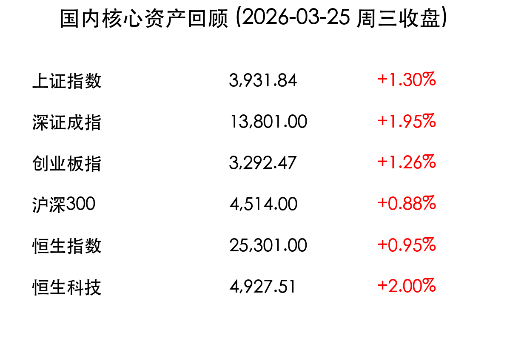
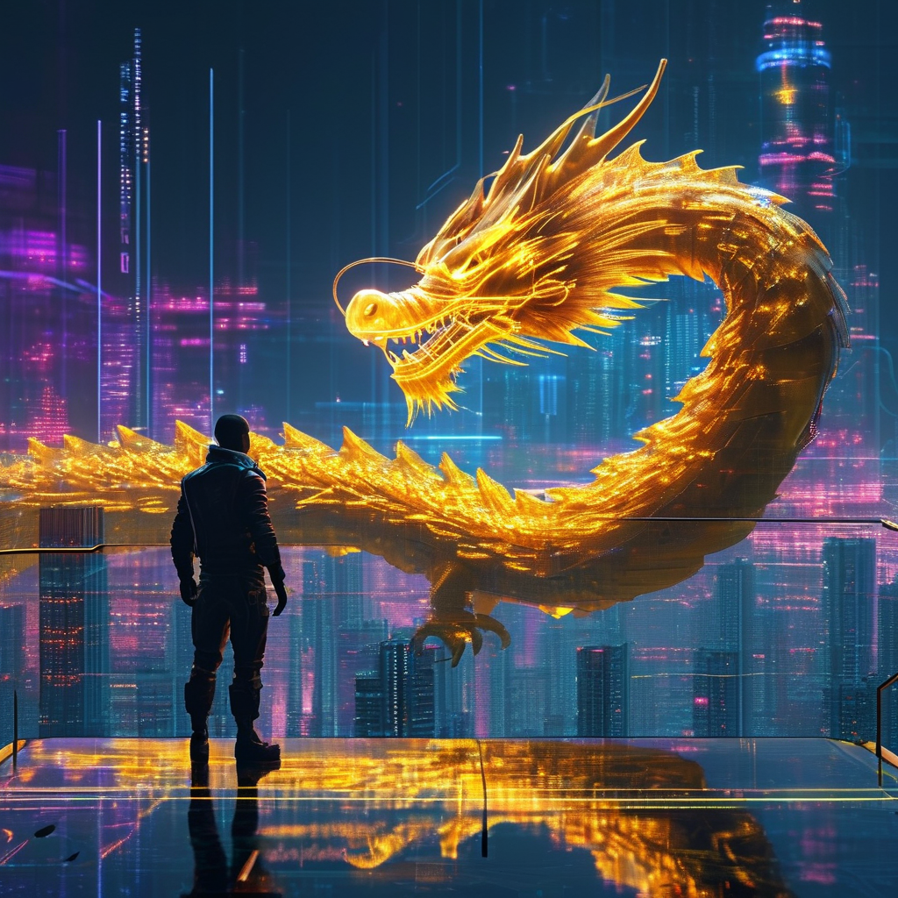

# 周三收盘：万亿成交 A股普涨，政策暖风下“算电协同”重燃火花

**日期：2026年03月25日 (星期三)** &nbsp; **时段：下午 (国内市场今日收盘)**

> **核心摘要**：今日 A 股与港股市场在多重利好支撑下全面爆发，上证指数成功站上 3900 点。央行连续第 13 个月加量续做 MLF 释放流动性暖意，全市场成交额放大至 2.19 万亿元。电力与 AI 产业链形成双轮驱动，市场风险偏好显著抬升，个股呈现普涨格局。

## 核心行情复盘

在流动性宽松预期与产业政策利好的双重共振下，国内市场今日走出单边上扬行情。

*   **上证指数**：报 **3931.84点**，上涨 **1.30%**。
*   **深证成指**：报 **13801.00点**，上涨 **1.95%**。
*   **创业板指**：报 **3,292.47点**，上涨 **1.26%**。
*   **沪深300**：报 **4,514.00点**，上涨 **0.88%**。
*   **恒生指数**：报 **25,301.00点**，上涨 **0.95%**。
*   **恒生科技**：报 **4,927.51点**，大涨 **2.00%**。

> **领涨板块分析**：**电力板块**掀起涨停潮，华电辽能录得 8 连板，受“算电协同”政策持续催化，绿电资产重估逻辑强化。**AI 产业链**表现极度活跃，CPO、算力、半导体、消费电子等子板块集体走强，反映出英伟达 GTC2026 带动的算力需求预期仍在升温。此外，**旅游酒店**午后异动拉升。
>
> **个股表现**：全市场超 4800 只个股上涨，逾百股涨停，市场赚钱效应极佳。沪深两市成交额显著放量，交投热度维持高点。

## 核心解读与市场逻辑

> **流动性的“定心丸”**：中国人民银行今日开展 5000 亿元 MLF 操作，由于有 4500 亿元到期，实现净投放 500 亿元。这是央行连续第 13 个月加量续做，在季末时点通过平稳的资金投放，有效对冲了流动性波动的担忧，提振了多头信心。

> **“算电协同”新动力**：深圳印发人工智能服务器产业链高质量发展行动计划（2026-2028年），明确支持 800G 及以上光模块量产。这不仅利好 AI 硬件端，更让市场坚定认为算力与绿色电力的协同发展是未来数年的核心投资主线。

## 政策脉动

*   **MLF 加量续做**：央行通过 MLF 净投放 500 亿元，释放维护季末流动性平稳信号，维持货币政策适度宽松基调。
*   **数据要素新规**：国家数据局将加快建立全国统一的数据产权登记制度，工信部推动出台数据要素赋能新型工业化政策。
*   **博鳌论坛前瞻**：2026 年博鳌亚洲论坛预计亚洲经济增速将达 4.5%，中国股市被看好将继续保持上涨态势。

## 最新机构观点

*   **中信证券 (CITIC)**：持续看好 AI 算力需求，建议聚焦英伟达 GTC 带来的增量空间，重点关注国内头部 **AI PCB、覆铜板 (CCL) 及存储厂商**。同时认为在风险偏好波动期，银行板块作为防御性资产仍具备配置价值。
*   **中金公司 (CICC)**：提醒投资者关注 **地缘政治波动下的油价冲击**。认为在外部不确定性（如美伊冲突）明朗前，建议关注具备“安全溢价”的资产，如绿电、硬科技及具备长期对冲价值的黄金。
*   **申万宏源**：认为今日反弹确立了 A 股在经历剧烈波动后的底部支撑，万亿成交规模意味着存量博弈正转向增量驱动。

## 今日市场情绪：万亿成交下的“金龙”出海

> Prompt: Cyberpunk style, A human trader (real person) standing on a transparent platform, looking out at a futuristic skyline. On the giant screen in the background, a golden digital dragon made of light and data particles coils upward from a glowing circuit board city, representing the A-share AI and power sector revival. Above the city, a large golden orb radiating digital energy is visible in the dark sky, symbolizing the MLF liquidity injection., masterpiece, high detail, intricate composition, cinematic lighting, 8k resolution

---
免责声明：内容仅供参考，不构成投资建议。
