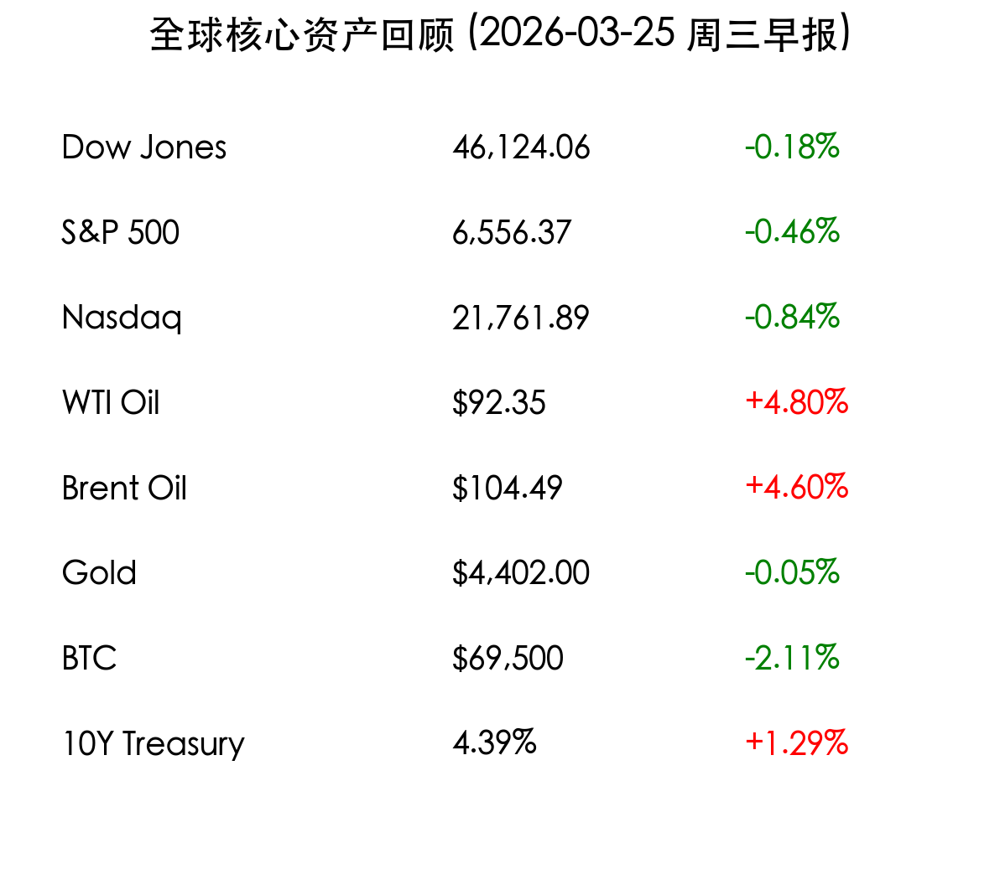

# 周三早报：伊核谈判迷雾重现，避险情绪升温导致美股高位回调

**日期：2026年03月25日 (星期三)** &nbsp; **时段：上午 (国际市场隔夜复盘)**

> **核心摘要**：因伊朗方面否认“止战谈判”，中东局势再度陷入紧张，避险情绪推动原油价格强劲反弹，美债收益率飙升至年内高点。受此压力，美股三大指数周二集体收跌，纳指领跌近 1%。

## 核心行情复盘

周二（3月24日），国际市场回吐了前一交易日的部分涨幅。随着地缘政治风险的“回马枪”，投资者重新审视通胀与利率路径。

*   **道琼斯指数**：收于 **46,124.06点**，下跌 **0.18%** (-84.47)。
*   **标普500指数**：收于 **6,556.37点**，下跌 **0.46%** (-30.40)。
*   **纳斯达克指数**：收于 **21,761.89点**，下跌 **0.84%** (-184.87)。
*   **WTI 原油**：收于 **$92.35/桶**，上涨 **4.80%**。
*   **布伦特原油**：收于 **$104.49/桶**，上涨 **4.60%**。
*   **现货黄金**：结算价为 **$4,402.00/盎司**，微跌 **0.05%**，高位震荡。
*   **比特币 (BTC)**：回落至 **$69,500** 附近，跌幅约 **2.11%**。
*   **10年期美债收益率**：飙升至 **4.39%**，反映出市场对长期通胀的担忧。

> **板块表现分析**：风险资产普遍承压，科技股成为抛售重灾区。英伟达 (NVIDIA) 跌 1.5%，特斯拉 (Tesla) 跌 2.2%。与之相对，**能源板块**表现强劲，埃克森美孚 (ExxonMobil) 上涨 2.8%。**军工板块**也因局势紧张而获得资金青睐。

## 核心解读与市场逻辑

> **地缘政治的“虚晃一枪”**：德黑兰方面正式否认了与美方进行“富有成效的对话”，称此前的推迟打击仅是美方的单方面宣称。这导致周一注入市场的“乐观溢价”迅速蒸发，原油价格单日反弹近 5%，直接推高了市场的通胀预期。

> **美债收益率的压制效应**：10年期美债收益率攀升至 4.39%，触及今年以来的最高水平。高收益率不仅增加了企业的融资成本，更对科技股等成长性板块的估值构成直接挤压，市场对美联储 2026 年降息的押注已几近清空。

## 政策脉动

*   **五角大楼高度戒备**：尽管特朗普政府维持“五日暂停”指令，但美方官员警告，若伊朗支持的武装力量发起任何挑衅，美方将立即恢复打击计划。这种“准战争”状态让市场如履薄冰。
*   **通胀预期修正**：周二公布的部分前瞻性通胀指标显示，由于能源价格高企，服务业通胀依然具有极强的“粘性”，这为美联储维持高利率提供了更多理由。

## 最新机构观点

*   **高盛 (Goldman Sachs)**：警告能源价格的波动已将美国未来 12 个月内进入衰退的概率推高至 **30%**。油价若持续站稳 100 美元上方，将对消费支出产生明显的抑制。
*   **巴克莱 (Barclays)**：尽管宏观环境严峻，但仍上调标普 500 年底目标位至 **7,650点**，认为强劲的企业盈利表现仍是美股的长效支撑，目前的调整是健康的。
*   **瑞银 (UBS)**：预计本月 CPI 可能跳升至 **3.4%**，远高于美联储 2% 的目标，这种“更高更久”的利率环境将成为 2026 年上半年的市场主旋律。

## 今日市场情绪：战云密布下的风险回撤

> Prompt: Cyberpunk style, A human trader (real person) standing in a high-tech control room, looking at a wall of screens where a digital map of the Middle East is glowing with orange danger zones, while financial red tickers flicker intensely, dramatic shadows and neon lighting, masterpiece, high detail, intricate composition, cinematic lighting, 8k resolution

---
免责声明：内容仅供参考，不构成投资建议。
