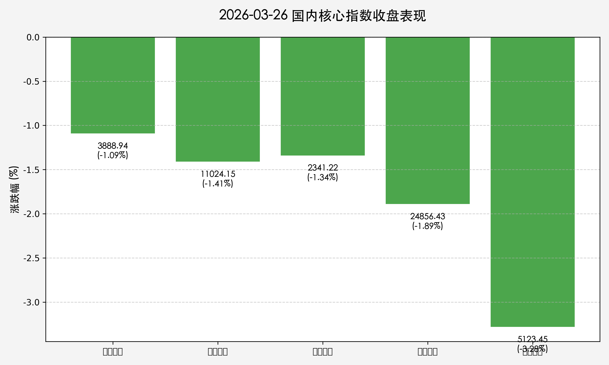
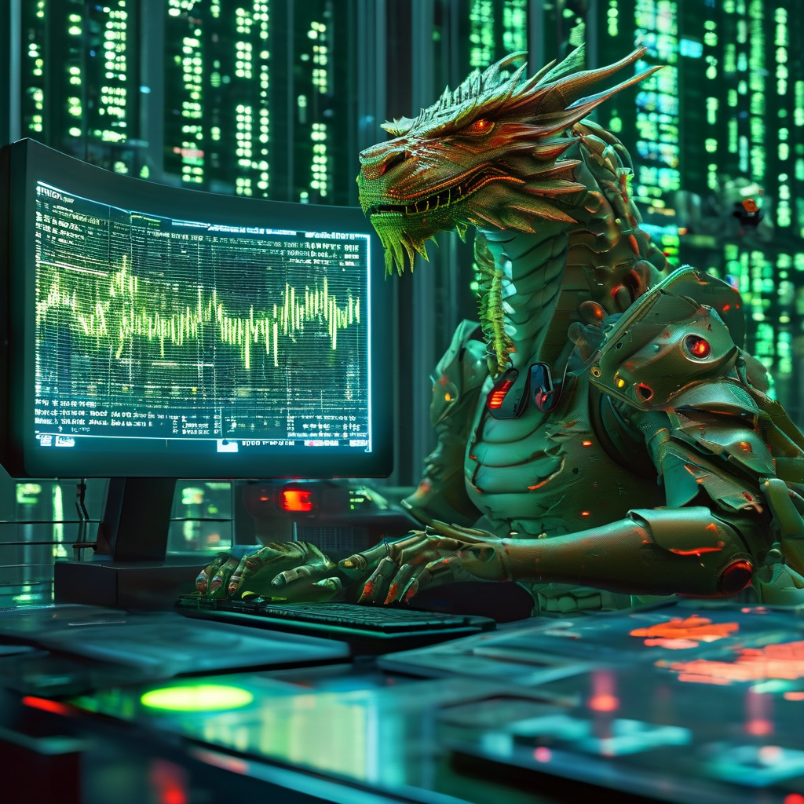

# 2026-03-26 收盘：缩量调整，Google“黑科技”突袭芯片股，A股失守3900点

**日期：2026年03月26日 (星期四)** &nbsp; **时段：下午 (国内市场今日收盘)**

> **核心摘要**：今日A股与港股在经历反弹后显著回调，上证指数失守3900点整数关口。Google发布的TurboQuant压缩算法引发市场对存储及算力芯片需求的结构性担忧，半导体板块领跌。同时受中东局势再度陷入僵局影响，市场风险偏好下降，资金流向电力、锂电及煤炭等防御与硬科技方向。

## 核心行情复盘

周四（3月26日），国内市场在缩量中选择向下寻求支撑。三大指数全天震荡走弱，特别是科技权重股的低迷对市场人气造成较大打击。

*   **上证指数**：报收 **3888.94点**，下跌 **1.09%**。
*   **深证成指**：报收 **11024.15点**，下跌 **1.41%**。
*   **创业板指**：报收 **2341.22点**，下跌 **1.34%**。
*   **科创50指数**：下跌 **2.12%**，受半导体下挫拖累。
*   **恒生指数**：报收 **24856.43点**，下跌 **1.89%**。
*   **恒生科技指数**：报收 **5123.45点**，大跌 **3.28%**。
*   **成交额**：A股全天成交额约为 **1.95万亿元**，较前一交易日显著缩量。

> **板块表现分析**：**电力与算电协同**板块逆市走强，华电辽能录得“9连板”成为市场焦点。**锂电及能源金属**板块受固态电池产业化进展刺激表现活跃。相比之下，**半导体与AI应用**板块沦为重灾区，中芯国际、兆易创新等权重股跌幅居前。**非银金融**（保险、券商）亦表现低迷。

## 核心解读与市场逻辑

> **Google "TurboQuant" 的冲击波**：Google最新发布的TurboQuant算法宣称能将AI模型内存占用降低6倍。市场对此解读为“变相降低了对高性能存储和算力芯片的需求量”，在当前高估值的背景下，引发了半导体板块的获利盘踩踏。

> **避险情绪重新回归**：因伊朗方面拒绝了15点和平方案，中东局势的不确定性再度上升。这一信号直接导致了早盘好不容易积累的多头情绪迅速涣散，资金被迫流向黄金、煤炭及具有公用事业属性的电力板块。

## 政策脉动

*   **“十五五”规划前瞻**：官方近期密集讨论“十五五”GDP目标，强调保持在4.5%-5.0%的合理区间，并重点转向“质效优先”。
*   **货币政策定调**：央行重申支持性货币政策立场，保持流动性合理充裕，缓解了市场对短期资金面收紧的担忧。
*   **制造业数字化**：广东省印发制造业与服务业融合行动方案，目标推动超4000家规上企业数字化转型，为相关软件与服务板块提供长期支撑。

## 最新机构观点

*   **证券日报/人民网**：提出 **“买中国就是买安全”**，认为在全球波动加剧背景下，中国资产的稳定性正成为吸引国际长线资金的核心要素。
*   **申万宏源**：认为当前属于反弹后的顺势整理，成交量虽然萎缩但基本盘依然稳健。建议关注 **“HALO资产”**（高壁垒、低代码化）及具备出海竞争力的先进制造企业。
*   **中信建投**：指出固态电池与绿电算力是当前最明确的结构性机会。尽管科技股短期受利空扰动，但中长期国产替代与能效提升的逻辑并未改变。

## 今日市场情绪：科技股的寒意与安全资产的港湾

> Prompt: Cyberpunk style, A high-tech trading floor, a human trader (real person) looking worriedly at a large screen showing a 6x compression algorithm (TurboQuant) impacting a chip diagram, while green downward arrows and some red 'safety' icons float in the background. Digital hologram of a dragon on the wall., masterpiece, high detail, intricate composition, cinematic lighting, 8k resolution

---
免责声明：内容仅供参考，不构成投资建议。
