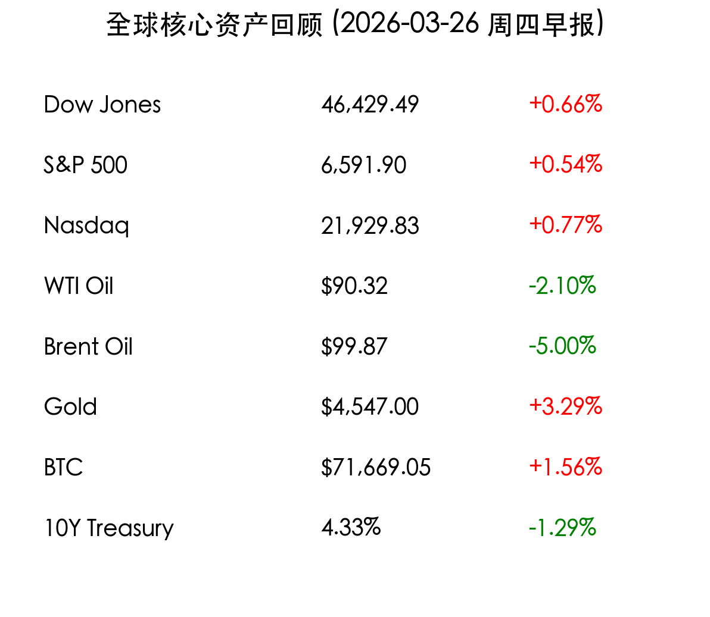
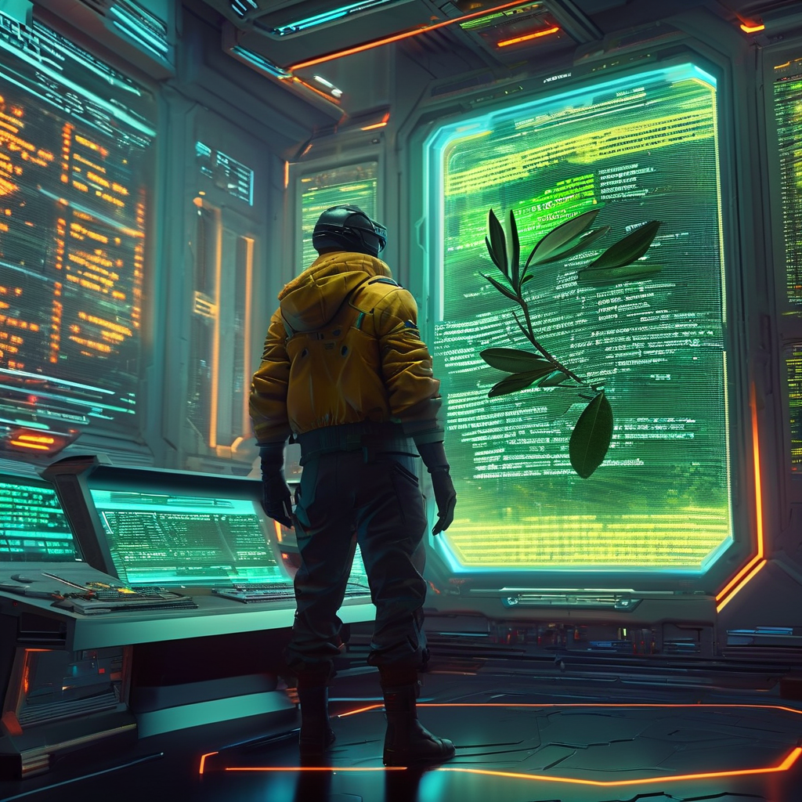

# 2026-03-26 隔夜复盘：中东和平方案提振，美股全线收红，原油回落

**日期：2026年03月26日 (星期四)** &nbsp; **时段：上午 (国际市场隔夜复盘)**

> **核心摘要**：受美国向伊朗提交15点和平计划的报道提振，中东局势出现缓和曙光，美股三大股指周三全线收涨。芯片股表现强劲领涨纳指，原油价格因避险情绪降温大幅回落，但黄金与比特币意外维持涨势。

## 核心行情复盘

周三（3月25日），国际市场情绪受地缘政治利好驱动显著回暖。投资者对中东局势走向停火的预期升温，推动资金从能源市场流回权益市场。

*   **道琼斯指数**：收于 **46,429.49点**，上涨 **0.66%** (+305.43)。
*   **标普500指数**：收于 **6,591.90点**，上涨 **0.54%** (+35.53)。
*   **纳斯达克指数**：收于 **21,929.83点**，上涨 **0.77%** (+167.93)。
*   **WTI 原油**：收于 **$90.32/桶**，下跌 **2.10%**。
*   **布伦特原油**：收于 **$99.87/桶**，下跌 **5.00%**，失守 100 美元关口。
*   **现货黄金**：结算价为 **$4,547.00/盎司**，大幅上涨 **3.29%** (+145美元)。
*   **比特币 (BTC)**：报 **$71,669.05**，上涨 **1.56%** (+1,100美元)。
*   **10年期美债收益率**：回落至 **4.33%**。

> **板块表现分析**：科技股特别是**半导体板块**成为反攻先锋。AMD、英特尔 (Intel) 和 Arm 因新产品预期及全线涨价传闻而大幅领涨。受油价回落影响，航空与交通运输板块集体反弹。与之相对，能源巨头则因布油跌破 100 美元而普遍承压。

## 核心解读与市场逻辑

> **15点和平计划的破冰尝试**：据报道，美国已向伊朗提交了一份包含 15 个要点的全面和平建议。尽管德黑兰方面尚未正式回应，且有伊朗媒体表示拒绝，但市场选择了“先涨为敬”，将其解读为外交解决冲突的重大转机。

> **大宗商品的走势背离**：原油价格因战争溢价消退而大跌，但黄金却逆市走强，收盘大涨逾 140 美元。这种背离反映出市场在乐观情绪中仍保留了极强的警惕性——投资者担心和平方案可能面临变数，且长期通胀压力依然让实物资产具备吸引力。

## 政策脉动

*   **美伊外交博弈**：白宫确认外交渠道正在发挥作用，特朗普政府试图在“五日指令”到期前达成框架性协议。目前焦点在于霍尔木兹海峡的航行权及相关的制裁解除条款。
*   **芯片产业政策**：市场传闻主要芯片代工厂商正酝酿新一轮涨价，以应对高企的能源成本和持续旺盛的 AI 算力需求，这为半导体企业提供了利润空间支撑。

## 最新机构观点

*   **摩根大通 (J.P. Morgan)**：将对美股的观点从“战术性看空”上调至 **“中性”**。认为除非看到具体的停火协议签署，否则市场将维持区间震荡，特别关注和平方案中关于霍尔木兹海峡的细节。
*   **高盛 (Goldman Sachs)**：维持谨慎，将未来 12 个月美国**衰退概率上调至 30%**。尽管和平传闻利好，但若能源价格波动不能长期平息，对全球 GDP 的负面冲击（预计 -0.3%）将不可避免。
*   **摩根士丹利 (Morgan Stanley)**：首席分析师 Mike Wilson 依然维持 **看多** 立场。他认为地缘政治冲击往往是短暂的，除非油价翻倍，否则不足以扭转美股牛市趋势，建议配置医疗、国防及网络安全板块。

## 今日市场情绪：曙光初现中的警惕

> Prompt: Cyberpunk style, A human trader (real person) standing in a high-tech control room, looking at a giant digital screen showing a 15-point peace scroll with an olive branch, while chip-like symbols float in the background. Cinematic lighting, high detail, intricate composition., masterpiece, high detail, intricate composition, cinematic lighting, 8k resolution

---
免责声明：内容仅供参考，不构成投资建议。
