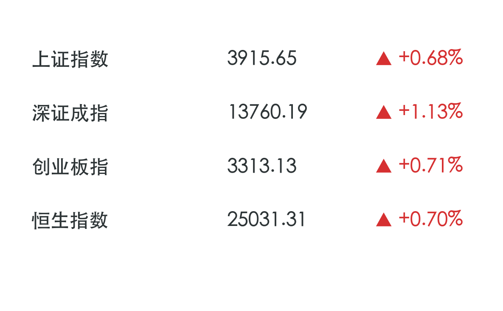

# 2026-03-27 收盘：低开高走 V型反转，锂电与医药引领多头反攻

**日期：2026年03月27日 (星期五)** &nbsp; **时段：下午 (国内市场今日收盘)**

> **核心摘要**：今日 A 股与港股在经历早盘外部利空冲击后展现极强韧性，走出“低开高走”的 V 型反转行情。锂电产业链、医药及化工板块成为反攻主力，上证指数稳步回升至 3900 点上方。全天成交额达 1.85 万亿元，显示资金在回调中积极入场，市场情绪显著修复。

## 核心行情复盘

周五（3月27日），国内市场展现出独立于美股的走势。在隔夜纳指走弱的背景下，A 股三大指数集体低开后震荡上行，最终全线收红。

*   **上证指数**：报收 **3915.65点**，上涨 **0.68%**。
*   **深证成指**：报收 **13760.19点**，上涨 **1.13%**。
*   **创业板指**：报收 **3313.13点**，上涨 **0.71%**。
*   **恒生指数**：报收 **25031.31点**，上涨 **0.70%**。
*   **成交额**：A股全天成交额约为 **1.85万亿元**，较前一交易日略有缩量，但市场赚钱效应回暖，超 4300 只个股上涨。

> **领涨行业分析**：**锂电产业链**（能源金属）今日集体爆发，受碳酸锂价格企稳预期及下游补库需求带动，多只权重股录得大涨。**医药生物**板块午后发力，创新药个股表现活跃。此外，**基础化工及建筑装饰**板块在政策利好预期下稳步推升。

## 核心解读与市场逻辑

> **1. 韧性凸显的独立行情**：尽管外部地缘政治仍有波动，但 A 股市场今日展现了较强的内在稳定性。早盘的低开完成了对隔夜美股下跌风险的快速释放，随后的震荡走高反映了内资对“十五五”开局年基本面复苏的信心。

> **2. 风格切换与存量博弈**：今日市场并未出现盲目的科技股踩踏，反而呈现出资金在不同成长赛道间的良性轮动。从 AI 到新能源的资金回流，显示出市场在万亿成交规模下，依然具备充足的流动性去支撑多个主线。

## 政策脉动

*   **资本市场改革**：证监会强调将继续严厉打击财务造假，进一步提升上市公司质量，旨在长效吸引长期资金入市，增强市场内生稳定性。
*   **绿色金融支持**：多部门联合发文，加大对工业领域节能降碳的技术改造贷款支持，直接利好环保与节能设备板块。

## 最新机构观点

*   **中信证券**：短期地缘扰动不改中长期复苏趋势，今日的 V 型走势确立了阶段性底部，建议关注具备业绩支撑的成长股龙头。
*   **国泰君安**：市场已进入震荡向上阶段，科技与制造双主线逻辑未变，锂电板块的反弹是估值修复的开始。
*   **华泰证券**：两市超 4000 只个股上涨，显示赚钱效应已全面铺开，建议维持积极仓位。

## 今日市场情绪：反转的曙光与多头的韧性

> Prompt: cinematic style, A hopeful Chinese investor looking at a massive screen in a bright digital trading room, showing rising green charts. In the background, a phoenix made of glowing data particles rises from a circuit board city, symbolizing the market's V-shape recovery., masterpiece, high detail, intricate composition, cinematic lighting, 8k resolution

---
免责声明：内容仅供参考，不构成投资建议。
