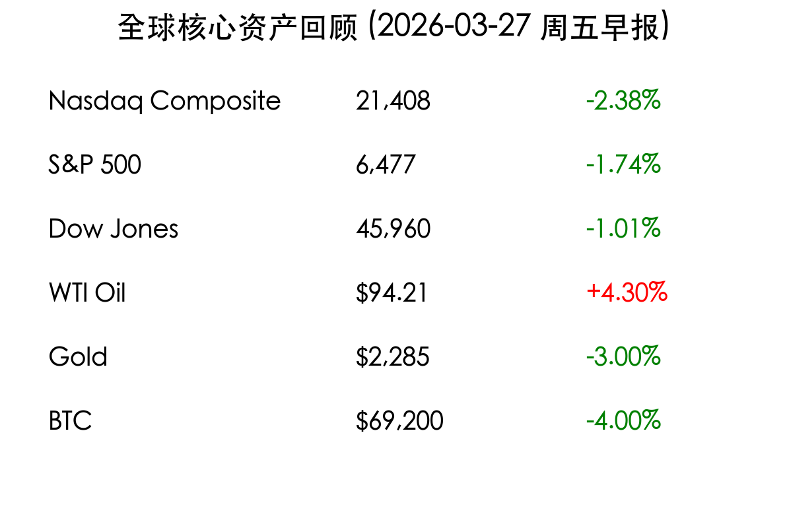

# 伊朗停火预期破灭：纳指陷回调区间，原油大涨金价重挫

**日期：2026年03月27日 (星期五)** &nbsp; **时段：上午 (国际市场隔夜复盘)**

> **核心摘要**：伊朗拒绝美方 15 点停火提案导致地缘政治危机升级，市场“停火交易”迅速反转。美股全线收跌，纳指正式进入回调区间；原油因供应风险飙升 4%，而金价受美债收益率反弹压制大幅重挫。

## 核心行情复盘

周四（3月26日）美股市场遭遇抛售潮，投资者对中东局势的乐观情绪被冰冷的现实击碎。

*   **纳斯达克综合指数**：大跌 **2.38%**，报 21,408 点，较去年 10 月的高点下跌超过 10%，正式进入技术性回调区间。
*   **标普 500 指数**：下跌 **1.74%**，失守 6,500 点整数关口。
*   **道琼斯工业平均指数**：下跌 **1.01%**。
*   **能源板块**：标普 500 能源板块逆市上涨 **1.6%**，成为唯一飘红的板块。
*   **大宗商品**：WTI 原油暴涨 **4.3%** 至 94.21 美元/桶；黄金则录得 **3.0%** 的单日跌幅，跌破 2,300 美元支撑位。

## 核心解读与市场逻辑

> **1. 地缘政治预期“大反转”**
> 尽管此前市场对停火抱有极大期望，但德黑兰方面正式拒绝了美方提出的方案，导致“停火交易”仓位发生踩踏。投资者开始为长期的能源供应中断和更高的通胀预期定价。

> **2. 科技股“挤水分”**
> 随着美债收益率上升，高估值科技股压力倍增。**Meta** 因监管裁决大跌近 8%，**英伟达** 跌超 4%。市场正在经历从 AI 增长股向传统价值/能源股的剧烈风格切换。

> **3. 通胀阴云不散**
> 欧央行行长拉加德的言论犹如一盆冷水。她警告称，市场对战争引发的通胀冲击过于乐观。这意味着利率在更长时间内保持高位（Higher for Longer）的预期再次回归。

## 政策脉动

*   **欧央行 (ECB)**：行长拉加德表示，当前的通胀路径仍具高度不确定性，利率下行的空间远小于市场预期。
*   **地缘外交**：美方 15 点提案遭拒后，中东局势进入僵持期，白宫表示将继续施压，但市场信心已受重创。

## 最新机构观点

*   **摩根士丹利 (Morningstar context)**：市场目前正处于“地缘政治风险”与“估值过高”的双重夹击中，建议投资者增加防御性资产配置。
*   **高盛 (Goldman Sachs)**：能源股的结构性行情可能才刚刚开始，如果油价站稳 100 美元，全球供应链压力将再次传导至消费端。
*   **英伟达分析师**：虽然 AI 基本面未变，但短期内资金流出的压力主要来自宏观环境的恶化，而非技术本身的瓶颈。

## 今日市场情绪：避险中的焦虑

> Prompt: cyberpunk style, A professional trader sitting in front of multiple screens, face showing deep anxiety as the stock tickers on the monitors all show sharp red downward graphs. In the background, a digital hologram of an oil barrel glows intensely red against a dark, stormy sky., masterpiece, high detail, intricate composition, cinematic lighting, 8k resolution

---
免责声明：内容仅供参考，不构成投资建议。
