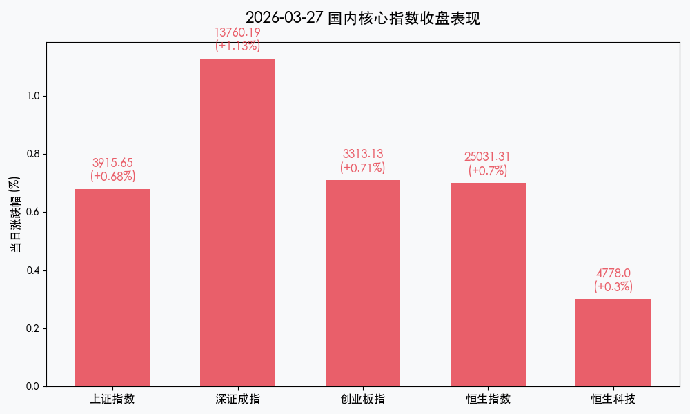
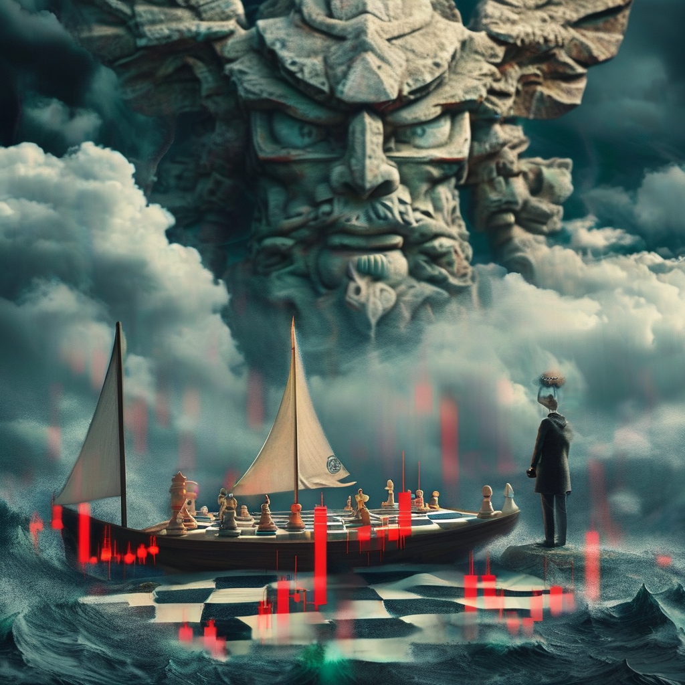

# 【周末复盘】中东战云扰动全球，A股底部韧性渐显，静待非农定音

**日期：2026年03月28日 (星期六)** &nbsp; **时段：下午 (周末全周复盘)**

> **核心摘要**：本周全球市场在中东局势急剧升温与通胀担忧中大幅震荡。A股在经历周初回调后，于周五凭借锂电与医药板块强势补涨展现独立韧性。下周市场将进入“非农时间”，在 G7 紧急能源会议与美国 3 月非农数据的双重考验下，避险资产与实物资产的对冲价值愈发凸显。

## 核心资产周度/日度表现回顾

本周（3月23日-3月27日），A 股与港股均呈现先抑后扬的“V”型走势。周五的有力反攻收复了周内大部分失地，但全周来看，主要指数仍维持小幅贴水态势。

*   **上证指数**：报收 **3915.65点**，周五上涨 **0.68%**，全周累计下跌 **1.09%**。
*   **深证成指**：报收 **13760.19点**，周五上涨 **1.13%**，全周累计下跌 **0.76%**。
*   **创业板指**：报收 **3313.13点**，周五上涨 **0.71%**，全周累计下跌 **1.68%**。
*   **恒生指数**：报收 **25031.31点**，周五上涨 **0.70%**，本周曾一度跌至 **24203点** 后展开反弹。
*   **核心特征**：周五两市成交额维持在 **1.85万亿元**，显示虽有外部扰动，但内资抄底意愿坚决。领涨板块由 AI 转向具备业绩支撑的**锂电产业链**与**医药生物**。

## 过去 48 小时重磅事件深度复盘

> **1. 中东“黑天鹅”：霍尔木兹海峡风险重塑通胀预期**
> 伊朗局势的骤然升级导致原油运输受阻，布伦特原油一度冲破 115 美元/桶，引发全球对“二次通胀”的剧烈担忧。美股周五全线重挫，但 A 股市场今日展现了较强的“避险”属性，资源股与高股息资产在动荡中成为资金避风港。

> **2. A股结构性反击：锂电与医药的估值修复**
> 在经历了前期科技股的极致抛售后的存量博弈中，资金开始回流新能源与创新药板块。碳酸锂价格的企稳预期及医药行业“十五五”规划的政策暖风，共同驱动了周五的 V 型反转。

> **3. 制度利好：科技型企业认定标准优化**
> 沪深交易所修订发布“轻资产、高研发投入”认定标准，这将显著拓宽科技成长型企业在主板的融资路径，为“科技-产业-资本”的良性循环提供了制度保障。

## 下周全球宏观大事预警

下周将是 2026 年一季度末与二季度初的交替期，市场情绪将高度敏感：

*   **3月30日（周一）**：**G7 紧急会议**。财长与能源部长将讨论释放战略石油储备以平抑油价。
*   **3月31日（周二）**：**中国 3 月官方制造业 PMI**。这是验证一季度经济复苏斜率的最核心指标。
*   **4月1日（周三）**：**美国 3 月 ADP 就业人数（小非农）**。
*   **4月3日（周五）**：**美国 3 月非农就业报告（NFP）**。全周最关键数据，将决定美联储 9 月后的利率走向。
*   **特别提醒**：4月3日（周五）为**耶稣受难日**，港股、美股及欧洲多国股市均休市一日，市场流动性或在周四提前收紧。

## 顶级机构周末策略内参摘要

*   **中信证券**：市场处于“磨底”阶段的末期，上证指数 3900 点具备极强的技术与心理支撑，建议保持 3-5 成仓位，守望成长股龙头。
*   **中金公司**：地缘政治造成的波动是布局优质实物资产（黄金、铜、原油）的良机，港股在 24000 点附近具备中线配置价值。
*   **国泰君安**：当前处于“B浪反弹”中，需关注下周非农数据后的美元指数动向。建议配置上侧重高股息+有色金属的组合以对冲不确定性。

## 今日市场情绪：战事、复苏与博弈的交响曲

> Prompt: Surrealism style, In a vast, dark ocean where the waves are composed of jagged red and green financial K-line charts, a small, fragile sailboat struggles to stay afloat. High above in the swirling clouds, a colossal stone titan sits at a table of light, calmly moving glowing chess pieces that represent global economies. On a distant, rocky cliff, a human trader (real person) stands in a flickering lighthouse, holding a telescope and watching the cosmic game unfold., masterpiece, high detail, intricate composition, cinematic lighting, 8k resolution

---
免责声明：内容仅供参考，不构成投资建议。
