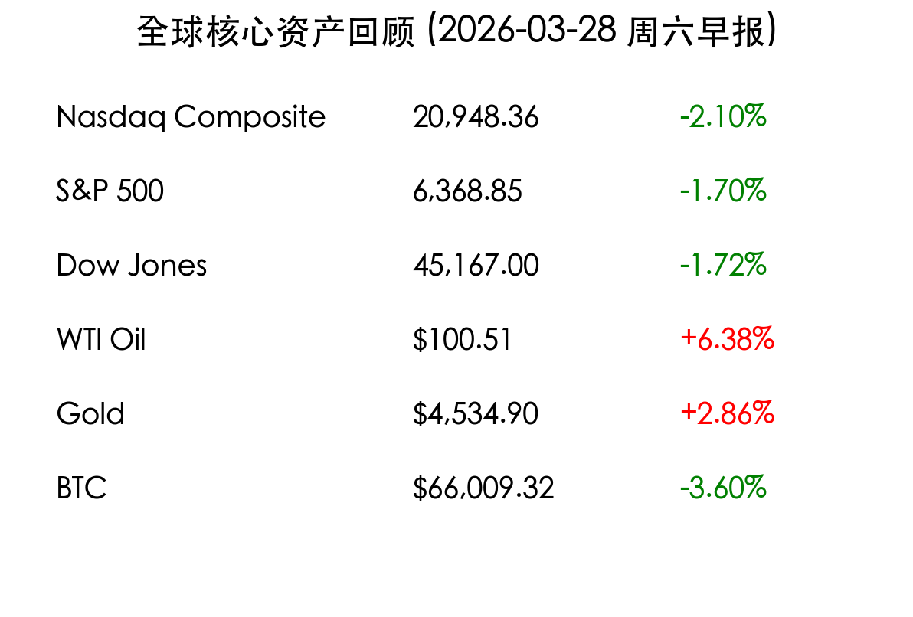

# 中东战云密布：三大股指全线重挫，原油重回 100 美元

**日期：2026年03月28日 (星期六)** &nbsp; **时段：上午 (国际市场隔夜复盘)**

> **核心摘要**：伊朗局势剧烈升级引发全球市场“风险厌恶”爆发，美股三大股指周五全线收跌，纳指领跌 2.1%。能源供应担忧推升 WTI 原油突破 100 美元关口，避险资金涌入黄金使其单日大涨近 3%。

## 核心行情复盘

周五（3月27日）美股市场遭遇多重利空袭击，地缘政治冲突与科技股抛售形成共振，标普 500 指数近两年来首次面临 5,000 点保卫战。

*   **纳斯达克综合指数**：大跌 **2.10%**，报 20,948.36 点，科技权重股全线走弱。
*   **标普 500 指数**：下跌 **1.70%**，报 6,368.85 点。
*   **道琼斯工业平均指数**：大跌 **1.72%** (约 793 点)，报 45,167.00 点，触及 6 个月新低。
*   **原油市场**：WTI 原油飙升 **6.38%**，报收于 **100.51 美元/桶**；布伦特原油突破 **104 美元/桶**。
*   **避险资产**：黄金期货大涨 **2.86%**，报收于 **4,534.90 美元/盎司**；比特币则受避险情绪反噬，跌破 68,000 美元至 **66,009.32 美元**。

## 核心解读与市场逻辑

> **1. 地缘政治：能源战阴云**
> 特朗普总统宣布延长对伊朗打击期限，但荷姆兹海峡（Strait of Hormuz）的封锁导致每日近 1,800 万桶原油运输受阻。市场对“长期断供”的恐惧已取代了先前的停火乐观情绪，原油价格的结构性暴涨正在重塑通胀预期。

> **2. 科技股：AI 逻辑的意外扰动**
> Google 推出的 TurboQuant AI 压缩技术本意是提高效率，但却意外引发了市场对“内存芯片需求下降”的担忧。美光（Micron）等半导体巨头的大跌直接拖累了纳指表现，反映出市场在当前高位对任何利空信号的极度敏感。

> **3. 宏观预期：降息再推迟**
> 随着油价推升二次通胀风险，经济学家普遍预期美联储（Fed）的降息窗口将从年中推迟至 2026 年 9 月以后。利率在更长时间内保持高位（Higher for Longer）的压力令高估值科技股持续承压。

## 政策脉动

*   **地缘局局势**：美国白宫表示将对伊朗能源设施保持高压态势，4 月 6 日被视为最后的外交谈判窗口。
*   **监管动态**：Meta 因涉及青少年社交安全问题的过失裁定，面临巨额潜在赔偿，其股价单周暴跌 13%。

## 最新机构观点

*   **Trivariate Research (Adam Parker)**：建议投资者在市场出现明确筑底信号前保持谨慎，目前下行压力尚未完全释放。
*   **Wedbush**：尽管市场动荡，仍维持对苹果（Apple）的“跑赢大盘”评级，认为其在 200 日均线附近具备较强的技术支撑。
*   **摩根士丹利**：指出原油价格若站稳 100 美元上方，将对全球消费电子和交通运输板块产生显著的成本压力。

## 今日市场情绪：原油烈火与科技寒冬

> Prompt: Surrealism style, A giant hourglass stands in a desolate landscape, its upper bulb filled with thick, black crude oil that is overflowing and crushing a golden scale below. In the background, a digital screen displays a sharp red downward stock graph, while a golden phoenix made of glowing laser light struggles to rise from a field of silicon chips. A human trader (real person) watches from a distance., masterpiece, high detail, intricate composition, cinematic lighting, 8k resolution

---
免责声明：内容仅供参考，不构成投资建议。
