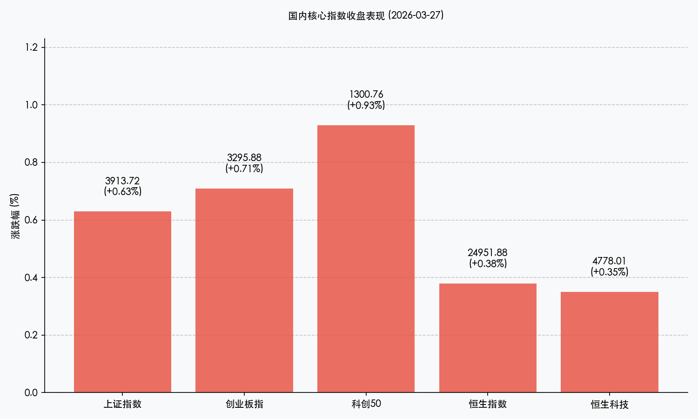

# 【新周展望】地缘博弈下的内生韧性：词元经济领航，静待政策春风

**日期：2026年03月29日 (星期日)** &nbsp; **时段：新周展望 (Mode C)**

> **核心摘要**：尽管中东局势升级引发全球避险情绪，但 A 股与港股在周五的企稳反弹显示出极强的防御底色。随着“词元经济”被正式定名，AI 应用端逻辑进一步夯实。下周市场将聚焦 4 月政治局会议前的政策博弈及一季报业绩预告，外需突围与内生增长将成为核心审美。

## 周末财经要闻终极汇总

1.  **“词元经济”正式定名，确立 AI 价值锚点**：国家数据局明确 Token 中文译名为“词元”，指出其为智能时代的价值锚点。国内日均词元调用量两年增长超千倍，标志着 AI 赛道从算力基建转向应用落地的关键拐点。
2.  **地缘局势持续紧张，全球避险情绪升温**：中东战火蔓延，美伊冲突升级，布伦特原油站稳 100 美元/桶上方。尽管外部动荡，但高盛维持对中国股票的“超配”评级，认为 A 股估值更具吸引力。
3.  **民航开启夏秋航季，商旅需求强劲复苏**：3 月 29 日起全国民航执行新航季，商务快线及热门旅游目的地运力增加，“五一”机票预订量同比增近两成，利好大消费板块。
4.  **监管信号明确，严守食品安全底线**：国务院食安办约谈多地负责人，针对“3·15”曝光问题督促整改，释放出存量博弈下对行业规范化的高要求。

## 新一周市场核心博弈逻辑

*   **外部扰动 vs 内部政策韧性**：中东局势虽导致全球“股债金”波动，但 A 股周五的“低开高走”证明了 3900 点附近的底座支撑。下周市场将进入 4 月政治局会议的预期交易期，政策红利有望对冲外部不确定性。
*   **AI 逻辑从“概念”转向“词元经济”**：随着词元（Token）定义的明确，市场关注点将聚焦于真正具备词元消耗量和商业化闭环的 AI 应用企业。
*   **业绩验证期开启**：4 月份是一季报披露高峰。在经历了前期小微盘股的波动后，资金将更加青睐具备确定性增长的创新药、优质制造出海及能源金属板块。

## 本周重磅经济数据与会议前瞻

*   **3月30日 (周一)**：G7 紧急能源会议，关注对油价及能源供应链的最新表态。
*   **3月31日 (周二)**：**中国 3 月官方制造业 PMI**。这是验证一季度经济复苏斜率的最核心指标，直接影响二季度资产配置风向。
*   **4月3日 (周五)**：**美国 3 月非农就业报告**。决定美联储利率路径的关键数据。
*   **休市提醒**：4月3日（周五）为耶稣受难日，港股、美股休市，需防范周四提前出现的流动性收紧。

## 头部券商/投行开盘策略点睛

*   **中金公司**：当前或是 A 股的中期相对低点，建议关注景气成长（AI 应用、生物医药）与周期反转（供需改善的顺周期行业）两条主线。
*   **中信证券**：强调创新药板块已进入“业绩兑现+政策红利”双驱动阶段，认为黄金中长期避险逻辑未变。
*   **高盛 (Goldman Sachs)**：维持中国股票“超配”评级，指出名义 GDP 回升将利好中下游企业盈利。

## 今日市场情绪：守望黎明

> Prompt: Surrealism style, A resilient emerald bamboo plant standing tall and firm in the center of a swirling golden desert sandstorm representing geopolitical turmoil. The bamboo leaves are glowing with soft blue circuitry lines symbolizing 'Token/AI' technology. In the background, a faint, massive stone gateway leading to a lush green valley is visible through the dust. A human trader (real person) is seen in the distance, shielding their eyes but looking towards the gateway with hope., masterpiece, high detail, intricate composition, cinematic lighting, 8k resolution

---
免责声明：内容仅供参考，不构成投资建议。
