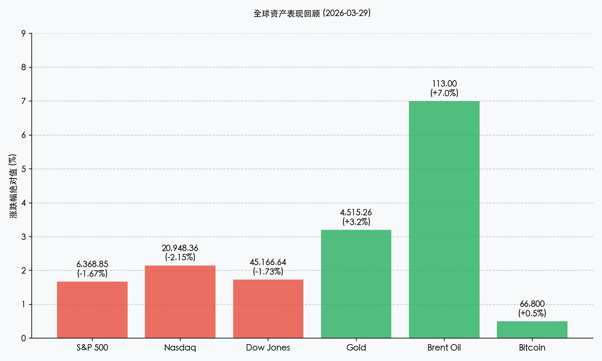

# 全球市场周度复盘与周初展望：地缘阴霾下的原油震荡

**日期：2026年03月29日 (星期日)** &nbsp; **时段：早报 (Morning Run)**

> **核心摘要**：美股录得连续第五周下跌，纳指正式进入“回调区间”。中东局势升级推动原油与黄金齐涨，投资者避险情绪浓厚。周末伊朗拒绝美方停火方案，市场静待周一开盘风险溢价的进一步计入。

## 核心资产周度/日度表现回顾

受地缘冲突与通胀预期上行的双重打击，全球风险资产在过去一周表现疲软，而避险资产与大宗商品则大幅走强。

*   **S&P 500**：收于 **6,368.85** 点，周跌幅 **-2.1%**，周五单日跌幅 **-1.67%**。
*   **Nasdaq Composite**：收于 **20,948.36** 点，周跌幅 **-3.2%**，正式进入回调区间（较 10 月高点下跌 >10%）。
*   **Dow Jones**：收于 **45,166.64** 点，周跌幅 **-0.9%**。
*   **黄金 (Gold)**：周五单日大涨 **+3.2%**，结算价报 **$4,515.26**/盎司。
*   **布伦特原油 (Brent Oil)**：周五单日飙升 **+7.0%**，报 **$113.00**/桶。
*   **比特币 (Bitcoin)**：周末维持在 **$66,800** 附近震荡，单日小幅反弹约 **+0.5%**。

## 过去 48 小时重磅事件深度复盘

> **地缘政治博弈进入白热化**：尽管特朗普将针对伊朗能源基础设施的打击限期延长至 **4 月 6 日**，但周末传来最新消息，德黑兰方面正式拒绝了美方提出的“15 点停火计划”。这一表态使得本周一开盘市场将面临极高的不确定性。
>
> **美国经济数据喜忧参半**：周五公布的密歇根大学消费者信心指数降至 **2025 年底以来的最低水平**，而一年期通胀预期则从 3.4% 意外攀升至 **3.8%**。这加剧了市场对于“滞胀”的担忧，市场目前对美联储年底前加息的概率预期已升至 **50%**。
>
> **科技股遭遇抛售潮**：Meta (-3.9%)、Amazon (-3.9%) 等 AI 领军企业因成本担忧及监管压力，领跌纳斯达克。投资者正在重新评估 AI 泡沫在当前利率环境下的持续性。

## 下周全球宏观大事预警

1.  **一季度收官“橱窗装饰” (周一/周二)**：基金经理可能集中清理表现落后的科技股，并转向防御性板块，预计周初波动率将显著放大。
2.  **美国 3 月非农就业报告 (周五)**：这是本周最重要的经济指标，将决定市场对 Fed 后续利率路径的定价。
3.  **ISM 制造业指数 (周三)**：观察工业生产是否受到高油价的实质性压制。

## 顶级机构周末策略内参摘要

*   **JPMorgan (小摩)**：将 2026 年底标普 500 指数目标价从 7,500 点下调至 **7,200** 点。分析师警告称，若美伊冲突实质性恶化，不排除指数近期回撤至 **6,000** 点。
*   **Goldman Sachs (高盛)**：尽管维持 **7,600** 点的基准目标，但针对“极端原油冲击”情景进行了压力测试，认为在此情况下指数可能下探至 **5,400** 点。高盛同时指出，系统性抛售可能已接近枯竭，若地缘局势出现任何缓和迹象，可能会引发剧烈的反弹。

## 今日市场情绪：原油压城，黄金避险

> Prompt: Surrealism style, A giant hourglass standing in a dark, stormy desert. Instead of sand, thick black crude oil is flowing from the top, slowly burying a golden scale. In the background, red glowing K-line charts flash like lightning across the sky. A human trader (real person) watches from a distance, looking worried., masterpiece, high detail, intricate composition, cinematic lighting, 8k resolution

---
免责声明：内容仅供参考，不构成投资建议。
