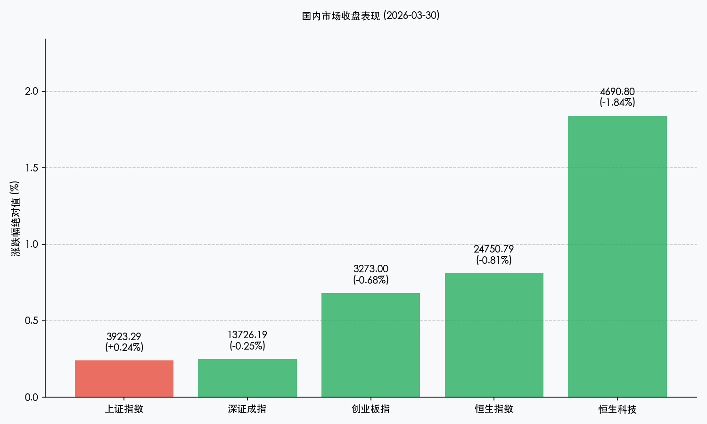

# 2026年3月30日 A股复盘：外部利空致低开，独立行情显韧性

**日期：2026年03月30日 (星期一)** &nbsp; **时段：晚间 (收盘报)**

> **核心摘要**：今日A股在外部利空冲击下展现强劲韧性，三大指数低开高走，沪指成功翻红。虽然港股及美股期指受中东局势影响走弱，但国内央行大额净投放及向好的工业利润数据支撑市场走出独立行情，铝业及黄金板块受地缘溢价驱动表现抢眼。

## 核心行情复盘

今日A股三大指数集体低开，随后展开震荡回升态势。沪指表现最为顽强，午后成功翻红并稳守3900点上方。

*   **上证指数**：报收 **3923.29点**，上涨 **0.24%**。
*   **深证成指**：报收 **13726.19点**，下跌 **0.25%**。
*   **创业板指**：报收 **3273.00点**，下跌 **0.68%**。
*   **成交额**：沪深京三市合计成交 **1.93万亿元**，较上一交易日小幅放量约638亿元。

**领涨板块**：
1.  **铝板块**：受中东铝冶炼厂遇袭消息刺激，供给担忧引发铝价大涨，天山铝业等多股涨停。
2.  **贵金属**：避险情绪升温，赤峰黄金涨停，山东黄金显著走高。
3.  **农业/创新药**：受粮价预期及出海数据利好驱动，表现活跃。

**领跌板块**：
*   **电力、光伏、保险**等板块跌幅居前，受成本压力及行业内卷竞争担忧拖累。

## 核心解读与市场逻辑

1.  **外部扰动与独立性**：周末美股重挫及中东冲突升级（伊朗袭击相关设施）导致国际油价和通胀压力骤增，令全球市场承压。然而，A股在低开后并未跟跌，而是凭借自身韧性回补缺口，显示出较强的抗风险能力。
2.  **基本面支撑**：1-2月规上工业企业利润同比增长 **15.2%**，为市场提供了坚实的底层信心。
3.  **地缘溢价驱动**：中东局势不仅推升了黄金的避险价值，更因巴林和阿联酋铝冶炼厂（涉及310万吨产能）受威胁，直接引爆了工业金属的涨价逻辑。

## 政策脉动

*   **央行流动性呵护**：为平滑季末资金波动，央行今日开展2695亿元逆回购操作，实现净投放 **2615亿元**，公开市场利率维持在1.40%低位，有效缓解了市场对资金面的焦虑。
*   **金融稳定工作会议**：央行强调“十五五”时期金融稳定高标准起步，将积极稳妥处置重点领域风险，守住系统性底线。
*   **证监会法治建设**：明确将制定“资本市场法治建设规划”，严厉打击财务造假等违法行为，支持中长期资金入市。

## 最新机构观点

*   **中信证券**：建议“坚守优势制造”，特别是具备全球定价权的资源与传统制造龙头。中东供给扰动风险升温，铝价有望超预期上涨，坚定看好铝板块及资源类资产。
*   **中金公司**：认为油价中枢上行短期压制估值，但中期在于重塑盈利格局。目前A股股债性价比仍具优势，地缘扰动带来的调整反而是优质资产的配置机会。

## 今日市场情绪：独立寒秋，金铝共振

> Prompt: Surrealism style, A human trader (real person) standing in a high-tech control room, looking at a wall of screens. On the main screen in the background, a golden digital shield is deflecting a rain of red arrows, while behind the shield, a lush green bamboo forest is thriving and glowing with data particles. In the distance, a volcanic eruption sends a plume of smoke shaped like an oil barrel and an aluminum ingot into the dark sky., masterpiece, high detail, intricate composition, cinematic lighting, 8k resolution

---
免责声明：内容仅供参考，不构成投资建议。
