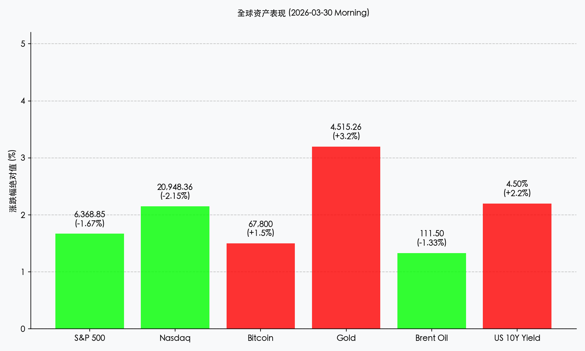

# 全球市场周初展望：G7 紧急能源会议开幕，A 股迎来“词元经济”首秀

**日期：2026年03月30日 (星期一)** &nbsp; **时段：早报 (Morning Run)**

> **核心摘要**：G7 紧急能源会议在伦敦拉开帷幕，市场预期将释放战略储备以平抑油价。与此同时，国内“词元经济”正式定名后的首个交易日备受瞩目，AI 应用端有望迎来爆发。美股盘前微涨，投资者正从上周五的暴跌中寻找企稳信号。

## 周末财经要闻终极汇总

1.  **G7 紧急能源会议开幕，油价应声回落**：针对布伦特原油突破 110 美元的紧张局势，G7 成员国能源部长今日在伦敦集会。初步消息显示，多国已达成“联合干预”默契，若油价触及 120 美元，将开启新一轮战略石油储备 (SPR) 投放。布伦特原油盘前下跌约 1.3%。
2.  **“词元经济”持续发酵，机构预测 A 股 AI 板块将迎普涨**：自国家数据局将 Token 定名为“词元”后，中金、中信等多家券商周末连夜发文，认为此举确立了 AI 时代的“度量衡”。今日 A 股开盘，具备高频词元消耗场景的社交、游戏及办公软件板块成为市场焦点。
3.  **地缘政治局势进入“冷观察期”**：虽然伊朗上周末拒绝了美方提议，但过去 24 小时内并未发生实质性冲突升级。市场风险偏好小幅修复，黄金高位震荡，比特币反弹至 67,800 美元上方。
4.  **美债收益率攀升至 4.5%**：由于通胀预期依然坚挺，美国 10 年期国债收益率周一早间触及 4.5% 关口，对高估值科技股形成持续压制。

## 新一周市场核心博弈逻辑

*   **通胀压力与增长预期的赛跑**：油价虽有 G7 干预预期而回落，但中期通胀压力未减。本周五的美国 3 月非农数据将是决定美联储是否在 5 月提前“转鹰”的关键。
*   **“词元经济”的估值重构**：市场正在从传统的“算力驱动”转向“词元消耗驱动”。哪些企业能将 AI 转化为可计费的词元流量，将成为 2026 年核心的投资审美。
*   **避险资产的避风港效应**：尽管今日风险情绪有所回升，但黄金（$4,515/盎司）与比特币（$67,800）的韧性显示，大宗资金依然在为可能的突发地缘事件保留头寸。

## 本周重磅经济数据与会议前瞻

*   **3月30日 (周一)**：G7 紧急能源会议（伦敦），关注最终公报及 SPR 释放细节。
*   **3月31日 (周二)**：**中国 3 月官方制造业 PMI**。市场预期 50.8，若超预期将极大提振市场对一季度经济复苏的信心。
*   **4月3日 (周五)**：**美国 3 月非农就业报告**。预计新增就业 20 万人，失业率维持在 3.9% 低位。
*   **休市提醒**：周五为耶稣受难日，欧美及港股休市。

## 头部券商/投行开盘策略点睛

*   **中信证券**：建议投资者在 A 股开盘后，重点关注“词元”核心受益链。目前市场仍处于存量博弈向增量博弈的过渡期，政策红利将是最大的确定性。
*   **高盛 (Goldman Sachs)**：认为全球市场正处于“滞胀风险”与“AI 生产力突破”的拉锯战中。维持对中国股票的“超配”评级，理由是估值溢价已压缩至历史极端水平。
*   **摩根士丹利**：警告投资者警惕美债收益率突破 4.5% 后的流动性收缩风险，建议增加防御性公用事业与红利资产的配置。

## 今日市场情绪：融冰中的博弈

> Prompt: Surrealism style, A massive G7 conference table made of ice, melting slowly in the middle of a burning desert. In the background, a giant digital ticker showing 'TOKEN' in glowing green neon letters. A group of diverse people in suits (real people) are looking at a compass that is spinning wildly., masterpiece, high detail, intricate composition, cinematic lighting, 8k resolution

---
免责声明：内容仅供参考，不构成投资建议。
