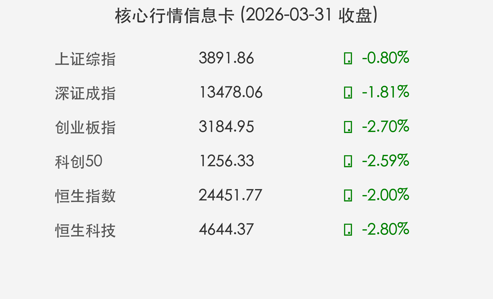

# 季末效应显现：三大股指全线调整，低估值红利板块逆势护盘
**日期：2026年03月31日 (星期二)** &nbsp; **时段：收盘报**

> **核心摘要**：3月收官战呈现明显“季末效应”，资金大规模从高增长科技股向低估值防御性板块切换。沪指失守3900点，创业板深调超2%，地缘政治扰动与出口政策变化加剧了市场波动。

## 核心行情复盘
今日A股与港股市场在多重压力下集体走低。沪指全天单边下行，最终失守3900点整数关口；创业板指受锂电、AI等赛道股拖累，跌幅近3%。

* **沪深两市**：全天成交额 **19925亿元**，较昨日放量，显示存在一定的恐慌性抛盘。
* **主力资金**：大幅净流出 **510.2亿元**。
* **北向资金**：净卖出 **12.36亿元**，终结连买态势。
* **领涨板块**：银行、保险、家电（美的集团涨超5%）、白酒（贵州茅台涨超2%）。
* **领跌板块**：煤炭、电力设备、电子、光伏。

> **核心解读**：季末资金面博弈加剧，加之特朗普针对伊朗石油设施的言论引发能源市场不安，投资者避险情绪显著升温。光伏退税政策的正式取消也对相关产业链构成短期利空。

## 核心解读与市场逻辑
> **季末防御策略占优**：随着一季度结束，公募及机构投资者倾向于在季末进行调仓，获利回吐压力在科技及赛道股中集中释放。资金转向业绩确定性更强的消费和金融红利股。

> **地缘政治与政策波动**：特朗普的强硬言论及中东局势的不确定性，使得避险资产受到青睐。此外，4月1日起正式取消的光伏出口退税政策，使得相关板块在今日出现了明显的抢跑式下跌。

## 政策脉动
* **杭州房地产政策优化**：杭州市进一步优化住房公积金贷款政策，旨在刺激市场需求。
* **出口退税调整**：光伏等产品的出口退税于4月1日起正式取消，产业正面临从“规模扩张”到“质量驱动”的转型阵痛。
* **茅台提价**：贵州茅台宣布上调出厂价及自营零售价，不仅增厚了公司业绩预期，也为整个白酒板块提供了价格锚点。

## 最新机构观点
* **中信证券**：坚定看好存储成长趋势，认为智能体（Agent）推理将驱动存力需求激增，短期回调不改长期增长逻辑。
* **中金公司**：市场对地缘政治及高油价等悲观情形的定价尚不充分，建议短期关注性价比较高的低波红利板块，采取防御姿态。

## 今日市场情绪：季末防御，避险升温

> Prompt: A weary knight in golden armor, representing defensive dividend assets, stands firmly on a cliff made of black basalt. In the background, a massive storm of red vertical bars (K-lines) crashes against the shore. A once-glowing green dragon, representing growth and tech sectors, is slowly dissolving into the mist above the turbulent ocean. The scene is dramatic and atmospheric, conveying a sense of seasonal transition and market defensive posture.

---
免责声明：内容仅供参考，不构成投资建议。
