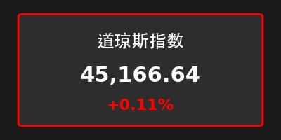
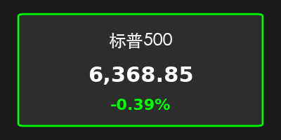
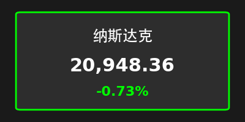
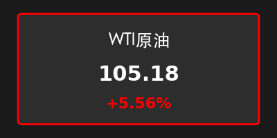
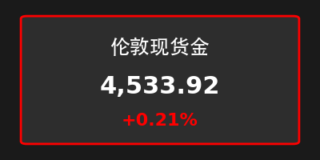
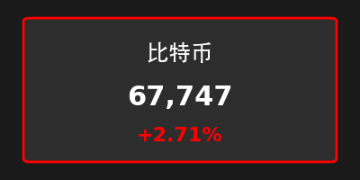
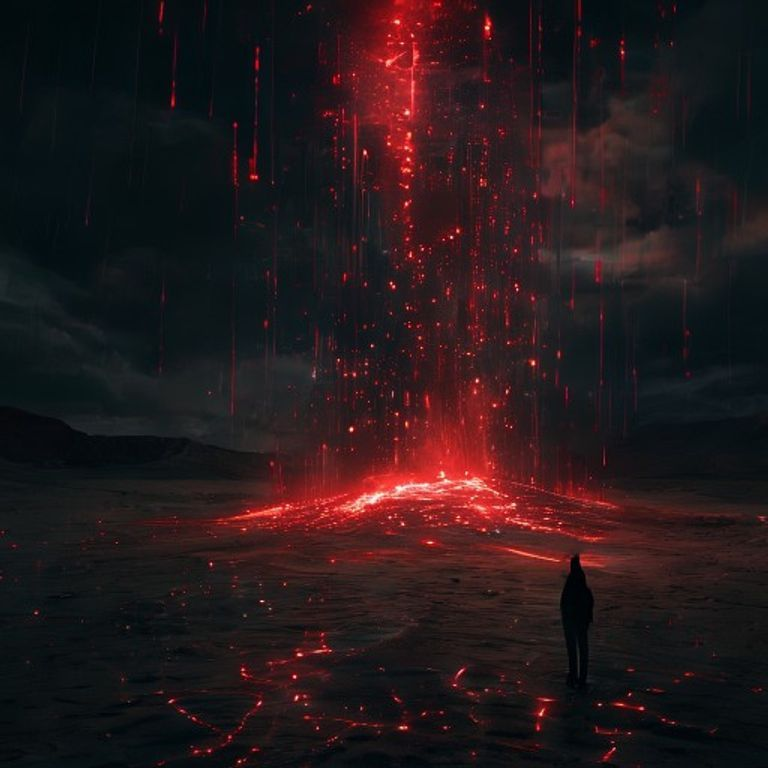

# 2026-03-31 周二早间：中东硝烟推升油价，美股科技股承压回撤

**日期：2026年03月31日 (星期二)** &nbsp; **时段：早报**

> **核心摘要**：中东地缘局势骤然升级，引发原油价格单日飙升逾 5%，避险资产金价再创新高。美股三大指数涨跌互现，科技与半导体板块受美债收益率及增长担忧拖累明显回撤，比特币在波动中展现韧性。

## 1. 核心行情复盘

*   **美股表现**：道指微涨 **0.11%** (45,166.64)，金融与公用事业板块提供支撑；标普 500 指数下跌 **0.39%** (6,368.85)，纳指受科技股抛压影响下跌 **0.73%** (20,948.36)。
*   **行业动态**：半导体板块领跌，美光科技（Micron）因业绩指引及行业担忧下跌近 **10%**。
*   **大宗商品**：WTI 原油暴涨 **5.56%**，报 **105.18** 美元，主因报道称中东基础设施遭导弹袭击引发供应担忧。现货金上涨 **0.21%**，触及 **4,533.92** 美元新高。
*   **加密货币**：比特币上涨 **2.71%**，报 **67,747** 美元左右，在市场剧烈波动中展现出一定的避险韧性。
*   **恐慌指数**：CBOE 波动率指数 (VIX) 升至 **30.61**，反映出投资者对全球增长和能源价格的显著焦虑。

> **核心解读**：当前市场的主导逻辑已转向“地缘风险溢价”与“滞胀担忧”。油价的快速拉升不仅直接冲击通胀预期，也对全球供应链成本构成压力。科技股的走弱反映了市场在风险偏好下降背景下，对高估值板块的审慎，而资金正流向能源与避险资产。

## 2. 核心解读与市场逻辑

*   **中东局势的连锁反应**：针对中东能源基础设施的袭击报告是周一市场走势的催化剂。原油价格的垂直拉升直接推高了通胀担忧，使得市场对美联储未来降息路径的预期更加复杂化。
*   **科技股的估值压力**：尽管 10 年期美债收益率有所回落，但科技股并未受益。市场担忧能源成本上升将侵蚀企业利润，特别是对能源依赖度高的算力中心及制造业。美光科技的大跌反映了存储芯片行业在需求波动中的脆弱性。
*   **避险资产的回归**：黄金与比特币的同时上涨暗示了当前市场“全方位避险”的特征。投资者在寻找能够对冲地缘风险与货币贬值的双重锚点。

## 3. 政策脉动与宏观博弈

*   **美债收益率回落**：10 年期美债收益率在避险买盘推动下回落，但这未能抵消股市对经济增长放缓的担忧。
*   **地缘局势演变**：市场正密切关注中东冲突是否会进一步扩大，以及对主要航道和能源供应的持续影响。

## 4. 最新机构观点

*   **高盛 (Goldman Sachs)**：维持对 2026 年市场的建设性看法，但短期内强调能源板块作为地缘政治风险“自然对冲工具”的价值。预计通胀波动的回归将使得资产配置更加侧重实物资产。
*   **摩根大通 (J.P. Morgan)**：建议投资者增加防御性板块的敞口。油价如果持续维持在 $100 以上，将迫使美联储在控制通胀与维持经济增长之间面临更艰难的权衡。
*   **瑞银 (UBS)**：认为当前波动是暂时的，全球经济增长韧性依然存在，但需关注大宗商品价格对全球制造业复苏的滞后影响。

## 5. 今日市场情绪：避险中的焦虑

> Prompt: Surrealism style, A giant black oil fountain erupting from a digital desert landscape, with glowing red K-line charts flickering in the dark stormy sky. In the foreground, a silicon chip is half-buried in the sand. A human trader (real person) stands in the distance, looking at the scene with concern., masterpiece, high detail, intricate composition, cinematic lighting, 8k resolution

---
*免责声明：内容仅供参考，不构成投资建议。*
