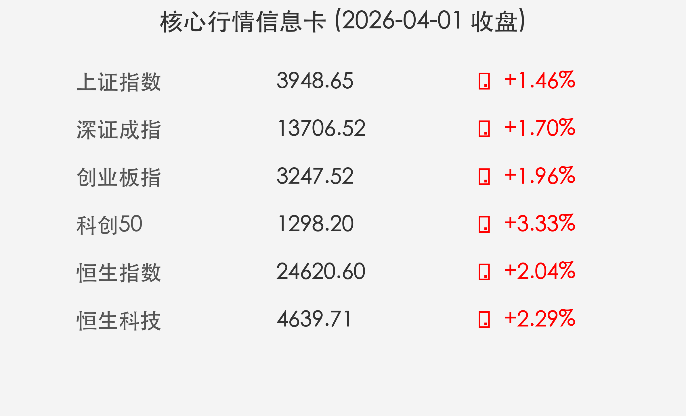

# 金融市场晚报：A股港股双双大涨，四月开门红！

**日期：2026年04月01日 (星期三)** &nbsp; **时段：傍晚收盘**

> **核心摘要**：今日A股与港股市场迎来“四月开门红”，三大指数集体走强，沪深两市成交额大幅放量至2.03万亿元。政策面上，央行一季度例会强调政策集成效应，创新药、算力硬件及有色金属板块表现亮眼，投资者信心显著修复。

## 核心行情复盘

今日市场呈现普涨态势，全市场近4500只个股上涨。三大指数低开高走，午后涨幅进一步扩大。

*   **上证指数**：收报 **3948.65点**，大涨 **1.46%**，重新站稳3900点关键关口。
*   **深证成指**：上涨 **1.70%**，收于 **13706.52点**。
*   **创业板指**：表现出色，上涨 **1.96%**，报收 **3247.52点**。
*   **科创50**：涨势最猛，单日飙升 **3.33%**。
*   **港股市场**：恒生指数上涨 **2.04%**，恒生科技指数上涨 **2.29%**，智谱AI（Zhipu AI）等科技股带动港股走强。
*   **成交量**：两市成交额突破 **2.03万亿元**，较前一交易日显著放量。
*   **资金流向**：北向资金全天成交活跃，资金重点流入创新药、算力硬件及有色金属板块。

## 核心解读与市场逻辑

> **解读：科技与医药双轮驱动**
>
> 1.  **创新药“春雨”滋润**：国家药监局启动“春雨行动”，旨在支持医疗器械创新和成果产业化。受此利好刺激，医药生物板块掀起涨停潮，多只创新药ETF涨幅超过7%。
> 2.  **算力与AI业绩催化**：智谱AI发布的超预期年报成为科技股上涨的引信，带动算力硬件、半导体及电子元件板块集体走强。
> 3.  **避险与复苏共振**：有色金属板块受中东地缘局势及避险情绪升温影响，价格弹性放大；同时，港股航空股因清明及春假旅游火爆预期而普涨，显示出消费复苏的韧性。

## 政策脉动

> **关键信号：货币政策的集成效应**
>
> 央行货币政策委员会召开2026年一季度例会，强调要“发挥增量政策和存量政策的集成效应”。这一措辞向市场传递了管理层维护金融市场稳定、支持实体经济回升向好的坚定决心。同时，市场正高度关注“十五五”规划开局之年的积极财政政策如何具体落地，特别是对基建和设备更新的支持力度。

## 最新机构观点

*   **中信证券**：建议投资者在4月继续坚守“中国优势制造业”，并指出当前已进入“4月决断”的关键窗口期。中信特别看好贵金属、工业金属及战略金属的配置价值。
*   **中金公司**：强调未来产业的投资机会在于“未来”而非“现在”，科技创新将是估值重塑的核心驱动力。中金自身的强劲业绩（归母净利润大增71.93%）也为证券板块注入了强心针。

## 今日市场情绪：开门大吉，信心修复

今日市场的情绪可用“满堂红”来形容。在多重利好共振下，市场不仅实现了指数的跨越，更完成了信心的重塑。

> Prompt: Surreal Digital Art style, A golden dragon soaring over a sea of green bamboo that is turning into glowing circuits, symbolizing the A-share market's powerful rebound driven by technology and traditional sectors on April 1st., masterpiece, high detail, intricate composition, cinematic lighting, 8k resolution

---
免责声明：内容仅供参考，不构成投资建议。
