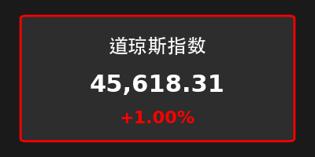
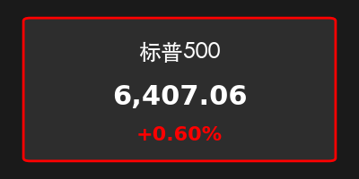
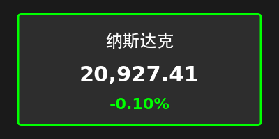
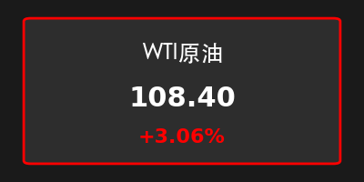
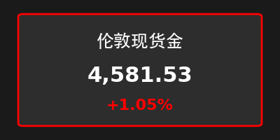
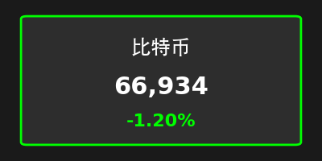
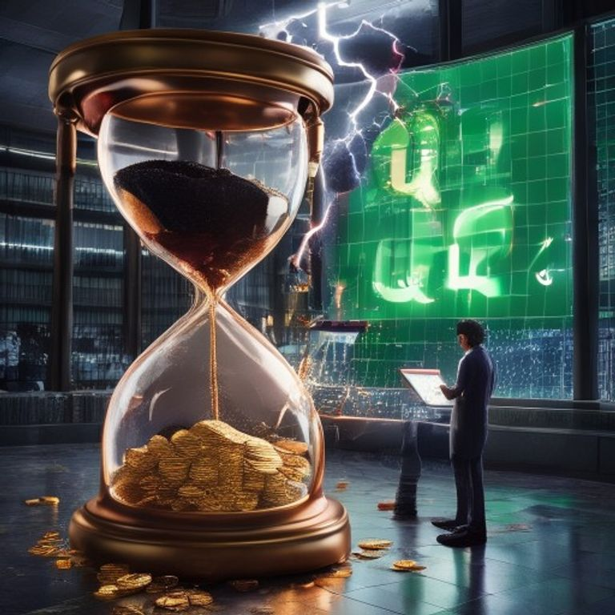

# 2026-04-01 周三早间：一季度收官，价值股托底美股，大宗商品全线狂飙

**日期：2026年04月01日 (星期三)** &nbsp; **时段：早报**

> **核心摘要**：2026年第一季度在波动中落下帷幕。周二美股表现分化，道指与标普在价值股与避险买盘托底稳步走高，纳指则受科技股估值压力微跌。受地缘局势及供应担忧持续发酵影响，原油及黄金在季末双双大涨，再度刷新高位。

## 1. 核心行情复盘

*   **美股表现**：道指收涨 **1.00%** (45,618.31)，标普 500 收涨 **0.60%** (6,407.06)，受季末再平衡资金流入防御性及价值板块提振。纳指微跌 **0.10%** (20,927.41)，高估值科技股在美债收益率震荡背景下表现审慎。
*   **行业动态**：能源、基础材料及公用事业板块领涨，科技及非必需消费品板块相对低迷。
*   **大宗商品**：WTI 原油继续狂飙 **3.06%**，报 **108.40** 美元，地缘局势不确定性令供应紧缩预期升温。现货金大涨 **1.05%**，收报 **4,581.53** 美元，避险情绪与通胀对冲需求同步共振。
*   **加密货币**：比特币下跌 **1.20%**，报 **66,934** 美元左右，季末流动性调整令加密市场承压，但整体仍维持在高位区间震荡。
*   **市场情绪**：第一季度最后一个交易日，市场在“防守”与“反攻”间博弈，整体风险偏好在避险情绪主导下偏向保守。

> **核心解读**：Q1 的收官不仅是数据的总结，更是市场逻辑的一次重大漂移。从“降息预期”到“滞胀防御”，资金在季末的调仓清晰地展示了对未来不确定性的担忧。原油与黄金的双牛齐鸣，是地缘政治风险溢价的最直观体现。

## 2. 核心解读与市场逻辑

*   **季末再平衡的博弈**：周二市场的稳健表现很大程度上源于养老金等机构投资者在季末的资产配置调整。在经历了科技股长时间的领跑后，部分利润落袋并转向估值更具吸引力的传统价值板块。
*   **地缘风险持续发酵**：中东局势的最新进展依然是原油和黄金价格的“助推器”。只要供应中断的阴影不散，实物资产的“超级牛市”预期就难以熄灭，这也直接对下游制造业成本构成挑战。
*   **科技股的估值修正**：尽管科技龙头基本面依然稳健，但在通胀预期回升和利率可能维持更高水平的情况下，高市盈率板块的估值承受着天然的“重力感”。

## 3. 政策脉动与宏观博弈

*   **通胀预期回升**：受能源价格上涨带动，市场对 Q2 通胀水平的预期有所抬升，这对央行的货币政策独立性构成了考验。
*   **全球供应链安全**：多国政府近期就能源安全和关键矿产供应密集发声，反映出地缘政治格局正深远地重塑全球贸易流向。

## 4. 最新机构观点

*   **高盛 (Goldman Sachs)**：指出当前原油库存处于多年低点，地缘溢价尚未完全计入，预计能源板块在 Q2 仍有显著上涨空间。
*   **中金公司 (CICC)**：认为全球资产定价正进入“动荡的新常态”，建议关注高股息价值股与硬通货资产的配置机会。
*   **摩根士丹利 (Morgan Stanley)**：警告科技股近期可能面临更剧烈的波动，建议寻找业绩增长与现金流高度确定的确定性品种。

## 5. 今日市场情绪：季末的守望与嬗变

> Prompt: Surrealism style, A giant golden hourglass standing on a dark trading floor, the top half filled with thick black oil and the bottom half with sparkling gold coins. In the background, a massive digital screen shows 'Q1' shattering into pieces, replaced by a solid green 'Q2'. A human trader (real person) is checking a glowing tablet with a rising line chart while a red lightning storm flashes outside the window., masterpiece, high detail, intricate composition, cinematic lighting, 8k resolution

---
*免责声明：内容仅供参考，不构成投资建议。*
